<!-- @import "[TOC]" {cmd="toc" depthFrom=1 depthTo=6 orderedList=false} -->

<!-- code_chunk_output -->

- [assembly](#assembly)
  - [CPU](#cpu)
  - [寄存器](#寄存器)
  - [Assembly](#assembly-1)
  - [转移](#转移)
  - [中断](#中断)
  - [与外设交互](#与外设交互)
- [Java](#java)
  - [SpringBoot](#springboot)

<!-- /code_chunk_output -->

## assembly

### CPU

**CPU组成**
- 运算器：信息处理
- 寄存器：信息存储
- 控制器：协调器件进行工作
- 内部总线：实现CPU内各个器件之间的联系

**三类总线**
地址总线：决定存储单元，地址总线的宽度决定了可寻址的存储单元的大小 // 8086总线宽度为20，寻址空间（内存地址空间）为2^20B(1MB)
数据总线：传输数据，数据总线的宽度决定了CPU和外界的数据传送速度
控制总线：对外部器件进行控制，控制总线的宽度决定了CPU对外部器件的控制能力

### 寄存器
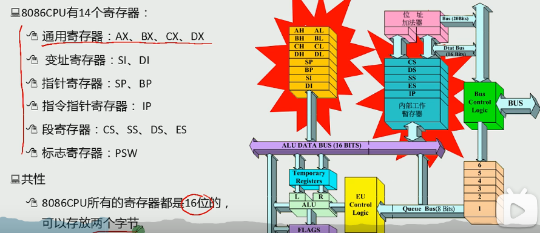
中阔号[]只对寄存器有影响，lea 寄存器加中括号代表取值（把地址当作值），mov 寄存器加中括号代表取地址（把他的内容当作地址，加上段地址变成物理地址，取物理地址内的值），[]只能存bx，bi，si，bp（变址 基址寄存器）,lea,[]都是*or&
 
数据寄存器（AX、BX、CX、DX寄存器）:
    AX（accumulator）累加器,是算术运算的主要寄存器。在乘、除等指令中指定用来存放操作数，以及所有的 I/O指令都使用这一寄存器与外部设备传送信息
    BX（base）基址寄存器。常做存放地址使用
    CX（count）计数器。常用来保存计数值，如在循环、位移和串处理指令中作隐含计数器
    DX（data）数据。一般在作双字长运算时把DX和AX组合在一起存放一个双字长数，DX用来存放高位数。对于某些I/O操作，DX可用来存放I/O的端口地址
 
变址寄存器（SI寄存器、DI寄存器）
    SI是源变址寄存器，DI是目的变址寄存器。一般用来存放地址偏移，也可以用来存放数据。但需要注意的是：在串处理指令中，SI用作隐含的源串地址，默认在DS中；DI用做隐含的目的串地址，默认在ES中；此时不能混用
 
指针寄存器（BP寄存器、SP寄存器）
    SP(stack pointer)堆栈寄存器，SP寄存器存放栈的偏移地址,SS存放段地址
 
    BP(base pointer)基数指针寄存器BP，它的用途有点特殊，需和堆栈指针SP联合使用的，作为SP校准使用的，只有在寻找堆栈里的数据和使用个别的寻址方式时候才能用到。比如说，堆栈中压入了很多数据或者地址，你肯定想通过SP来访问这些数据或者地址，但SP是要指向栈顶的，是不能随便乱改的，这时候你就需要使用BP，把SP的值传递给BP，通过BP来寻找堆栈里数据或者地址.
    BP作为基址寄存器，一般在函数中用来保存进入函数时的SP的栈顶基址.每次子函数调用时，系统在开始时都会保存这个两个指针并在函数结束时恢复SP和BP的值
段寄存器（DS寄存器、ES寄存器）
    DS（Data Segment）和 ES（Extra Segment）都属于段寄存器，用于存放的就是某个段地址
    注：CPU不支持直接将立即数送入段寄存器中，如下操作方式不合法：
    mov ds,1000h masm里新建asm文件的初始代码传输也分了两次

**标志寄存器**
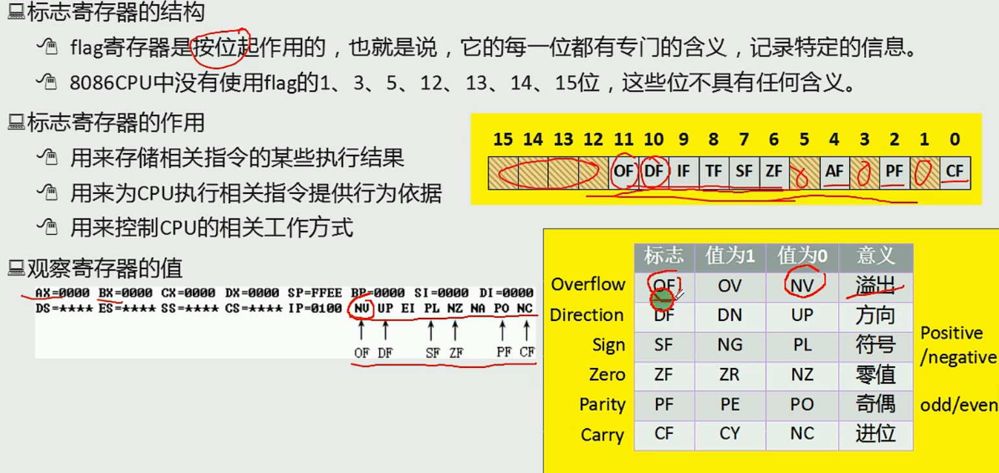
6个状态标志位：OF、SF、ZF、AF、PF、CF，及3个控制标志位DF、IF、TF
标志寄存器Flag
Flag是16位的寄存器，有9个标志位，其中6个状态标志位，3个控制标志位
 
6个状态标志位
CF：进位或者借位 有进位或者借位时CF=1，并且debug显示为CY
否则CF=0，debug显示为NC
 
PF：奇偶标志位 用于校验，运算结果**低8位**（AL AH等） 化为2进制 为奇数个1时PF=0 debug显示 PO
否则 偶数个1时PF=1 debug显示PE
 
AF:辅助进位标志 运算结果的低4位向前1位有进位或者借位时 AF=1，debug显示AC
否则无进位和借位时AF=0,debug显示NA
 
ZF:零标志位 运算结果为0时 则ZF=1，debug显示ZR
否则ZF=0，debug显示NZ
 
SF:符号标志位 运算结果为负数时，SF=1，debug显示NG
否则SF=0，debug显示PL
 
OF:溢出标志位 如果运算结果溢出(与常识不符合 例如两个正数相加为负数 或者两个异数相减为负数)，则ZF=1,debug显示OV
否则ZF=0，debug显示NV
 
3、3个控制标志位
TF:追踪标志位
TF=1则单步执行，执行之后TF=0 即中断然后正常执行
 
IF:中断允许标志位
IF=1,则允许CPU响应外部中断 debug 显示EI
IF=0,则禁止 debug显示DI
 
DF:方向标志位
DF=1，地址减方向 debug显示DN
DF=0,地址增方向 debug显示UP

**字和字节**
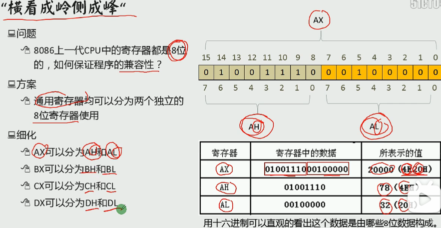
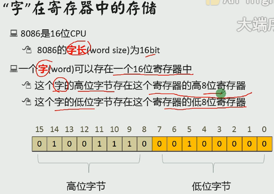

**8086CPU物理地址**
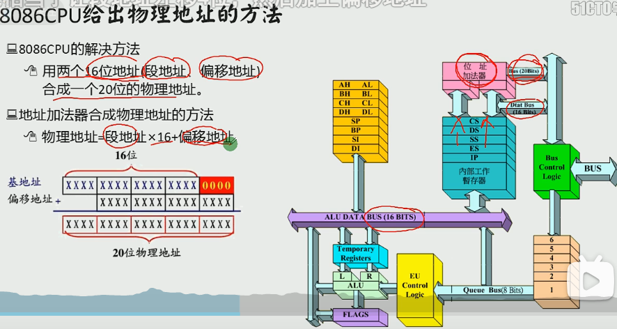

**8086读取和执行指令演示**
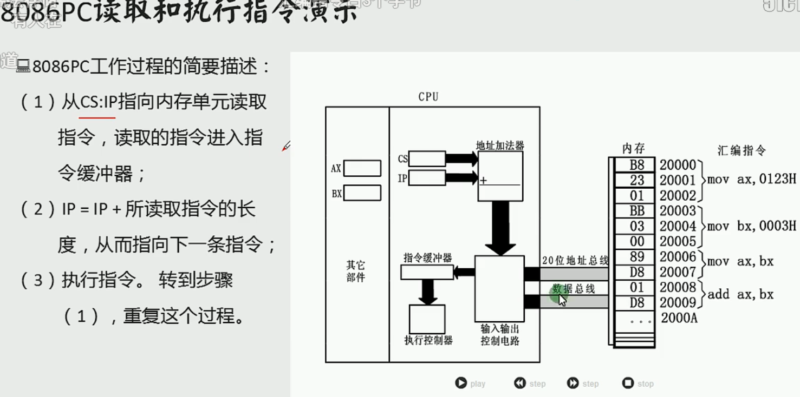

### Assembly

**标号**
地址标号：仅仅表示地址
数据标号：标记了存储数据的单元的地址和长度//不加冒号

**mov and add**
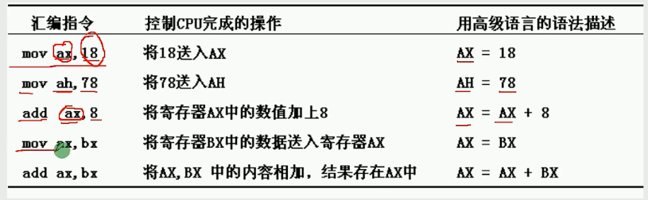

**DEBUG**
*用R命令查看、改变CPU寄存器的内容*
-R -查看寄存器内容
-R寄存器名 -改变指定寄存器内容
*用D命令查看内存中的内容*
-D  -列出预设地址内存储的128个字节的内容
-D 段地址：偏移地址 -列出内存中指定地址处的内容
-D 段地址：偏移地址 结尾偏移地址 -列出内存中指定地址处的内容
*用E命令改变内存中的内容*
-E 段地址：偏移地址 数据1 2 ……
-E 段地址：偏移地址  //逐个询问时修改
*用U命令将内存中的机器指令翻译成汇编指令*
-U 段地址：偏移地址
*用A命令以汇编指令的格式在内存中写入机器指令*
-A 段地址：偏移地址
*用T命令执行机器指令*
-T - 执行CS：IP处的指令
*用Q命令退出Debug*

**CPU从内存单元中读取数据**
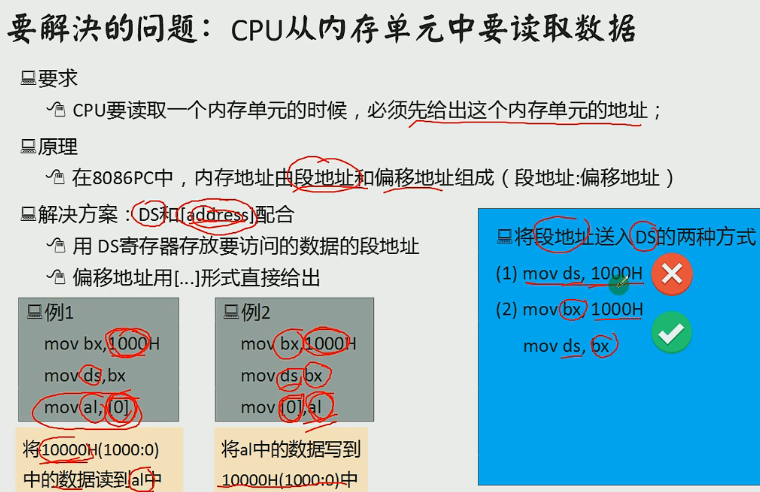

**stack**
在8086CPU中有两个和栈有关的寄存器
- 栈段寄存器ss -存放栈顶的段地址
- 栈顶指针寄存器sp -存放栈顶的偏移地址
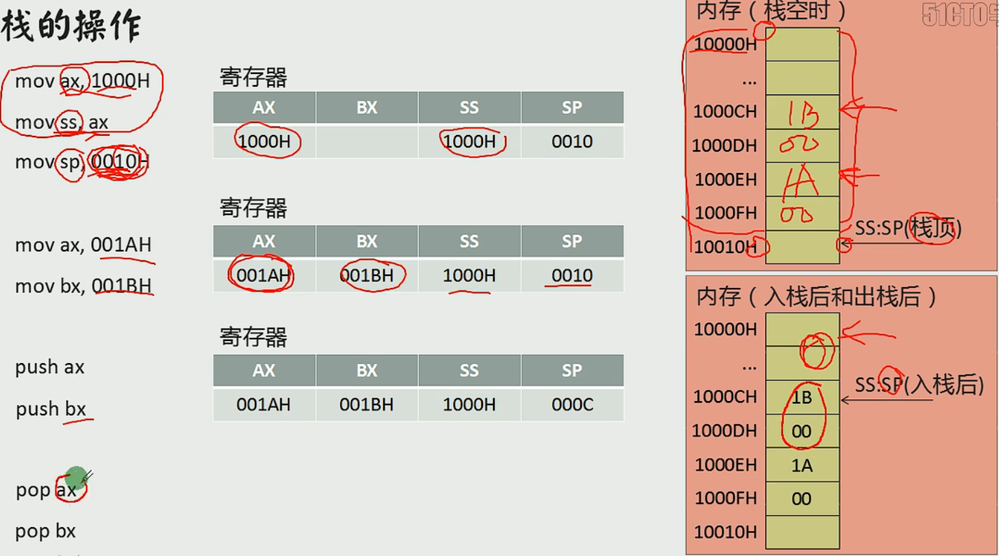

**汇编语言程序的工作过程**

**三种伪指令**
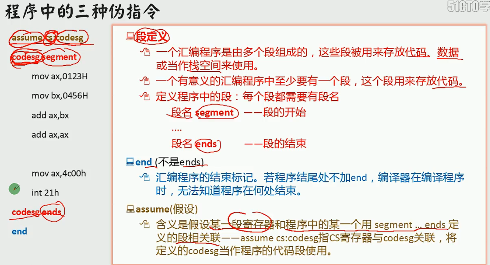

**如何写一个程序**
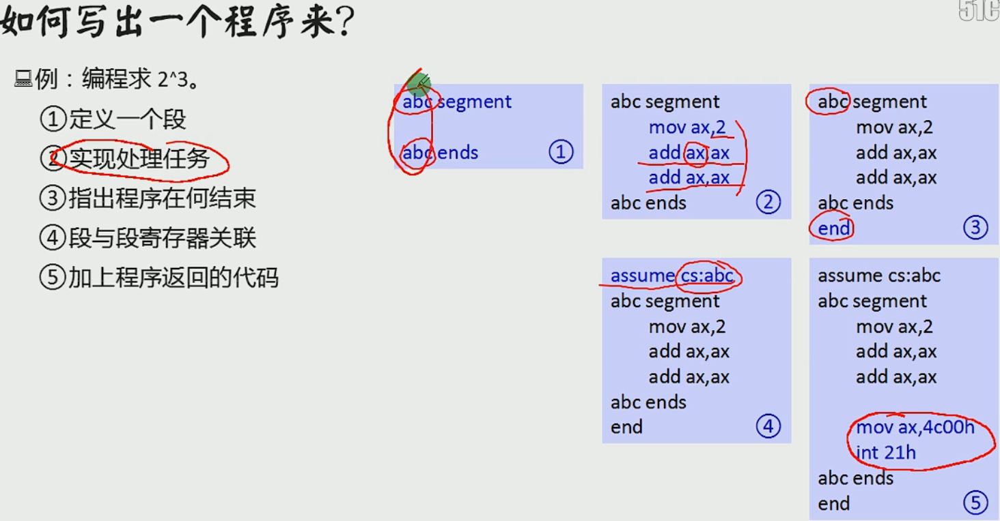

**loop指令**
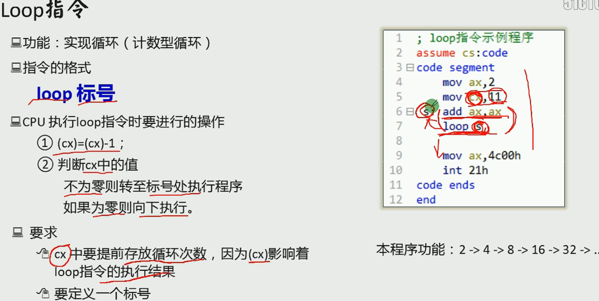

**段前缀**
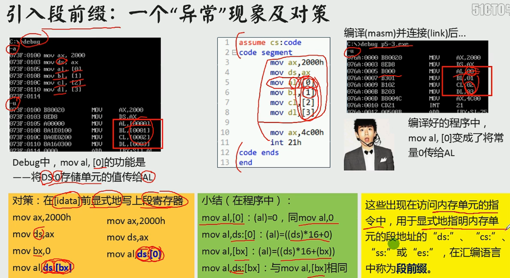

**字符**
汇编程序中用''的方式指明字符，编译器将他们转化为ASCLL码

**内存寻址方式**
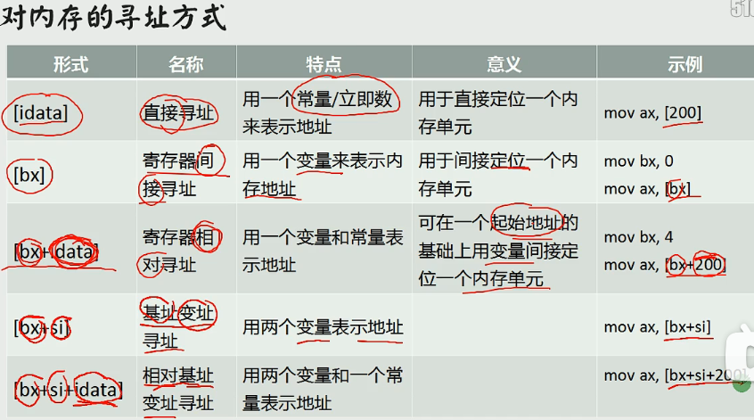

**div指令**
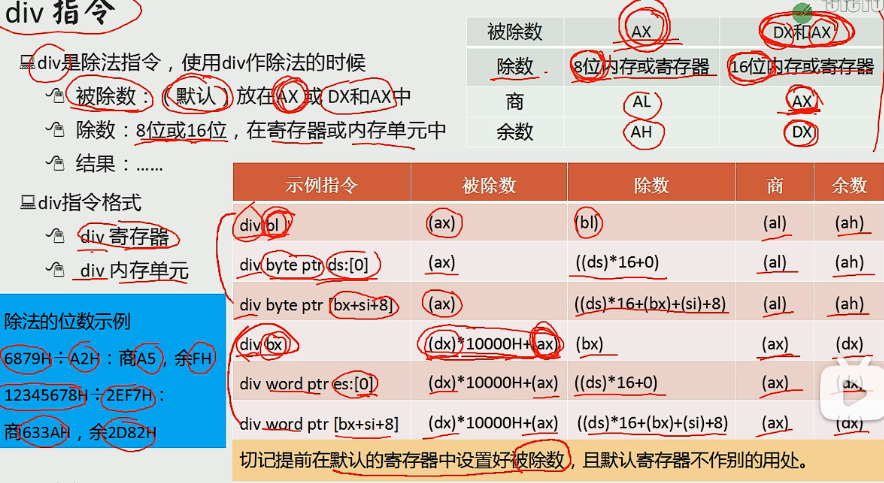

**dup指令**
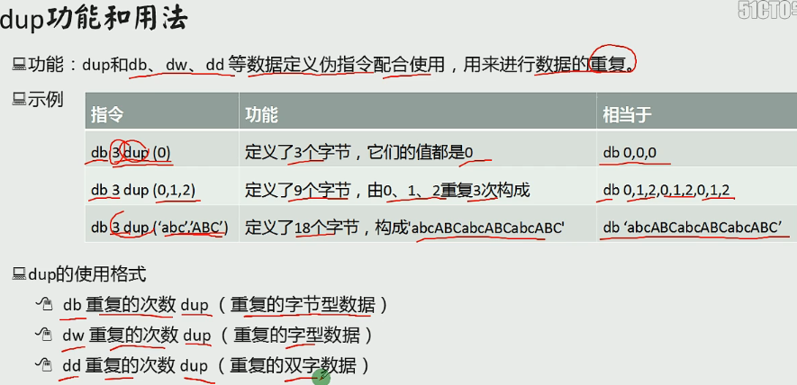

### 转移
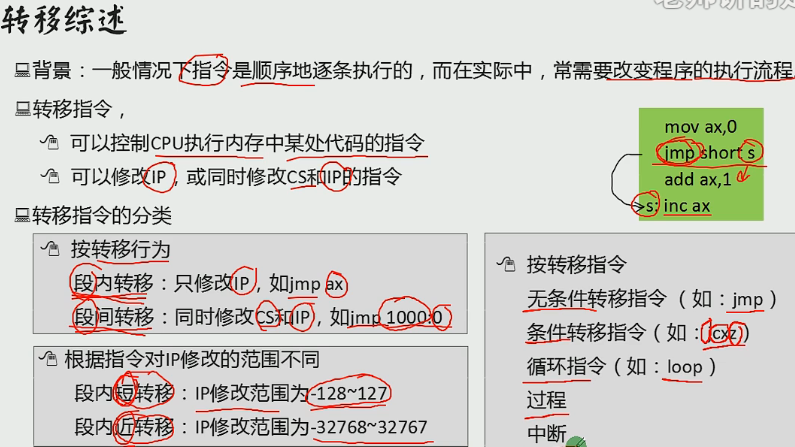

**offset操作符**
offset作用：取得标号的偏移地址
格式：
    offset 标号
例子：
    start： move ax，offset start；相当于 move ax，0

**jmp指令**
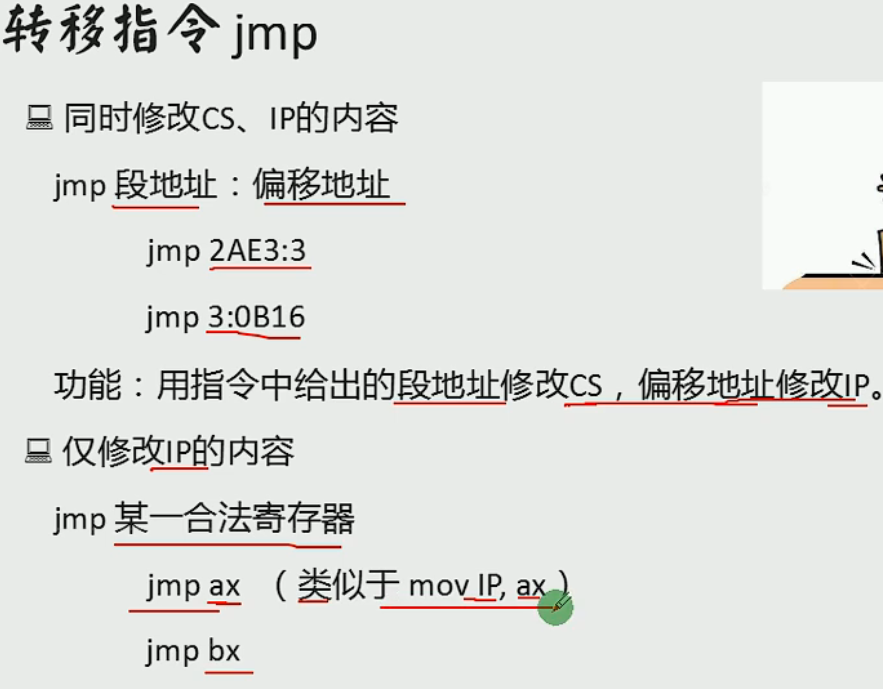
jmp short 标号 -短转移，位移为8位，范围-128~127
jmp near ptr 标号 -近转移，位移为16位，范围-32769~32767
jmp far ptr 标号 -远转移
*短转移和近转移给定偏移量，而远转移直接给定偏移地址*

**jcxz**
原理：
jmp改
作用：
如果（cx）=0，则跳转到标号处执行；否则什么也不做（程序向下执行）
格式：
jcxz 标号

**条件转移指令**
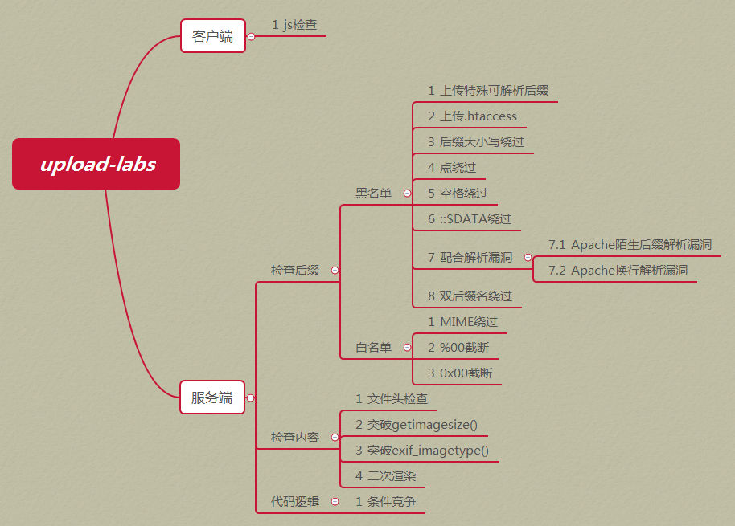

**call**
原理：
1. 将当前的IP或CS和IP压入栈中；
2. 转移到标号处执行指令。
*近转移*
作用：
调用子程序
格式：
call 标号

**call far ptr**
原理：
push CS
push IP
jmp far ptr 标号
    
**mul**
作用：
乘法指令
格式：
mul 寄存器
mul 内存单元

**cmp**
原理：
对象1-对象2，通过其他指令识别标志寄存器变化来得知比较结果
作用：
比较指令
格式：
cmp 对象1，对象2

**串传送指令**
movsb：（以字节为单位传送）
movsw：（以字为单位传送）

**移位指令**
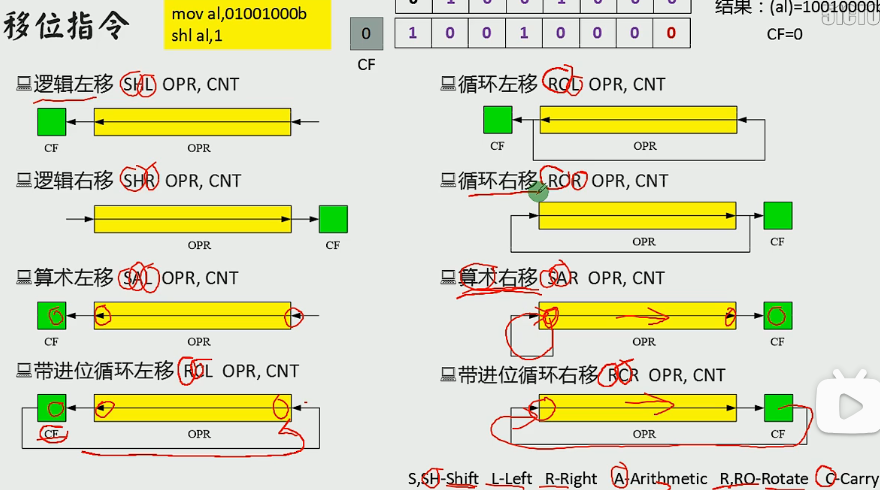

**操作显存数据**
低位字节：要显示符号的ascll
高位字节：
| 7 | 6 | 5 | 4 | 3 | 2 | 1 | 0 |
|---|---|---|---|---|---|---|---|
|BL | R | G | B | I | R | G | B |
|闪烁|背景|||高亮|前景|||

### 中断
中断：CPU不再向下执行指令，而去处理中断信息
内中断：CPU内部发生的事件而引起的中断
外中断：外部设备发生的事件引起的中断

### 与外设交互

**读写端口指令**
in： CPU从端口读取数据
执行时：
1. CPU通过**地址总线**将地址信息60h发出；
2. CPU通过**控制线**发出端口读命令，选中端口所在的芯片，并通知要从中读取数据；
3. 端口所在的芯片将60h端口中的数据通过**数据总线**送入CPU。
out： CPU从端口写入数据

**PC机键盘处理过程**
1. **键盘输入**：键盘中的每一个按键相当于一个开关，键盘中有一个芯片来监控这些开关
    1. 键盘被按下：
        - 开关接通，芯片产生一个扫描码，记录闭合开关的位置
        - 扫描码被送入主板相关接口芯片的寄存器（端口位置为60H）中
    2. 键盘被松开：
        - 同上
    3. 扫描码：长度为一个字节的编码
        - 按下产生的扫描码--通码，第七位为0
        - 松开产生的扫描码--断码，第七位为1
2. **引发9号中断**
3. **执行int 9中断例程**

## Java

### SpringBoot

**web入门**
- Spring Boot将传统Web开发的mvc，json，tomcat等框架整合提供了spring-boot-start-web组件，简化了Web应用配置。
- webmvc为Web开发的基础框架，json为JSON数据解析组件，tomcat为自带的容器以来

**控制器**
- Spring Boot提供了 **@Controller（请求页面和数据）** 和 **@RestController（只请求数据）**两种注解来标识此类负责接收和处理HTTP请求

Model       数据
View        页面
Controller  控制器

1. 用户向 Controller 发送**HTTP请求**
2. Controller 向 Model 请求信息
3. Model 响应信息给 Controller
4. Controller 返回数据给 View
5. View HTTP响应给用户

**路由映射**
- @RequestMapping 注解主要负责URL的路由映射。它可以添加在Controller类或具体的方法上。
- 添加在Controller类上，则对类中所有路由映射都加上此规则；加上方法上，则只对当前方法生效。
- @RequestMapping参数：
    **value**：请求URL的路径，支持URL模板，正则表达式
    **method**：HTTP请求方法
    consumes：请求的媒体类型（Content-Type），如application/json
    produces：相应的媒体类型
    params，headers：请求的参数及请求头的值

**参数传递**
- @RequestParam将请求参数绑定到控制器的方法参数上，传输名和参数名一致可省略
- @PathVaraible：用来处理动态的URL，URL的值可以作为控制器中处理方法的参数
- @RequestBody接收的参数是来自requestBody中，即请求体。一般处理非Content-Type：application/x-www-form-urlencoded编码格式的数据，如application/json

**静态资源访问**
- /static/目录
- 在application.properties中直接定义过滤规则和静态资源位置：
    spring.mvc.static-path-pattern=/static/**
    spring.web.resources.static-locations=classpath:/static/

**文件上传**
- 表单enctype属性规定发送到服务器之前应该如何对表单数据继续进行编码。
- 当表单的enctype="multipart/form-data"时，可以使用MultipartFile获取上传的文件数据，再通过transferTO方法将其写入到磁盘中

**拦截器**
- Spring Boot定义了HandlerInterceptor接口来实现自定义拦截器的功能
- HandlerINterceptir接口定义了preHandle，postHandle，afterCompletion三种方法，通过重写这三种方法实现请求前，请求后等操作

**拦截器注册**
- addPathPatterns方法定义拦截的地址
- excludePathPatterns定义排除某些地址不被拦截
- 添加的一个拦截器没有addPathPattern任何一个url则默认拦截所有请求
- 没有excludePathPattern任何一个url则默认不放过一个请求

**RESRful**
- 每一个URI代表一种资源
- GET获取资源，POST新建资源，PUT更新资源，DELETE删除资源
- 通过操作资源的表现形式来实现服务端请求操作
- 资源的表现形式是JSON或者HTML

**使用Swagger生成WebAPI文档**

#### 注解
@restcontroller
@requestmapping
@PathVaraible
@RequestBody

## HTML
### vue

**MVVM模式**
- Model-View-ViewModel,核心是提供对View和VIewModel的双向数据绑定
- Vue提供了MVVM风格的双向数据绑定，核心是MVVM中的VM，ViewModel负责连接View和Model，保证视图和数据的一致性

**Vue框架**

**Vue组件化**

**生命周期函数**
created
mounted

**Axios网络请求**
- Axios是一个基于promise网络请求库
- Axios只用XMLHttpRequests发送网络请求，并能自动完成JSON数据的转换

