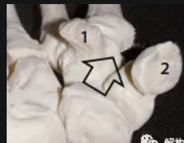
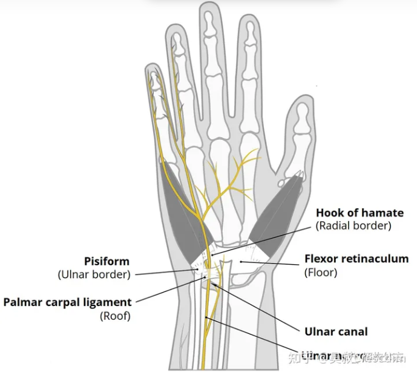
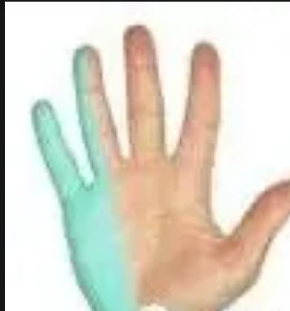
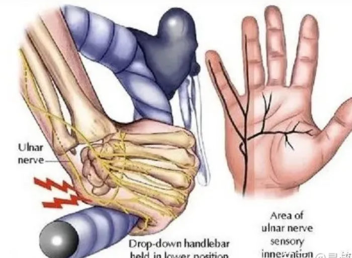
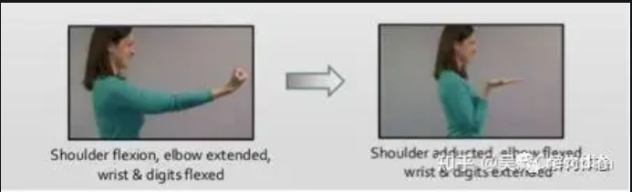

<!-- @import "[TOC]" {cmd="toc" depthFrom=1 depthTo=6 orderedList=false} -->

<!-- code_chunk_output -->

- [营养](#营养)
  - [矿物质](#矿物质)
  - [维生素](#维生素)
- [肌肉](#肌肉)
    - [肩](#肩)
    - [手](#手)
      - [Guyon管](#guyon管)
    - [腿](#腿)
      - [股四头肌](#股四头肌)
      - [大腿后群肌肉](#大腿后群肌肉)
      - [臀大肌](#臀大肌)
      - [小腿三头肌](#小腿三头肌)
      - [大腿外展肌群](#大腿外展肌群)
      - [大腿内收肌群](#大腿内收肌群)
    - [膝盖](#膝盖)
  - [常见问题](#常见问题)
    - 
    - [Guyon管综合征（尺管综合征）](#guyon管guyon管综合征尺管综合征)
    - [髋外侧弹响](#髋外侧弹响)
    - [膝盖内侧疼痛](#膝盖内侧疼痛)
    - [膝外翻（膝内扣）](#膝外翻膝内扣)
    - [肱骨前移](#肱骨前移)

<!-- /code_chunk_output -->

# 肌肉

### 肩

### 手

#### Guyon管
Guyon管是一个由骨骼、韧带和肌腱围成的空间，其名字是根据发现者命名的——100多年前的一位法国外科医生。

构成Guyon管的骨骼边界包括勾骨勾（上图1）与豌豆骨（上图2）。

豆勾韧带、腕掌侧韧带、掌短肌以及尺侧腕屈肌肌腱则构成了其余的边界。
无论是外力的直接压迫，还是上述结构边界的增生，都可能引发Guyon管综合征。
### 腿

#### 股四头肌

股四头肌解剖图

起止点:

肱四头肌是大腿前侧强有力的羽状肌肉。顾名思义，股四头肌四个头。其中股直肌起自于髂前下棘，外侧头长在大腿外侧，内侧头长在大腿偏内侧，股中间肌被股直肌盖住了。共同包绕髌骨止于胫骨粗隆。

功能:

肱四头肌最重要的功能伸直膝关节，与膕绳肌、腓肠肌等互为对抗肌。其中股直肌连接在骨盆上，所以不仅可以做膝伸，还能协同髂腰肌等完成髋屈（骨盆前倾）的动作。在行走和奔跑时，股直肌向前拉股骨的同时前踢小腿，这是股直肌完美的功能写照。

股四头肌是身上唯一的膝关节伸直肌肉

#### 大腿后群肌肉

大腿后群肌肉功能解剖图

起止点:

大腿后群肌肉主要是股二头肌和半腱半膜肌。我们常说的膕绳肌指的是半腱半膜肌和股二头肌的长头。这三块肌肉都起自于坐骨结节，止于小腿内外侧。股二头肌的短头起自于股骨后侧，止于腓骨头。

功能:

膕绳肌是双关节肌，可以协助臀大肌做髋伸（骨盆后倾），也可以协助腓肠肌做膝屈。在维持人体站立姿态也起重要作用，所以膕绳肌常被过度使用。股二头肌短头可以做膝关节屈，是稳定膝关节一块比较重要的肌肉。

为什么是直膝硬拉？因为在直膝状态下，膕绳肌的止点（小腿端）被拉长固定，此时膕绳肌在另一端（坐骨结节）牵拉骨盆就会更稳定，更好发力。

---

#### 臀大肌

臀大肌解剖图

起止点：

臀大肌起自于髂骨、骶尾骨背面，止于臀肌粗隆与髂胫束。臀大肌并没有将臀部完全包住，臀大肌偏上侧是臀中肌。

功能：

臀大肌本是身上最有力的肌肉之一，最重要的功能就是带动大腿在髋关节处伸（骨盆后倾），与髂腰肌、股直肌等互为对抗肌。现代生活方式导致许多人的臀大肌废用无力，功能被其它肌肉取代。引起一系列体态和腰痛的问题。

为什么要用这个动作练臀大肌？因为在屈膝状态下，膕绳肌被缩短，根据肌肉长度与张力的关系，此时膕绳肌在髋伸时力量被限制，臀大肌参与更多。

#### 小腿三头肌

小腿三头肌解剖图

起止点

小腿三头肌是小腿后侧强有力的肌肉。顾名思义，小腿三头肌三个头。细分为表层的腓肠肌和深层的比目鱼肌。腓肠肌有二个头，起自于股骨内外上髁，比目鱼肌是单关节肌，长在胫腓骨后面，共同止于跟结节。

功能

小腿三头肌最重要的功能就是跖屈（踝关节屈），俗称提踵掂脚尖。其中腓肠肌是长在股骨上的， 跨越了膝关节。所以腓肠肌不仅能提踵还能协助膕绳肌做膝屈。

在提踵的动作中，哪块肌肉更多的参与还是看膝关节所处的角度。直膝下做提踵，更多刺激的是腓肠肌，比如跳跃投篮时。屈膝状态下，比目鱼参与的更多，比如闲庭信步时。

#### 大腿外展肌群

起止点

大腿外展肌群是许多髋外展肌的统称。这里不做详细介绍，主要指臀大肌、臀中肌、臀小肌还有阔肌膜张肌。深层还有许多外旋外展的小肌肉，对于维持髋关节的稳定性极为重要。

功能

大腿外展肌群的功能是做髋外展和髋水平伸。并在行走，奔跑中维持骨盆稳定。

如果双手放松，不扶固定物，直接做大腿外展。你会发现先酸的有可能是支撑腿，因为髋外展肌天生的功能是单腿支撑时维持骨盆稳定。  

#### 大腿内收肌群

起止点

大腿内收肌群是指耻骨肌、短收肌、长收肌、大收肌、股薄肌的统称。主要起自于耻骨附近，止于股骨内侧。

功能

大腿内收肌的功能是做髋内收和髋水平屈，并在行走，奔跑中拉动大腿完成交替屈伸。

[健身大讲堂：腿部肌肉 - 知乎 (zhihu.com)](https://zhuanlan.zhihu.com/p/47781910)

---

### 膝盖

## 常见问题

### [Guyon管](#guyon管)综合征（尺管综合征）

**症状**:Guyon管综合征最主要的症状就是手掌外侧刺痛或麻木，涉及区域从小鱼际下至小指和无名指尺侧的一半。急性损伤也可能出现轻度肿胀或淤血等。

**原因**：
- 手掌手腕承力时出现或加剧，比如做卧推时，或俯卧撑等需要手部支撑的动作中，都可能诱发Guyon管综合征。因为从Guyon管穿过的尺神经和尺动脉因为手掌受力过大或时间过长，受到了力学压迫。
- 豆勾韧带、腕掌侧韧带、掌短肌以及尺侧腕屈肌肌腱等结构边界的增生
**措施**：
- 首先，也是最关键的一点，就是要避免外力刺激，可通过暂停训练（至少一周）和佩戴护具（可用健身手套代替）。此外，也不要大力按揉或者过度拉伸腕部。

- 尺神经滑动对改善症状也有一定帮助。首先屈腕屈指，肘关节伸直，然后缓慢弯曲肘关节的同时伸直手指且伸展腕关节（上图）。动作应缓慢轻柔，做3组，每组10次。
- 症状消退一段时期后，加入握力练习，训练小鱼际肌群，增加肌肉对外力的缓冲作用。可先从抓球开始，进阶到握力器（尽量选取带有橡胶或海绵缓冲的）。
- 除此之外，摆位放松、尺侧腕屈肌的神经肌肉技术以及腕骨手法调整也属于行之有效的局部治疗，建议由专业人士操作。
**补充**：
尺神经卡压除了手腕外，还有一个很重要的部位，就是**手肘鹰嘴窝**。这个位置除了卡压，也常见尺神经半脱位和完全脱位等原因，都会造成尺神经的损伤。导致下三指与小鱼际的麻木，严重肌肉萎缩，形成鸡爪手。
除了手术治疗外，保守治疗一般口服甲钴胺，维生素B1等。慢慢静养，避免运动。

### 髋外侧弹响
**原因**：
1. 长期久坐导致髂腰肌紧张，拉动股骨向内侧移动，导致运动时的摩擦弹响
2. 髋外展肌（和髂腰肌对抗的肌群）薄弱

### 膝盖内侧疼痛

**三类及其恢复方式**

1. - **韧带因素——内侧副韧带损伤**
   
   - 这一种损伤往往是发生在X型腿，扁平足的患者中。原因是由于距下关节旋前导致胫骨内旋（相对股骨外旋），股骨内旋的情况，这时候，外侧半月板被挤压，内侧副韧带被拉长,走路时间久后则会出现膝关节内侧的疼痛。如果患者X型腿表现出外侧膝关节的疼痛，则可能是由于外侧半月板的磨损造成了周围结构的代偿而引起的（当然X型腿会造成髌骨的外上方移位）。我们在帮这类患者做下肢检查时，往往发现患者出现旋前综合征，即走路时出现功能性扁平足的动作；又或者患者足部形态的内侧纵弓和横弓塌陷。
   
   - **处理意见**：该类患者往往会主诉走路久后，膝关节内侧区域发生疼痛，局部内侧副韧带区域压痛明显。当我们给他治疗时，每次治疗都会有效，但是往往持续时间不久，根本原因是因为足弓没有矫正导致的内侧副韧带长期损伤。我们可以通过矫形鞋垫或足底运动感知觉的恢复足弓训练得到测试或解决。

2. - **肌肉引起的，比如说内侧的鹅足肌肉损伤**
   
   - 鹅足肌肉损伤多发生在老年人O型腿的患者中，该类患者主诉内侧鹅足区域疼痛，走久后疼痛加重，疼痛区域压痛明显。具体损伤原因见上图。所以如果该患者存在着鹅足肌肉的损伤，不应该只单纯的处理局部，还要分析其局部肌动学的变化，比如臀大肌、臀中肌过度紧张造成了股骨的外旋。
   
   - 内收肌作为一个的维持骨盆稳定和股骨位置的肌肉，其损伤在临床上更为多见。我们常见到一些比较胖的人站立时双腿明显分开，这提示着患者躯干稳定性不足，利用降低重心来增加躯干的稳定。强化内收肌可有效增加患者的稳定性。由于平时很难触碰而又长期使用去维持稳定，内收肌损伤也常常被忽略。该类患者疼痛往往也是膝盖内侧疼痛，但是往往跟骨盆位置也有关系，被动髋关节外旋和内收肌长度测试会显现出阳性体征。
   
   - 腘肌损伤也会导致膝关节疼痛，不仅仅是膝关节内侧疼痛，外侧疼痛更为多见。腘肌本身连接在内侧半月板和外侧半月板上，因此其损伤会导致膝关节内外侧疼痛。这一点大家也需要注意。
   
   - **处理意见**：上述损伤原因均需要从下肢生物力学里去思考，不能单独的处理膝关节内侧，足弓、踝关节和髋关节、骨盆的处理同样十分重要。

3. - **支配膝关节内侧区域的神经：闭孔神经损伤**
   
   - 闭孔神经属于腰丛神经，是L2\3\4神经根前支组成，其从腰大肌内侧缘穿出，伴随动脉沿小骨盆侧壁向前下方下行，支配大腿内收肌（大收肌、长收肌、短收肌、耻骨肌和股薄肌）以及皮肤区域，如下图。
     
     
     
     所以很多膝关节内侧疼痛的真正原因是闭孔神经在穿行区域被卡压所引起，这种膝关节疼痛往往持续存在，不负重时症状减轻，但是处理周围肌肉往往没有特别好的效果。卡压的区域主要在闭孔外肌和闭孔内肌区域。所以对闭孔的处理就至关重要了。
     
     俯卧位，触诊到患者坐骨结节，手指向外沿着骨面滑动，触诊到的就是闭孔外肌；向内沿着骨面滑动，触诊到的就是闭孔内肌。这个区域的处理对处理膝关节内侧疼痛有着非常重要的作用，很多时候我们会忽略了这个区域，但是因为它是闭孔神经的出口，所以它的处理往往也会收到意想不到的效果。

https://zhuanlan.zhihu.com/p/37727247#:~:text=%E5%8E%9F%E5%9B%A0%E6%98%AF%E7%94%B1%E4%BA%8E%E8%B7%9D%E4%B8%8B%E5%85%B3,%E5%85%B3%E8%8A%82%E5%86%85%E4%BE%A7%E7%9A%84%E7%96%BC%E7%97%9B%E3%80%82

---

### 膝外翻（膝内扣）

**原因**

- **踝关节灵活性较差**：例子，在做深蹲时，下蹲过程中需要胫骨前移，即踝关节做背屈的动作，如果踝关节灵活性差，胫骨前移受限，胫骨就会内移代替前移的动作已获得足够的下蹲幅度，这就是**人体的动作补偿机制**，膝外翻内移就随之发生了。

- **髋关节周围肌力失衡**：如你的髋外展肌群薄弱的话，可能同时伴随内收肌群过度活跃，或者你的腘绳肌薄弱，而股四头肌过强，这些原因都会导致股骨发生内外偏移和旋转，引发膝外翻。

- **动作学习与控制问题**：对缺乏运动经验的人群而言，出现膝外翻可能是神经肌肉控制不足，动作模式不稳定所致。比如足底位置的感知、重心的控制，甚至运动时自信心不足都有可能会造成膝关节内移外翻。

- **解剖结构的影响**：每个人由于身体结构原因（例如：骨盆较宽、Q角过大、股骨较长、扁平足等骨性结构问题）可能会改变运动时的轨迹和难度，他们会更容易出现膝外翻。这就需要我们在训练过程中，合理的选择训练动作和运动负荷，避免出现膝外翻导致损伤。

---

### 肱骨前移

**原因**

- **后关节囊短缩**：为了保持关节的共轴位置，关节囊必须具有适当的伸展性。如果后关节囊短缩，不允许肱骨头向后移动，将导致肱骨头在肩关节伸展期间的向前移位。

- **外旋肌短缩**：由于肱骨头必须保持在关节窝内。外旋肌，如冈下肌、小圆肌或三角肌后束的短缩及僵硬，会导致类似于后关节囊短缩的运动轴的移位。

- **肌肉不平衡**：肩胛下肌功能是将肱骨头拉回关节窝中。一旦肩胛下肌薄弱或被抑制，作为与肩胛下肌有相同内旋功能的背阔肌和大圆肌就会起主导作用，它们将共同拉动肱骨头向前移动。

- **不正确的训练模式**：我们常在健身时被指导“下沉肩胛骨”或“后缩肩胛骨”，这样是为了更好的“稳定”肩胛骨，但这并不是关节的动态稳定，他会使得肩胛骨失去应有的灵活，导致相邻的代偿性运动增加，而为了更好地承担负荷，肩关节只能将肱骨头向前移动。

**矫正方式**

- 恢复胸椎活动度，松解肩部后侧肌肉

- 激活核心和前锯肌

- 强化肩内旋肌群（背阔肌，肩胛下肌，大圆肌），有助于将肱骨往回拉

- 建立正确的肩伸方式

---
