<!-- @import "[TOC]" {cmd="toc" depthFrom=1 depthTo=6 orderedList=false} -->

<!-- code_chunk_output -->

- [物质与能量](#物质与能量)
  - [磷酸肌酸](#磷酸肌酸)
- [运动补剂](#运动补剂)
  - [肌酸](#肌酸)
- [骨骼与肌肉](#骨骼与肌肉)
  - [头](#头)
    - [牙齿](#牙齿)
      - [蛀牙](#蛀牙)
        - [成因](#成因)
        - [再矿化（作用很小，龋齿早早期有用）](#再矿化作用很小龋齿早早期有用)
        - [刷牙](#刷牙)
  - [肩](#肩)
    - [肩胛骨](#肩胛骨)
    - [肩袖肌群](#肩袖肌群)
    - [前锯肌](#前锯肌)
  - [胸](#胸)
    - [胸椎](#胸椎)
  - [腹](#腹)
    - [腹直肌](#腹直肌)
    - [腹横肌](#腹横肌)
    - [腹内斜肌](#腹内斜肌)
    - [腹外斜肌](#腹外斜肌)
  - [手](#手)
    - [Guyon管](#guyon管)
  - [臀腿](#臀腿)
    - [梨状肌](#梨状肌)
    - [股四头肌](#股四头肌)
    - [大腿后群肌肉](#大腿后群肌肉)
    - [臀大肌](#臀大肌)
    - [臀中肌](#臀中肌)
    - [臀小肌](#臀小肌)
    - [小腿](#小腿)
      - [腓骨肌](#腓骨肌)
      - [胫骨后肌](#胫骨后肌)
  - [膝盖](#膝盖)
- [运动与康复](#运动与康复)
  - [前置知识](#前置知识)
    - [肌肉募集](#肌肉募集)
    - [肌肉长度-张力（力量）曲线与力量-速度曲线](#肌肉长度-张力力量曲线与力量-速度曲线)
    - [肌肉生长](#肌肉生长)
    - [训练动作变量](#训练动作变量)
    - [肌肉训练计划](#肌肉训练计划)
      - [周期性训练](#周期性训练)
      - [其他力量训练方案](#其他力量训练方案)
    - [体态问题的影响](#体态问题的影响)
      - [对骨骼](#对骨骼)
      - [对肌肉](#对肌肉)
      - [对关节](#对关节)
      - [对韧带](#对韧带)
      - [对其他软组织](#对其他软组织)
    - [体态矫正注意事项](#体态矫正注意事项)
    - [体态矫正步骤](#体态矫正步骤)
    - [肌腱的恢复](#肌腱的恢复)
    - [other](#other)
  - [具体问题](#具体问题)
    - [颞下颌关节紊乱症](#颞下颌关节紊乱症)
    - [Guyon管综合征（尺管综合征）](#guyon管guyon管综合征尺管综合征)
    - [颈椎过度前凸](#颈椎过度前凸)
    - [颈椎侧屈](#颈椎侧屈)
    - [头前伸](#头前伸)
    - [头颈部旋转](#头颈部旋转)
    - [驼背](#驼背)
    - [平背](#平背)
    - [胸廓旋转](#胸廓旋转)
    - [腰椎前凸过度、腰椎前凸减少](#腰椎前凸过度-腰椎前凸减少)
    - [脊柱侧凸](#脊柱侧凸)
    - [骨盆前倾](#骨盆前倾)
    - [骨盆后倾](#骨盆后倾)
    - [骨盆旋转](#骨盆旋转)
    - [骨盆侧倾](#骨盆侧倾)
    - [髋部内旋](#髋部内旋)
    - [膝超神](#膝超神)
    - [膝关节屈曲](#膝关节屈曲)
    - [膝内翻](#膝内翻)
    - [膝外翻](#膝外翻)
    - [胫骨扭转](#胫骨扭转)
    - [平跖足](#平跖足)
    - [高足弓](#高足弓)
    - [足外翻](#足外翻)
    - [足内翻](#足内翻)
    - [肩胛骨前伸](#肩胛骨前伸)
    - [肱骨内旋](#肱骨内旋)
    - [翼状肩胛骨](#翼状肩胛骨)
    - [高低肩](#高低肩)
    - [肘部屈曲](#肘部屈曲)
    - [肘部过伸](#肘部过伸)
    - [臀部疼痛](#臀部疼痛)
      - [骶髂关节疼痛](#骶髂关节疼痛)
      - [坐骨神经痛](#坐骨神经痛)
      - [梨状肌综合征](#梨状肌综合征)
      - [髂胫束综合症](#髂胫束综合症)
    - [髋关节弹响](#髋关节弹响)
    - [股骨前移](#股骨前移)
    - [膝盖内侧疼痛](#膝盖内侧疼痛)
    - [膝外翻（膝内扣）](#膝外翻膝内扣)
    - [肱骨前移](#肱骨前移)
    - [腓骨肌腱炎](#腓骨肌腱炎)
  - [经验](#经验)
    - [臀部疼痛 2024/4/2x](#臀部疼痛-202442x)
- [训练动作](#训练动作)
  - [90/90侧卧骨盆剪切训练](#9090侧卧骨盆剪切训练)
  - [YTWL](#ytwl)
    - [Y](#y)
    - [T](#t)
    - [W](#w)
    - [L](#l)
  - [额](#额)
  - [悬垂举腿（悬垂举骨盆）](#悬垂举腿悬垂举骨盆)
  - [熊爬](#熊爬)
- [训练方式](#训练方式)
  - [肩袖肌群](#肩袖肌群-1)
  - [前锯肌](#前锯肌-1)
  - [肱二头肌](#肱二头肌)
  - [胸椎](#胸椎-1)
  - [肩胛](#肩胛)
  - [臀部](#臀部)
  - [臀中肌](#臀中肌-1)
  - [脚踝](#脚踝)
- [功能性训练](#功能性训练)
  - [功能力量评估](#功能力量评估)
    - [上肢功能力量评估](#上肢功能力量评估)
    - [下肢功能力量评估](#下肢功能力量评估)
    - [总结](#总结)
  - [设计方案](#设计方案)
    - [2-3周的基础建设期](#2-3周的基础建设期)
    - [训练方案设计](#训练方案设计)
      - [精要](#精要)
      - [周期划分](#周期划分)
      - [功能性进阶序列](#功能性进阶序列)
  - [泡沫轴滚动、拉伸和动态热身](#泡沫轴滚动-拉伸和动态热身)
    - [泡沫轴使用技巧](#泡沫轴使用技巧)
    - [静态拉伸技术和技巧](#静态拉伸技术和技巧)
    - [灵活性激活](#灵活性激活)
      - [“关节交替关节”理论](#关节交替关节理论)
      - [灵活性联系](#灵活性联系)
        - [胸椎灵活性](#胸椎灵活性)
        - [踝关节灵活性](#踝关节灵活性)
        - [髋关节灵活性](#髋关节灵活性)
        - [上半身灵活性训练](#上半身灵活性训练)
    - [动态热身](#动态热身)
      - [直线性主动热身（每个20米）](#直线性主动热身每个20米)
      - [第1至3周：非竞争性速度练习](#第1至3周非竞争性速度练习)
      - [第4至6周：短距离竞争性速度练习](#第4至6周短距离竞争性速度练习)
      - [第7至9周：长距离竞争性速度练习](#第7至9周长距离竞争性速度练习)
      - [侧向热身：提高侧向敏捷性和速度](#侧向热身提高侧向敏捷性和速度)
      - [敏捷性训练：绳梯](#敏捷性训练绳梯)
  - [下肢训练](#下肢训练)

<!-- /code_chunk_output -->

# 运动与营养
## other
1. 增长1磅肌肉需要消耗2300到3500卡（1卡约为4.2焦耳）的热量。
2. 抗阻训练期间，营养摄入的最终目标是最大限度地加快蛋白质的合成，最大限度地延缓蛋白质的降解，恢复肌肉能量存储能力并补充水分。

## 肌肉代谢
肌肉蛋白通过生理和化学过程不断进行重塑过程。这个过程被称为肌肉代谢，包括构建或合成，维持和分解或蛋白质降解，其中有一些分解的蛋白质被用于能量转换。

## 激素的作用
- 胰腺释放胰岛素，降低高浓度的血糖水平。
- 生长激素，由主要单体组成的多肽激素的聚合体。垂体前叶分泌不同大小的生长激素，以应对运动、睡眠、压力和低血糖。不同的亚型新陈代谢会导致肌肉细胞吸收氨基酸，加快蛋白质合成、脂肪水解和葡糖糖保存。经过30分钟抗阻训练后，体内的生长激素浓度会升高。
- 胰岛素样生长因子是一种合成代谢激素，也是一组在肝脏和骨骼肌中产生的结合蛋白，这些蛋白质可以调节不同的合成代谢功能和代谢反应。
- 睾酮
- 雌性激素
- 皮质醇

## 营养要素
三种主要产生能量的营养要素为碳水化合物、脂肪和蛋白质/
蛋白质提供氨基酸，它们是蛋白质的主要结构材料，有助于蛋白质合成。
碳水化合物是训练的主要能量来源，体内碳水化合物的存在刺激肌肉生长。
脂肪对于维持肌肉发育来说至关重要。
肌肉蛋白代谢反应发生在运动后24至48小时内。因此，在此期间吃的任何一餐都将影响肌肥大。

### 蛋白质
必须氨基酸比非必须氨基酸更重要。
特别强调，支链氨基酸（如亮氨酸）似乎是肌肉蛋白质合成的最重要的刺激物。

### 碳水化合物
运动前和运动后立即（每次每千克体重1.2g/h，且四小时内每30分钟补充1次）补充碳水化合物。
## 磷酸肌酸
提供能量特别快，含量少，在高强度运动中重要，功能时间约为10s。
补充肌酸的目的就是增加肌肉中磷酸肌酸的含量。
**肌酸**
短期补充增加0.8~1.7公斤的体重（细胞中的水分，能促进增肌）
长期补充+抗阻训练可增加2.8~3.2公斤的肌肉量（肌肉中的蛋白质）
训练期间补充可增加1RM的肌力和爆发力

# 骨骼与肌肉
## 头
### 牙齿
#### 蛀牙
##### 成因
与细菌，牙齿表面，口水，时间4个因素有关：
吃东西不到二十分钟时，口腔内细菌与食物残渣里的糖分和口水产生作用，在牙齿表面，牙龈沟形成牙菌斑。
牙菌斑代谢产生的酸性物质会侵蚀牙釉质。
##### 再矿化（作用很小，龋齿早早期有用）
- 说明
  - 进食时，口腔中的酸性强，钙等矿物质流失，为**脱矿现象**。
  - 不进食时，唾液中的唾液安定化可与牙齿表面矿物质氢氧基磷灰石结合，对有脱矿化现象的牙齿表面进行修复，为**再矿化**。
- 增强再矿化
  - 减少不间断进食次数
  - 减少酸性食品摄入
  - 多喝水，促进唾液分泌
##### 刷牙
- 作用
  - 限制细菌排除酸性物质
  - 氟化物离子可以融入到牙釉质里促进牙釉质再矿化
- ps
  - 刚进食半小时内，不能立即刷牙。此时牙釉质处于软化状态，易被破坏

## 肩
### 肩胛骨

### 肩袖肌群
**介绍**：
稳定肩胛骨

### 前锯肌

## 胸
### 胸椎
胸椎8-12段，是我们活动度最大的一段（久坐时，该位置含胸张力最大）

## 腹

### 腹直肌

位置：
位于腹前壁正中线的两旁，居腹直肌鞘内，为上宽下窄的带形多腹肌，起自耻骨联合和耻骨嵴，肌纤维向上止于胸骨剑突和第5～7肋软骨前面。

功能：收缩使躯干前屈

### 腹横肌
简介：
腹横肌是一块深层肌肉，起到维持腹压，稳定骨盆的作用。

起点：第7~12肋软骨内面（与膈肌肌齿相互交错）、胸腰筋膜前层、髂嵴前部、腹股沟韧带外侧1/3

止点：耻骨联合、腹白线

支配神经：T12-L1神经前支支配

主要功能：主要构成腹腔壁以保护腹腔脏器。它对瘦腰收腹起到至关重要的作用。

### 腹内斜肌
位置：
腹内斜肌位于腹外斜肌深面，起于胸腰筋膜、髂嵴及腹股沟韧带外侧半，肌纤维呈扇形展开，上部止于下3对肋，中部斜向内上方，下部斜向内下方。

功能：同侧屈曲，躯干旋转

### 腹外斜肌
位置：
位于腹前外侧部的浅层，起始部呈锯齿状，起自下位8个肋骨的外面，肌束由外上斜向前下方，后部肌束向下止于髂嵴前部，上中部肌束向内移行于腱膜，经腹直肌的前面，并参与构成腹直肌鞘的前层，至腹正中线终于白线。

功能：对侧屈曲，躯干旋转

## 手

### Guyon管
Guyon管是一个由骨骼、韧带和肌腱围成的空间，其名字是根据发现者命名的——100多年前的一位法国外科医生。
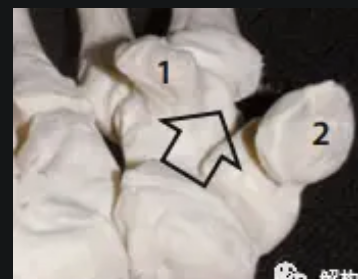

构成Guyon管的骨骼边界包括勾骨勾（上图1）与豌豆骨（上图2）。
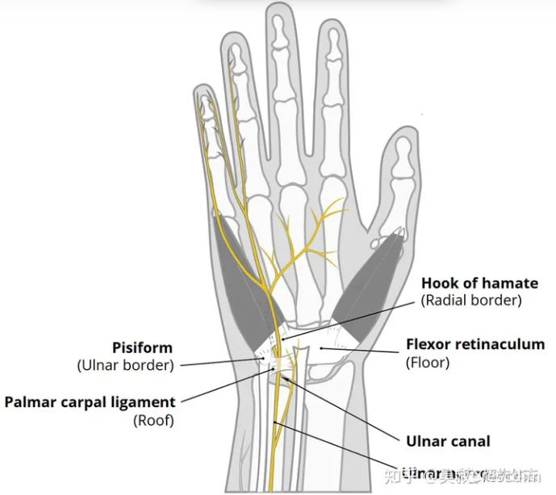

豆勾韧带、腕掌侧韧带、掌短肌以及尺侧腕屈肌肌腱则构成了其余的边界。
无论是外力的直接压迫，还是上述结构边界的增生，都可能引发Guyon管综合征。

## 臀

### 臀大肌

臀大肌解剖图

**起止点**：
臀大肌起自于髂骨、骶尾骨背面，止于臀肌粗隆与髂胫束。臀大肌并没有将臀部完全包住，臀大肌偏上侧是臀中肌。

**功能**：
臀大肌本是身上最有力的肌肉之一，最重要的功能就是带动大腿在髋关节处伸（骨盆后倾），与髂腰肌、股直肌等互为对抗肌。现代生活方式导致许多人的臀大肌废用无力，功能被其它肌肉取代。引起一系列体态和腰痛的问题。

### 臀中肌
**位置**：
臀中肌位于髋部外侧，呈扇形，起于髂骨的外侧面，止于股骨大转子。臀中肌部分被臀大肌覆盖，只有未被覆盖的前部能被直接触及。

**功能**：
由于臀中肌的面积较大，跨越了髋关节水平轴和垂直轴的前后，因此根据功能，可以将臀中肌分为前部和后部。前部纤维除了能使髋关节外展，同时也能进行屈曲和内旋；后部纤维则相反，可进行伸展和外旋。

### 臀小肌
功能与臀中肌类似
与梨状肌关系密切，可能导致假性坐骨神经痛

### 梨状肌
**功能**
1. 带动脊椎旋转
2. 协助髋袖肌群

## 大腿

### 股四头肌

股四头肌解剖图

起止点:

肱四头肌是大腿前侧强有力的羽状肌肉。顾名思义，股四头肌四个头。其中股直肌起自于髂前下棘，外侧头长在大腿外侧，内侧头长在大腿偏内侧，股中间肌被股直肌盖住了。共同包绕髌骨止于胫骨粗隆。

功能:

肱四头肌最重要的功能伸直膝关节，与膕绳肌、腓肠肌等互为对抗肌。其中股直肌连接在骨盆上，所以不仅可以做膝伸，还能协同髂腰肌等完成髋屈（骨盆前倾）的动作。在行走和奔跑时，股直肌向前拉股骨的同时前踢小腿，这是股直肌完美的功能写照。

股四头肌是身上唯一的膝关节伸直肌肉

### 大腿后群肌肉

大腿后群肌肉功能解剖图

起止点:

大腿后群肌肉主要是股二头肌和半腱半膜肌。我们常说的膕绳肌指的是半腱半膜肌和股二头肌的长头。这三块肌肉都起自于坐骨结节，止于小腿内外侧。股二头肌的短头起自于股骨后侧，止于腓骨头。

功能:

膕绳肌是双关节肌，可以协助臀大肌做髋伸（骨盆后倾），也可以协助腓肠肌做膝屈。在维持人体站立姿态也起重要作用，所以膕绳肌常被过度使用。股二头肌短头可以做膝关节屈，是稳定膝关节一块比较重要的肌肉。

为什么是直膝硬拉？因为在直膝状态下，膕绳肌的止点（小腿端）被拉长固定，此时膕绳肌在另一端（坐骨结节）牵拉骨盆就会更稳定，更好发力。

---

## 小腿

*小腿前侧肌肉*
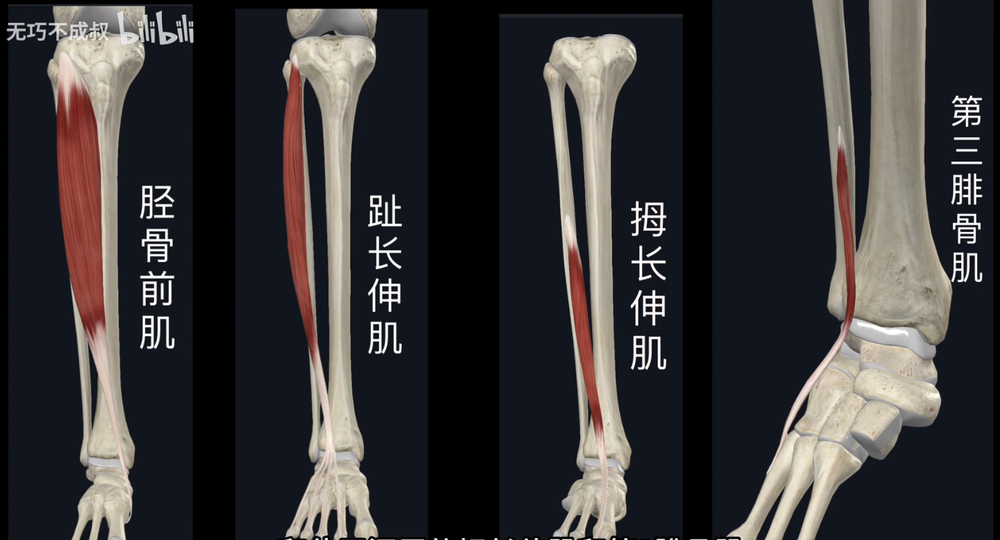
### 胫骨前肌

### 趾长伸肌

### 拇长伸肌

### 第三腓骨肌

*小腿外侧肌肉*
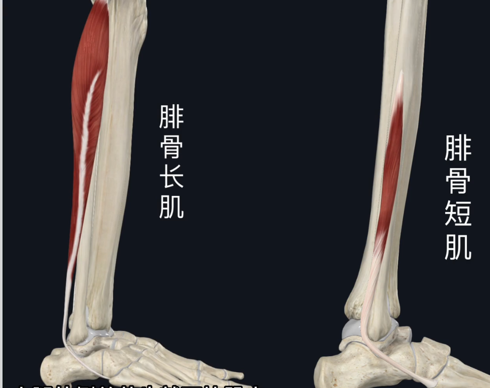
### 腓骨长肌

### 腓骨短肌

#### 腓骨肌
1. 腓骨长肌和短肌的主要功能是，收缩使足部跖屈（脚背向下蹬地）并将足部外翻。
2. 当我们日常站立和进行跑跳运动时，腓骨肌还起到稳定脚踝和足弓的作用。
3. 腓骨短肌是足部最主要最有力的外展肌，并行使踝关节的次级屈肌和外翻肌的功能（使足远离足中线）。
4. 腓骨肌腱能够在步态支撑相时稳定踝关节，当踝关节外侧稳定性下降时，腓骨肌腱负荷增加，当负荷大到一定程度时，会发生断裂或者向前脱出的情况。

*小腿后侧肌肉*
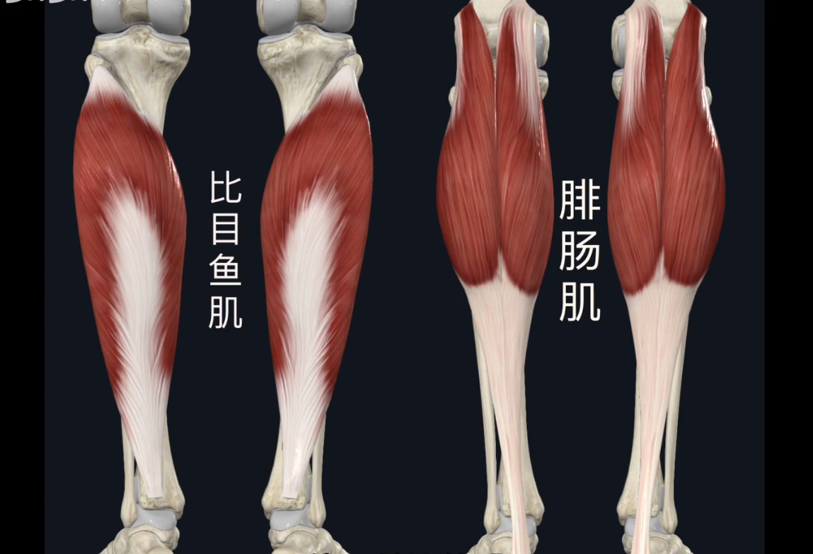
### 比目鱼肌

### 腓肠肌

### 胫骨后肌
位置：
小腿后侧深面

起点：
胫骨和腓骨后侧近端，骨间膜

止点：
足的跖面（第2~4跖骨和除距骨外的跗骨）

神经支配：
胫神经（L4~L5）

特别属性：
胫骨后肌属于羽状肌，其纤维呈倾斜排列，类似于羽毛的排列方式，这使得羽状肌相对于平行肌来说在给定的长度内可以包含更多的肌纤维，从而增加了肌肉的力量。 作者：运动与解剖 https://www.bilibili.com/read/cv26553905/ 出处：bilibili

主要功能：

主要的跖屈肌是腓肠肌和比目鱼肌，而胫骨后肌则是次要的跖屈肌。

不过胫骨后肌是强有力的足部旋后肌和内翻肌，在负重时可以支撑内侧纵弓，防止足弓塌陷。另外，在承重反应期胫骨后肌还可以控制和抵抗足的旋前。

# 运动与康复

## 前置知识

### 肌肉募集
**大小原则**：
较小的运动单位（低阈值运动单位（主要由Ⅰ型纤维组成））先被募集。接着，根据所需的力量来募集高阈值的运动单位（主要由Ⅱ型纤维组成）。
耐力训练也能引起高阈值运动单位的募集，*如长跑能额外募集Ⅰ型纤维组成的运动单位*
*即高重量能够募集更多的肌纤维，起到更好的锻炼效果*

### 肌肉长度-张力（力量）曲线与力量-速度曲线
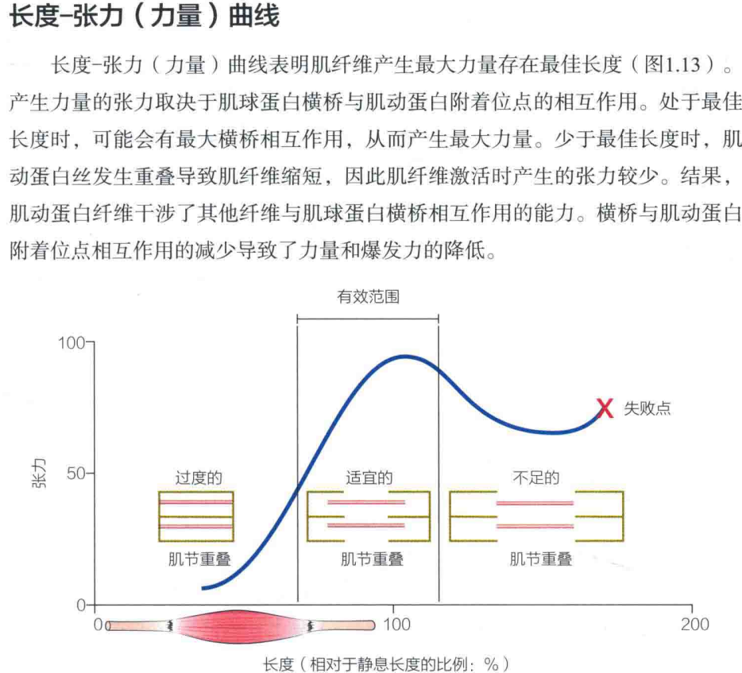
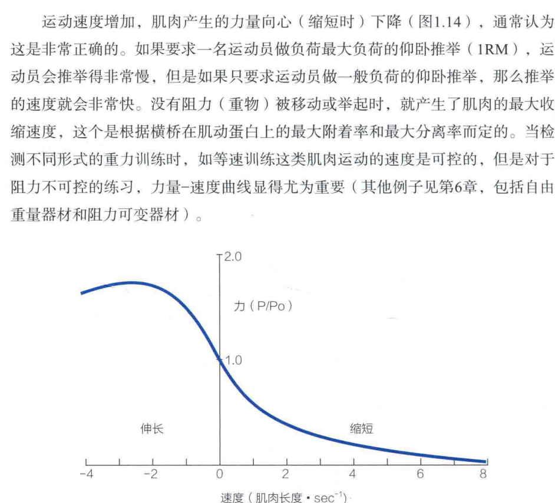
*是否是在适宜范围内的离心运动产生的肌肉力量最大，效果最好*

### 肌肉生长
**肌肥大（肌纤维增大）**目前认为是主要肌肉生长的因素：
1. 肌肉收到刺激
2. 能量和新蛋白生长的原材料

增生（肌纤维数量增加）

### 训练动作变量
- 单关节运动和多关节运动：
  多关节练习的好处在于激活的肌肉组织、激素反应以及新陈代谢都远高于单关节练习。
- 练习的先后：
  先练习要求高的练习。
  如先锻炼大块肌群，再练小块；
  先多关节运动；
  先进行弱侧练习，再进行优势侧练习。
  进行其他类型的练习前，先进行爆发力训练。
  全身运动环节交替进行推拉训练。
  全身运动环节交替进行上肢和下肢训练。
- 练习的强度
  重负荷低次数，增强力量；激活Ⅱ型纤维
  低负荷高次数，增强耐力；激活Ⅰ型纤维
- 练习的重复次数
  进行多组练习好于单组
- 休息间隙
  高强度训练需要至少3-5分钟休息

### 肌肉训练计划

#### 周期性训练

**线性周期**：
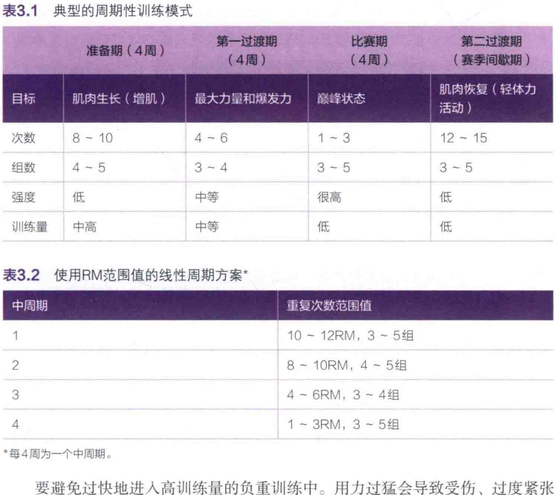

**非线性周期**：
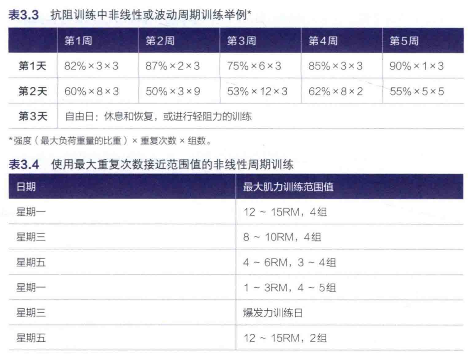

#### 其他力量训练方案
**循环训练**：
选择8-12个动作，每一个循环都进行这些动作，重复1-3次。
主要目的在于增强心血管耐力和所锻炼肌肉部位的耐力。

**单组训练**
**多组训练系统**
**超慢系统**
**金字塔形或三角形通路**
**超级组训练**

**离心训练**
研究表明，离心训练中即使使用向心训练最大负荷的120%，也无法产生更多的力量增长。

**功能性等长收缩**
利用特殊的关节角度在等长收缩中获得力量增长

### 体态问题的影响

#### 对骨骼
受到的压力和张力变化，骨骼与之相关联的关节无法发挥其最佳功能，且可能导致骨骼关节形变和相关肌肉的疼痛。
#### 对肌肉
**肌肉紧绷**
**肌肉缩短**：
结构性肌节数量减少、长度缩短，肌腱长度缩短，肌肉力量减弱。关节僵硬，可能降低关节活动范围
**肌肉拉长**（拉伸性肌无力）：
肌节长度增加，肌肉力量变弱。肌肉伸长，关节比较松弛，增加关节活动性
**问题发生**：
1. 任何一个人再长时间保持一种静止体态是，肌肉变得紧绷，甚至引起疼痛。久而久之，这些部位的肌肉可能产生扳机点
2. 肌肉适应这种异常后，问题会逐步扩大，更快疲劳，受影响位置也会更远

#### 对关节
受到的压力增大，。。。带来疼痛

#### 对韧带
韧带拉长
1. 关节不稳定
2. 对神经末梢的机能产生影响
3. 增加韧带撕裂的风险

#### 对其他软组织
造成过度压力张力，对软组织的机能造成不良影响

### 体态矫正注意事项
1. 患者存在灵活性过高问题。重点应当为说短组织
2. 患者体态问题是由于肌肉张力过高引起时。可能是因为某些潜在因素（脑瘫、中风有关的肘屈肌痉挛），或因为药物治疗的后果，此时试图通过降低肌肉张力来解决问题往往是徒劳的。
3. 患者体态问题是由于肌肉无力时。可能是因为某些潜在因素

### 体态矫正步骤
1. 确定成因
2. 增加活动过低关节的活动范围：拉伸、牵引、按摩、肌筋膜扳机点灭活、肌筋膜释放和复位等技术，拉长该关节缩短的软组织
3. 减少活动过高关节的活动范围：锻炼，利用肌效贴和支具
4. 维持正常关节位置
5. 动作再学习

### 肌腱的恢复
30s的高强度等长收缩的效果最好

### other
**延迟性肌肉酸痛**：
（锻炼完后往往在第二天感受到肌肉的酸痛）
1. [原因是锻炼导致的肌梭内的神经受到微损伤]https://www.bilibili.com/video/BV1WL4y1L7Rb/?spm_id_from=333.1007.top_right_bar_window_custom_collection.content.click&vd_source=15c229538881316b8c6a43f997de056f

## 具体问题

### 颞下颌关节紊乱症
[video,改善方法](https://www.bilibili.com/video/BV1AJ411w7gm/?spm_id_from=333.1007.top_right_bar_window_custom_collection.content.click&vd_source=15c229538881316b8c6a43f997de056f)

1. 下巴后倾：5~7次，一次5~10秒，深吸气，呼气的同时下巴往后倾，如果不会可以想象如何双下巴
2. 拇指按下巴：4次，一次张开4秒，闭上再张开4秒，大拇指抵住下巴张合，要感觉到下巴在跟你的大拇指较劲
3. 虎口立耳朵：15~16次（双向），虎口贴在耳后（耳下）的骨头上，摇摆头部，要注意要感觉到你的手在支撑你的头（脖子不用力，手拖住头）
4. 舌头乱甩：3~4组，每组三个动作，每个动作3~4秒，先抵住喉咙，再左颊，再右，重复，要注意嘴巴是张宽！不是张大，舌头要用力（视频里说锻炼舌头很有必要所以不要怕酸）
5. 下巴微动：14次（双向），张最长嘴巴，下巴微微左右移动，到累即可
6. 手指按摩：先揉揉，接着12次，双手握拳找到疼痛的地方，张嘴到痛的大小，双手锁住头，感受疼痛（突然想起我的疼痛在你之上.jpg）
7. 血盆大口：23~25秒，张最大嘴（最长最宽），把牙齿抵住下牙顶点，（视频说这个对下巴好，即使没有这个病也可以做这个动作）
8. 脖子按摩：双手共1分钟左右，在脖子后面找到能让你爽的地方（有点像给猫挠下巴猫的那种感觉）
9. 血盆大口：重复，注意要选一个舒服一点的姿势，做完这个动作可以试试说点话，看看自己的嗓音是不是更性感了（啊这）
10. 手指按摩
11. 血盆大口
12. 放松训练：90秒~2分钟，舌头顶住上牙顶部，嘴巴微张，肌肉放松，脑子里想着（我的肌肉放松了）之类催眠的话，放松你的整个身体的肌肉，注意深呼吸，这是一个放松的姿势，舌头不用太用力，关键在于大脑要让你的肌肉放松

### [Guyon管](#guyon管)综合征（尺管综合征）

**症状**:Guyon管综合征最主要的症状就是手掌外侧刺痛或麻木，涉及区域从小鱼际下至小指和无名指尺侧的一半。急性损伤也可能出现轻度肿胀或淤血等。
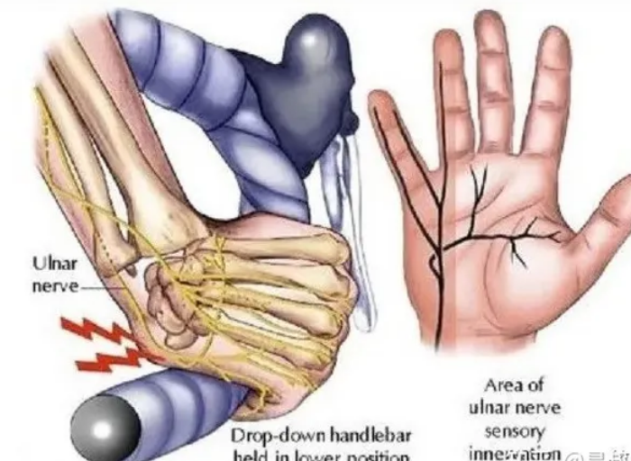

**原因**：
- 手掌手腕承力时出现或加剧，比如做卧推时，或俯卧撑等需要手部支撑的动作中，都可能诱发Guyon管综合征。因为从Guyon管穿过的尺神经和尺动脉因为手掌受力过大或时间过长，受到了力学压迫。
- 豆勾韧带、腕掌侧韧带、掌短肌以及尺侧腕屈肌肌腱等结构边界的增生

**措施**：
- 首先，也是最关键的一点，就是要避免外力刺激，可通过暂停训练（至少一周）和佩戴护具（可用健身手套代替）。此外，也不要大力按揉或者过度拉伸腕部。
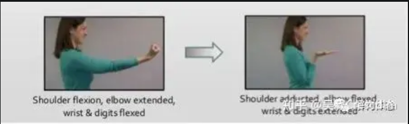

- 尺神经滑动对改善症状也有一定帮助。首先屈腕屈指，肘关节伸直，然后缓慢弯曲肘关节的同时伸直手指且伸展腕关节（上图）。动作应缓慢轻柔，做3组，每组10次。
- 症状消退一段时期后，加入握力练习，训练小鱼际肌群，增加肌肉对外力的缓冲作用。可先从抓球开始，进阶到握力器（尽量选取带有橡胶或海绵缓冲的）。
- 除此之外，摆位放松、尺侧腕屈肌的神经肌肉技术以及腕骨手法调整也属于行之有效的局部治疗，建议由专业人士操作。

**补充**：
尺神经卡压除了手腕外，还有一个很重要的部位，就是**手肘鹰嘴窝**。这个位置除了卡压，也常见尺神经半脱位和完全脱位等原因，都会造成尺神经的损伤。导致下三指与小鱼际的麻木，严重肌肉萎缩，形成鸡爪手。
除了手术治疗外，保守治疗一般口服甲钴胺，维生素B1等。慢慢静养，避免运动。

### 颈椎过度前凸
**症状**：
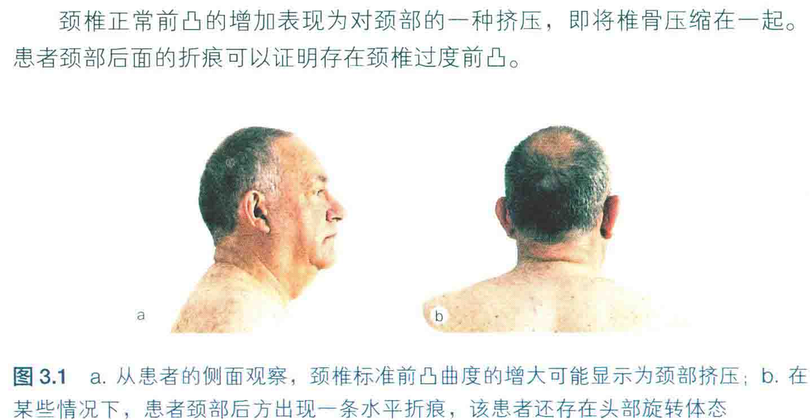

这种体态下，颈部后面的软组织压缩变短，而前面的组织被拉长。椎间盘后侧比前侧承受更大的压力，并且造成小关节的移位。前、后纵韧带都会受到影响：后纵韧带被缩短，前纵韧带被拉长。后纵韧带可限制颈部过度屈曲并且保护行经颈椎骨松质内的动脉、静脉以及淋巴管。颈椎屈曲时，后纵韧带张力增加，将营养液泵入骨松质并帮助骨骼抵抗负荷。颈椎前凸姿势使后纵韧带持续受压可能会影响这些骨骼的血管分布吗？前纵韧带通常限制颈部伸展。在头颈部运动时，这些韧带一起施加微小的压力作用于椎骨来稳定头颈部的运动。理论上，拉长这种张拉结构中的一方或缩短另一方，都会对其功能产生不良后果。同时，颈椎过度前凸会导致颈深屈肌的肌肉力量下降。在颈部疼痛的患者中经常观察到颈椎体态不良，当他们做头颈部屈曲时，常表现为颈浅屈肌的活动增加，而颈深屈肌的活动减少。

**肌肉状态**
缩短的肌肉：
颈后部浅表肌中的斜方肌上束、肩胛提肌，深层肌中的半棘肌、头半棘肌、颈夹肌、头夹肌。
拉长的肌肉：
颈前部浅表肌中的胸锁乳突肌、斜角肌，深层肌中的头长肌，颈长肌。

### 颈椎侧屈
**原因**
引起颈椎侧屈的原因有多种，可能由长期的职业或日常体态引起的：也有可能是由腿部长度差异或脊柱侧弯引起的，其中脊柱侧弯的患者由于胸椎弯曲和颈椎弯曲的方向相反，造成颈椎侧屈。

**后果**
颈椎侧屈时，头部侧向弯曲一侧的软组织被压缩，同时颈部相对侧的软组织被拉长。相比不弯曲的一侧，椎间盘和小关节在头部弯曲的一侧被过度挤压。随着时间的推移，长时间挤压颈部一侧的小关节对这些关节的功能带来不利影响。双眼不再平行于地平线，因此应该会影响视力。颈部和肩部的软组织受到同样的影响，这样的体态很可能对肩部功能也产生不利的影响。

**相关肌肉**
后侧的肩胛提肌、斜方肌上束，前侧的斜角肌、胸锁乳突肌

### 头前伸
**表现**
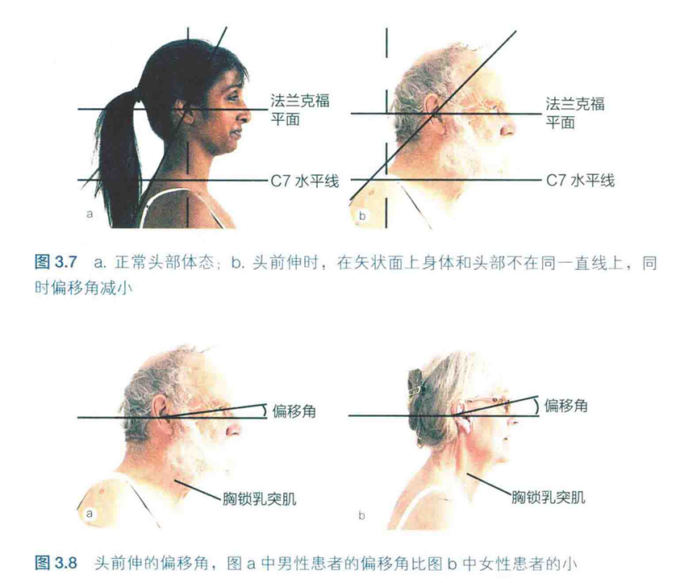
**后果**
格里默和特洛特发现，只有在上颈椎偏移较大的角度时，才会出现颈深部短屈肌的减弱。当头颈部进一步前伸时，可使头部后伸并增加偏移角度。这种体态会拉伸局部的深屈肌，并使得它们肌力下降。
图3.8b中的女性患者比图3.8a中的男性患者的偏移角度更大，因
此这个女性患者的颈部深层屈肌的肌力更低。这可以通过胸锁乳突肌
(SCM)的肥大来验证，可以在照片中观察到这个女性患者的右侧胸
锁乳突肌肥大。深颈屈肌的减弱是个重要提示，因为这些肌肉有助于
维持颈部的稳定性并提供本体感觉。不仅是颈长肌，颈部所含的肌肉
对颈部的本体感觉均有重要意义。在说话、咳嗽和吞咽期间，这些肌
肉可以稳定颈部。颈长肌减弱的后果，是在说话、咳嗽和吞咽期间屈
曲颈部的能力降低，特别是在对抗重力时（如抬起头）降低颈部的稳
定性。有推测，这对咀嚼肌也会有一定的影响，并可能导致颞下颌关
节出现问题。
头前伸产生的其他后果还有斜角肌出现肥大和痉挛，压迫C5至
T1脊神经根的腹侧神经、锁骨下动脉和静脉，因为这些结构在上斜角
肌和中斜角肌之间以及第1肋上方。这种压迫引起的疼痛和功能障碍，
被称为胸廓出口综合征。颈部屈曲时，两侧的胸锁乳突肌能增强颈椎
的稳定性。当有头前伸以及颈长肌的减弱，胸锁乳突肌就不能稳定颈部，
反而双侧胸锁乳突肌外展（不是屈曲）导致颈部拉伸和脊柱前凸曲度
增加。
患者的头夹肌和斜方肌的张力增强(Nohetal.,2013),可能引起
颈部疼痛和肩部疼痛。
最后，由于前伸的头部会影响颈部的肌肉，而这些肌肉有助于提供
本体感觉，因此头前伸对平衡可能有负面影响。

**肌肉状态**
缩短的肌肉：
颈前部的头长肌、颈长肌、舌骨上肌群，颈后部的枕下肌。
拉长的肌肉：
颈前部的舌骨下肌群，颈后部的肩胛提肌。
*这些缩短肌与上部颈椎无关：上部颈椎的偏移引起颈深肌拉长*

### 头颈部旋转
**原因**
部分胸椎旋转、锁骨的移位、肩胛骨外展的伴随症状

**肌肉**
相关肌肉有胸锁乳突肌、斜角肌、肩胛提肌、头夹肌、颈夹肌

### 驼背
**介绍**
当患者胸椎向后弯曲，程度超过了正常的生理
曲度，我们把这个症状定义为驼背。从患者体侧观
察，很容易看出驼背的体态特征。该体态常伴有颈
胸结合部的脂肪堆积，原因可能是由于身体为调节
驼背而做出的反应，以及相关肌肉不平衡的结果。
人体衰老是导致驼背的主要原因之一，驼背多发于
老年人。五十岁以后，驼背的发病率会急剧上升
(0'Gorman et al..,1987)。医学上将胸椎向后弯
曲角度大于40度的案例称为驼背。驼背会造成后背
疼痛、脊柱活动受限、功能受限、呼吸系统的减弱
和骨质疏松性骨折(Greendale et al.,2009)。
研究证实，头部的位置和驼背的发生有很大的
关系，头部越向前伸，从第七颈椎到第六胸椎弯曲
的角度就越大(Raine et al.,1994)。长时间保持
静止体态，如久坐、开车，或工作中需要经常头部
前伸的人群，患驼背的概率较大。

**后果**
驼背患者的颈前纵韧带收缩，颈后纵韧带拉长，颈椎间盘前部受压。
换而言之，身体前部的肌肉和软组织（胸肌和腹肌）收缩变短；身体后
部的肌肉和软组织（脊髓伸肌和斜方肌中束、下束）则拉伸变长。驼背
可显著增加第五腰椎至第一脊椎椎间盘的负荷，很可能导致腰椎间盘病
变，以至于第五腰椎至第一脊椎可能出现滑脱，即便手术治疗也不能达
到理想的治疗效果。驼背使胸椎伸肌过度疲劳，
导致肌肉疲劳，以及后背疼痛。驼背还会影响肩膀的活动功能。例如，
重度驼背的老年患者通常也无法抬高手臂。

**肌肉**
缩短的肌肉：
胸大肌、胸小肌、腹直肌
拉长的肌肉：
斜方肌中束和下束、胸髂肋肌

### 平背
**介绍**
腰椎变平直，生理弧度消失。

### 胸廓旋转
**肌肉**
相关肌肉：深层胸椎旋转肌、腹内斜肌、腹外斜肌、腰大肌、竖脊肌腰段、使颈部旋转的肌肉

### 腰椎前凸过度、腰椎前凸减少
**肌肉**
过度
缩短肌：竖脊肌腰段肌群、腰大肌
拉长肌：腹肌、腘绳肌、臀大肌

减少
缩短肌：下腹肌、臀大肌、腘绳肌
拉长肌：竖脊肌腰段、髋屈肌

### 脊柱侧凸
- 非结构性脊柱侧凸。也称作功能性脊柱侧凸。没有发生结构性改变，韧带和肌肉也不会受到病理性影响。病因包括腿长不一致，视力或听力受损，炎症和肌肉痉挛。当患者进行**亚当测试**时，非结构性脊柱侧凸会消失，也可能被患者自行矫正。可能发展为结构性脊柱侧凸。
- 暂时型结构性脊柱侧凸
- 结构性脊柱侧凸
- 特发性脊柱侧凸。没有已知病因。约80%的结构性脊柱侧凸病例属于这一范畴
- 先天性脊柱侧凸
- 后天性脊柱侧凸
- 神经肌肉型脊柱侧凸

**后果**
疼痛是这种不良体态的主要症状之一。椎管出口处的脊椎神经被压迫。
内脏器官发生移位，理论上会导致内脏功能受损。临床上还出现过肌肉不
平衡，肌肉疲劳以及颈椎强直等症状。脊柱侧凸患者还可能因胸腔不对称
而发生呼吸浅短。椎间盘和小关节可能发生无症状的退变。此外，脊柱支
撑体重的能力降低，这会损害身体的正常功能。由于躯干侧移，人体平衡
也可能会出现问题。很多脊柱侧凸患者会担忧自身的形象，自尊心受到伤
害(National Scoliosis Foundation,2014)。韦恩斯坦及其同事认为，多
年来，相关研究始终保持一种观点：脊柱侧凸会导致重度残疾和心肺功能
的退化，且患者死亡率高于一般人群。然而，一项50年追踪调查的结果
并不支持脊柱侧凸可能导致肺功能退化和心脏病风险的推测

**肌肉**
缩短的肌肉：
颈部的右侧斜角肌、斜方肌上束、肩胛提肌、颈竖脊肌，胸部的左侧肋间肌、竖脊肌腰段、腹肌，腰部的右侧腰方肌、竖脊肌腰段
拉长的肌肉：
方向相反

### 骨盆前倾
**肌肉**
缩短的肌肉：
竖脊肌腰段、腰大肌，股直肌、髂肌、阔筋膜张肌、缝匠肌
拉长的肌肉：
腹直肌，臀大肌、腘绳肌
### 骨盆后倾

### 骨盆旋转

### 骨盆侧倾

### 髋部内旋

### 膝超神
**肌肉**
缩短的肌肉：
股四头肌、比目鱼肌
拉长的肌肉：
半腱肌、半膜肌、股二头肌，腘肌，腓肠肌

### 膝关节屈曲
**肌肉**
缩短的肌肉：
半腱肌、半膜肌、股二头肌，腘肌
拉长的肌肉：股四头肌，比目鱼肌

### 膝内翻

**介绍**
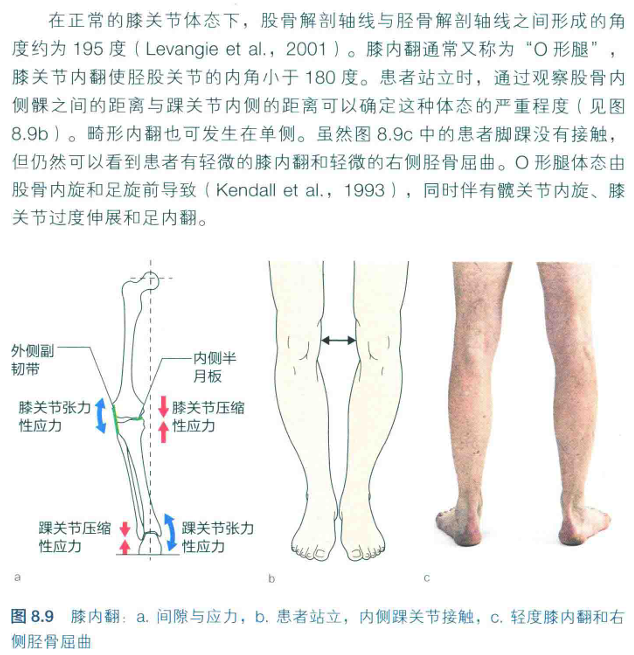
**肌肉**
缩短的肌肉：
股四头肌、髋内旋肌、股薄肌、半腱肌和半膜肌，腓骨肌
拉长的肌肉：髋外旋肌、股二头肌，腘肌、胫骨后肌、趾长屈肌

### 膝外翻
**介绍**
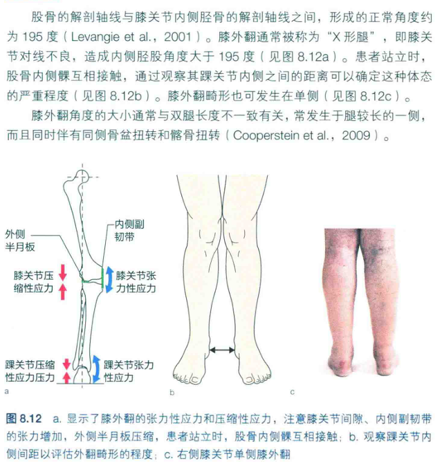
**肌肉**
缩短的肌肉：
股二头肌、阔筋膜张肌、髋内收肌，腓骨肌
拉长的肌肉：
股薄肌、半膜肌和半腱肌、缝匠肌

### 胫骨扭转

### 平跖足

### 高足弓

### 足外翻
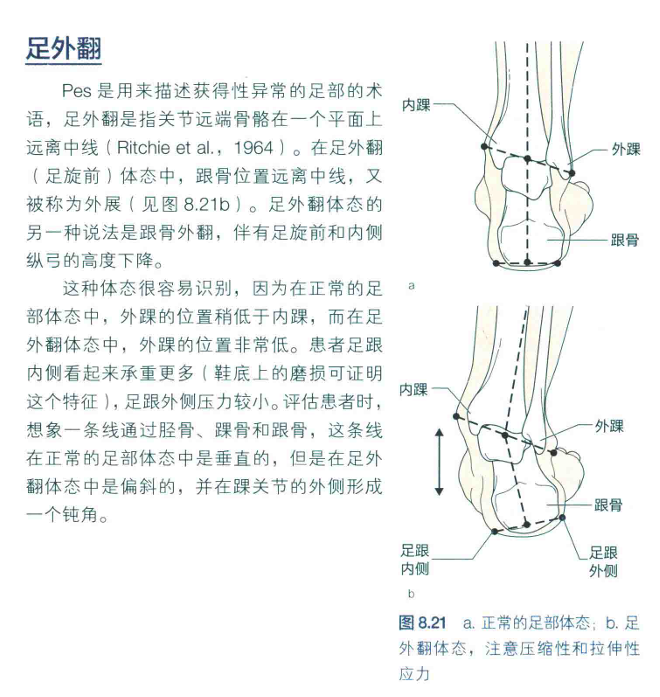

**肌肉**
缩短的肌肉：
腓骨肌、腓肠肌、比目鱼肌，股二头肌、髋内收肌、阔筋膜张肌
拉长的肌肉：
胫骨后肌、拇指内收肌、拇指长屈肌、趾长屈肌，臀大肌、臀中肌

### 足内翻
**肌肉**
缩短的肌肉：
拇指长屈肌、趾长屈肌、胫骨前肌
拉长的肌肉：
腓骨肌、趾长伸肌、拇指长伸肌
### 肩胛骨前伸

### 肱骨内旋

### 翼状肩胛骨

### 高低肩

### 肘部屈曲

### 肘部过伸

### 臀部疼痛
#### 骶髂关节疼痛
**原因**：
1. 长期久坐导致的骶骨和髂骨关系紊乱的结果，导致了周边的高张力以及代谢循环的障碍。

**措施**：
- 松动骶髂关节。如，扶助支撑物，站姿前后甩腿。
- 调整髂骨前侧张力。如，疼痛腿前伸，微勾脚尖，弯腰下压，感受腿部后侧拉伸。
- 调整髂骨后侧张力。 如，上下抬腿。
#### 坐骨神经痛
#### 梨状肌综合征
**原因**
1. 骶髂关节不稳定，髋袖肌群失能，导致梨状肌紧绷，压迫神经
2. 日常不正确久坐，腿部固定上身旋转

**症状**
1. 压迫坐骨神经。
  - 疼痛部位在腿后部，小腿肚，脚跟……
  - 出现麻木，刺痛，灼烧
2. 卡压会阴神经，臀部神经（骨盆神经血管）。
  - 导致阳痿腹股沟，生殖器或者肛门区的疼痛
  - 臀肌萎缩，一侧或两侧臀部变小
3. 梨状肌本身触发点的疼痛

#### 髂胫束综合症
**症状**
1. 长距离跑步之后膝关节外侧疼痛，尤其最突出处的局部疼痛，以刺痛为主，位置明确，休息后缓解，有时候下坡跑疼痛明显。
2. 部分运动员因为炎症严重可以表现为膝外侧广泛的疼痛，甚至会出现在休息时。

**原因**
1. 臀中肌等外展肌薄弱
2. 不良运动习惯（喜欢沿着马路同侧跑、不足够的热身、运动过度、不合适的跑鞋等）

### 髋关节弹响
**原因**：
1. 长期久坐导致髂腰肌紧张，拉动股骨向内侧移动，导致运动时的摩擦弹响
2. 髋外展肌（和髂腰肌对抗的肌群）薄弱
3. 关节不稳定
  - 腰椎
  - 髋臼窝

### 股骨前移
[video](https://www.bilibili.com/video/BV1B44y1b76C/?spm_id_from=333.1007.top_right_bar_window_custom_collection.content.click&vd_source=15c229538881316b8c6a43f997de056f)
**原因**
1. 髋关节后囊处的肌肉（臀大肌，深层髋外旋肌群）僵硬
2. 引导髋关节实现共轴运动的肌肉（髂腰肌，臀大肌的深层纤维）配合程度不好

### 膝盖内侧疼痛

**三类及其恢复方式**

1. - **韧带因素——内侧副韧带损伤**
   
   - 这一种损伤往往是发生在X型腿，扁平足的患者中。原因是由于距下关节旋前导致胫骨内旋（相对股骨外旋），股骨内旋的情况，这时候，外侧半月板被挤压，内侧副韧带被拉长,走路时间久后则会出现膝关节内侧的疼痛。如果患者X型腿表现出外侧膝关节的疼痛，则可能是由于外侧半月板的磨损造成了周围结构的代偿而引起的（当然X型腿会造成髌骨的外上方移位）。我们在帮这类患者做下肢检查时，往往发现患者出现旋前综合征，即走路时出现功能性扁平足的动作；又或者患者足部形态的内侧纵弓和横弓塌陷。
   
   - **处理意见**：该类患者往往会主诉走路久后，膝关节内侧区域发生疼痛，局部内侧副韧带区域压痛明显。当我们给他治疗时，每次治疗都会有效，但是往往持续时间不久，根本原因是因为足弓没有矫正导致的内侧副韧带长期损伤。我们可以通过矫形鞋垫或足底运动感知觉的恢复足弓训练得到测试或解决。

2. - **肌肉引起的，比如说内侧的鹅足肌肉损伤**
   
   - 鹅足肌肉损伤多发生在老年人O型腿的患者中，该类患者主诉内侧鹅足区域疼痛，走久后疼痛加重，疼痛区域压痛明显。具体损伤原因见上图。所以如果该患者存在着鹅足肌肉的损伤，不应该只单纯的处理局部，还要分析其局部肌动学的变化，比如臀大肌、臀中肌过度紧张造成了股骨的外旋。
   
   - 内收肌作为一个的维持骨盆稳定和股骨位置的肌肉，其损伤在临床上更为多见。我们常见到一些比较胖的人站立时双腿明显分开，这提示着患者躯干稳定性不足，利用降低重心来增加躯干的稳定。强化内收肌可有效增加患者的稳定性。由于平时很难触碰而又长期使用去维持稳定，内收肌损伤也常常被忽略。该类患者疼痛往往也是膝盖内侧疼痛，但是往往跟骨盆位置也有关系，被动髋关节外旋和内收肌长度测试会显现出阳性体征。
   
   - 腘肌损伤也会导致膝关节疼痛，不仅仅是膝关节内侧疼痛，外侧疼痛更为多见。腘肌本身连接在内侧半月板和外侧半月板上，因此其损伤会导致膝关节内外侧疼痛。这一点大家也需要注意。
   
   - **处理意见**：上述损伤原因均需要从下肢生物力学里去思考，不能单独的处理膝关节内侧，足弓、踝关节和髋关节、骨盆的处理同样十分重要。

3. - **支配膝关节内侧区域的神经：闭孔神经损伤**
   
   - 闭孔神经属于腰丛神经，是L2\3\4神经根前支组成，其从腰大肌内侧缘穿出，伴随动脉沿小骨盆侧壁向前下方下行，支配大腿内收肌（大收肌、长收肌、短收肌、耻骨肌和股薄肌）以及皮肤区域，如下图。
     
     
     
     所以很多膝关节内侧疼痛的真正原因是闭孔神经在穿行区域被卡压所引起，这种膝关节疼痛往往持续存在，不负重时症状减轻，但是处理周围肌肉往往没有特别好的效果。卡压的区域主要在闭孔外肌和闭孔内肌区域。所以对闭孔的处理就至关重要了。
     
     俯卧位，触诊到患者坐骨结节，手指向外沿着骨面滑动，触诊到的就是闭孔外肌；向内沿着骨面滑动，触诊到的就是闭孔内肌。这个区域的处理对处理膝关节内侧疼痛有着非常重要的作用，很多时候我们会忽略了这个区域，但是因为它是闭孔神经的出口，所以它的处理往往也会收到意想不到的效果。

https://zhuanlan.zhihu.com/p/37727247#:~:text=%E5%8E%9F%E5%9B%A0%E6%98%AF%E7%94%B1%E4%BA%8E%E8%B7%9D%E4%B8%8B%E5%85%B3,%E5%85%B3%E8%8A%82%E5%86%85%E4%BE%A7%E7%9A%84%E7%96%BC%E7%97%9B%E3%80%82

---

### 膝外翻（膝内扣）

**原因**

- **踝关节灵活性较差**：例子，在做深蹲时，下蹲过程中需要胫骨前移，即踝关节做背屈的动作，如果踝关节灵活性差，胫骨前移受限，胫骨就会内移代替前移的动作已获得足够的下蹲幅度，这就是**人体的动作补偿机制**，膝外翻内移就随之发生了。

- **髋关节周围肌力失衡**：如你的髋外展肌群薄弱的话，可能同时伴随内收肌群过度活跃，或者你的腘绳肌薄弱，而股四头肌过强，这些原因都会导致股骨发生内外偏移和旋转，引发膝外翻。

- **动作学习与控制问题**：对缺乏运动经验的人群而言，出现膝外翻可能是神经肌肉控制不足，动作模式不稳定所致。比如足底位置的感知、重心的控制，甚至运动时自信心不足都有可能会造成膝关节内移外翻。

- **解剖结构的影响**：每个人由于身体结构原因（例如：骨盆较宽、Q角过大、股骨较长、扁平足等骨性结构问题）可能会改变运动时的轨迹和难度，他们会更容易出现膝外翻。这就需要我们在训练过程中，合理的选择训练动作和运动负荷，避免出现膝外翻导致损伤。

// 2024.05.08 [video,含改善动作](https://www.bilibili.com/video/BV1tC4y1d7fe/?spm_id_from=333.1007.top_right_bar_window_custom_collection.content.click&vd_source=15c229538881316b8c6a43f997de056f)
- 骨盆内旋能力不足，通过大腿内收来代偿。 此时应当增强臀中肌前部（加强骨盆内旋能力），而非用弹力带侧向移动增强臀中肌后部（增强骨盆外旋能力）。
---

### 肱骨前移

**原因**

- **后关节囊短缩**：为了保持关节的共轴位置，关节囊必须具有适当的伸展性。如果后关节囊短缩，不允许肱骨头向后移动，将导致肱骨头在肩关节伸展期间的向前移位。

- **外旋肌短缩**：由于肱骨头必须保持在关节窝内。外旋肌，如冈下肌、小圆肌或三角肌后束的短缩及僵硬，会导致类似于后关节囊短缩的运动轴的移位。

- **肌肉不平衡**：肩胛下肌功能是将肱骨头拉回关节窝中。一旦肩胛下肌薄弱或被抑制，作为与肩胛下肌有相同内旋功能的背阔肌和大圆肌就会起主导作用，它们将共同拉动肱骨头向前移动。

- **不正确的训练模式**：我们常在健身时被指导“下沉肩胛骨”或“后缩肩胛骨”，这样是为了更好的“稳定”肩胛骨，但这并不是关节的动态稳定，他会使得肩胛骨失去应有的灵活，导致相邻的代偿性运动增加，而为了更好地承担负荷，肩关节只能将肱骨头向前移动。

**矫正方式**

- 恢复胸椎活动度，松解肩部后侧肌肉

- 激活核心和前锯肌

- 强化肩内旋肌群（背阔肌，肩胛下肌，大圆肌），有助于将肱骨往回拉

- 建立正确的肩伸方式

### 腓骨肌腱炎
**症状**
1. 腓骨肌腱炎的典型特征为沿着踝关节外表面的疼痛随着活动而恶化，特别是在运动后疼痛会加剧，但随着休息疼痛可以改善;
2. 一些急性期患者会在外踝后下侧处触及肿胀或疼痛,当主动足外展或做跖屈动作时，疼痛加重和会产生无力感;
3. 在倾斜的地形上行走时，疼痛会使脚向外倾斜；趾屈内翻足时会产生疼痛。

**原因**
1. 运动引起：跑步或打网球等运动易造成的的外翻性损伤是诱发急性腓骨肌腱炎的因素。如在不平坦或光滑的地面上跑步或涉及到快速变向运动如足球、篮球和网球等，踝关节外侧负荷增加，或者脚没有以正确的方式着地，容易导致本病。
2. 过度使用：这是腓骨肌腱炎的最常见原因。
3. 尤其当突然提高运动量，也就是我们文章开头提及的原因，如果穿着不合适的鞋子和高足弓，患病可能性就更大。
4. 受伤：大多数踝关节扭伤是由于脚踝向内翻转而发生的。其中一个原因是腓骨肌及其肌腱不像踝内侧的肌肉那么强壮。如果脚踝受伤或反复扭伤，导致足部的韧带脆弱和关节整体不稳定，会给腓肌腱带来更大的压力。
5. 肌肉不平衡：小腿肌肉一直处于紧绷状态，平时运动后不注意放松，或者小腿肌肉无力腓骨肌必须承担更高的负荷以维持着地后的稳定，此时肌腱受力增加，容易导致腓骨肌腱炎。

## 经验
### 臀部疼痛 2024/4/2x
跑完步，压腿。第二天。腰部在弯腰时酸胀.
简单处理后，左侧恢复，右侧臀部有卡压感。臀部后侧弯腰疼痛，活动度受限......
2024/5/31：先松解臀部，再恢复骨盆水平，然后锻炼梨状肌，明显好转

---

# 训练动作

## 90/90侧卧骨盆剪切训练

训练侧在上

## YTWL

[Video](https://www.bilibili.com/video/BV16W4y1e7vj/?spm_id_from=333.1007.top_right_bar_window_custom_collection.content.click&vd_source=15c229538881316b8c6a43f997de056f)
**总纲**
- 先收肩胛，再动手臂
- 骨盆后倾（下背变平，肚皮离开地面）
- 不能过度耸肩
- 追求动作完美，而非力竭
### Y
后倾、上旋肩胛，激活下斜方

### T
中斜方肌，三角肌后束以及肩袖

### W
肩外旋，肩胛内收

### L
肩外旋肌群
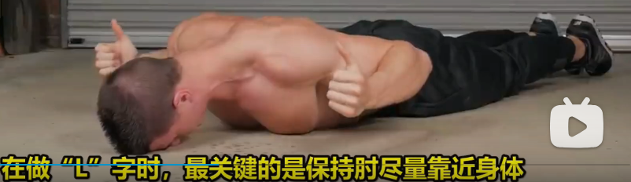

## 额
1. 学会腹式呼吸 10sets*15s
2. 波比跳练习 10sets*5rps
3. 拱桥式拉伸 N/A
4. 俯卧撑 3*30
5. 仰卧式自行车蹬 3*30
6. 引体向上 4*12
7. 贴墙式伸展运动 3*15

## 悬垂举腿（悬垂举骨盆）
1. 骨盆后倾位
2. 大腿外旋。减少股直肌代偿，增加内收肌做功。
3. 在大腿水平为开始，做向上收缩一小段。此位置腹直肌效率最高。

## 熊爬
先感受核心稳定，再做动作
1. 静态支撑
2. 单手摸肩
3. 伸髋模式
4. 抬手负重抗阻
5. 弹力圈伸髋
6. 单手单脚
7. 侧向爬行
8. 前后爬行
[video](https://www.douyin.com/?recommend=1)

# 训练方式

## 肩袖肌群
**动作**
- 墙壁天使 6次x3
- 侧躺手臂小幅度外旋 多次小重量
- 躺着手臂呈L（外旋）状用最大力量与地面对抗 30s
- 躺着手臂呈L（内旋，无法直接90°，肱骨会上翘，需要用物品减少行程）状用最大力量与地面对抗 30s

## 前锯肌
**动作**
- 躺卧，手臂向天花板前伸，感受前锯肌发力，可用弹力带负重。
- 跪姿，单侧手臂下压，前移到最远处，翻腕上抬
- 站姿，弹力带缠住小臂贴墙，手掌外翻，上下移动手臂。20次x3

## 肱二头肌
**动作**
- 锤式弯举
- 躺着的肱二头弯举
  - 下放时收缩肱三头肌
  - 力竭时让哑铃滑至指尖举起（增加力矩，突破极限）
- 21响
[video](https://www.douyin.com/user/MS4wLjABAAAAj72V0SzSL8EIow2mbrngYJXThZwMWiJU8YPRBbXfuAWn7MZ7MVqmmOs74IInvSyA?modal_id=7164605321321680158&showTab=post&vid=7194083757744327973)
## 胸椎
**松解方法**：

[video](https://www.douyin.com/user/self?modal_id=7194083757744327973&showTab=favorite_collection)

## 肩胛
**前置条件**
1. 恢复胸椎灵活性

**动作**：[video](https://www.douyin.com/user/MS4wLjABAAAAj72V0SzSL8EIow2mbrngYJXThZwMWiJU8YPRBbXfuAWn7MZ7MVqmmOs74IInvSyA?modal_id=7160110636351900964&vid=7194083757744327973)

## 臀部
**动作**
- 杠铃臀冲
- 单腿哑铃臀冲
- 保加利亚箭步蹲
- 深蹲

## 臀中肌
**动作**
对于前部，可以用分腿罗马尼亚硬拉，[90/90侧卧骨盆剪切训练](#9090侧卧骨盆剪切训练)
对于后部，可以用保加利亚深蹲，蚌式开合，弹力带侧向移动

## 脚踝
[video](https://www.douyin.com/user/MS4wLjABAAAAj72V0SzSL8EIow2mbrngYJXThZwMWiJU8YPRBbXfuAWn7MZ7MVqmmOs74IInvSyA?modal_id=7164605321321680158&showTab=post&vid=7194083757744327973)

# 功能性训练

## 功能力量评估

### 上肢功能力量评估
1. 引体向上 10次 10公斤 20公斤
2. 仰卧悬垂引体
3. 俯卧撑 10次 5公斤 10公斤

### 下肢功能力量评估
1. 后脚抬高分腿蹬 最大次数 ，最高重量
2. 双腿纵跳

### 总结
力量评估不是训练而是评估进度的方式

## 设计方案

### 2-3周的基础建设期
1. 节奏跑（间歇跑）

### 训练方案设计

#### 精要
1. 先学习基本动作模式
2. 简单自重训练开始
3. 进阶
4. 渐进式阻力

#### 周期划分
大训练量低负荷 与 高强度低训练量（3x8 3x5） 交替

#### 功能性进阶序列
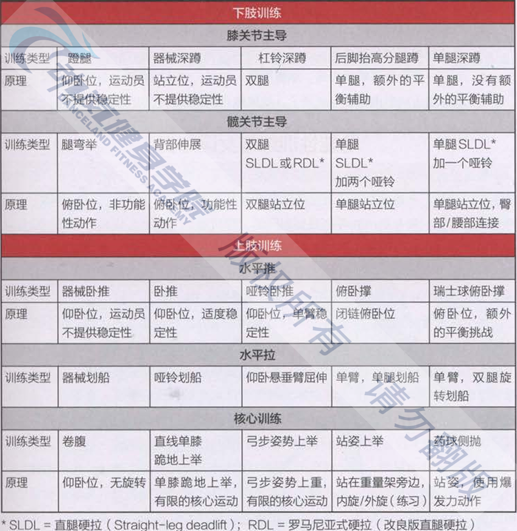

## 泡沫轴滚动、拉伸和动态热身
### 泡沫轴使用技巧
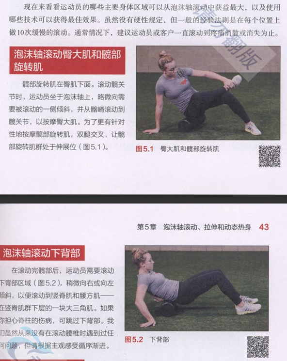
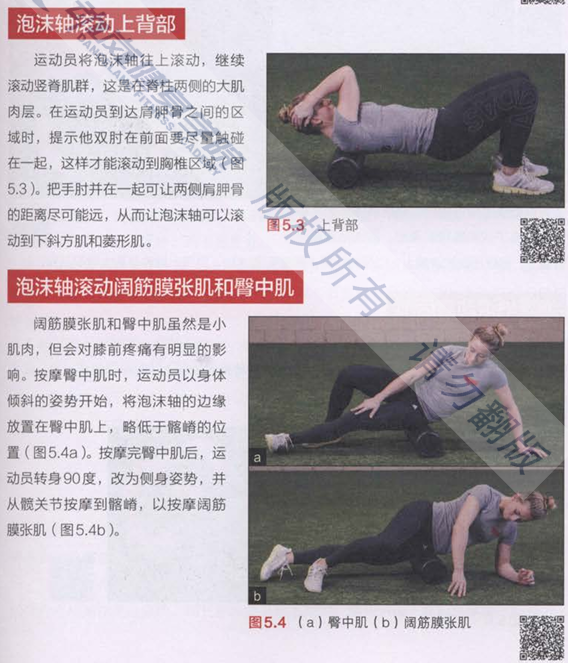
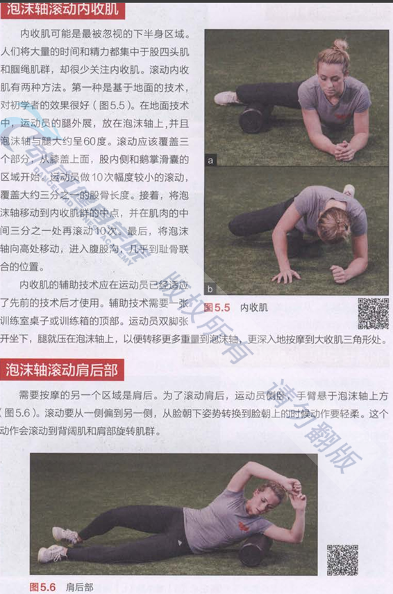
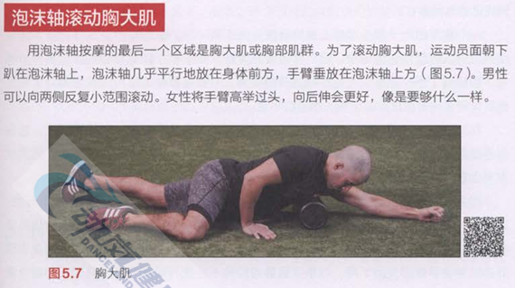

### 静态拉伸技术和技巧
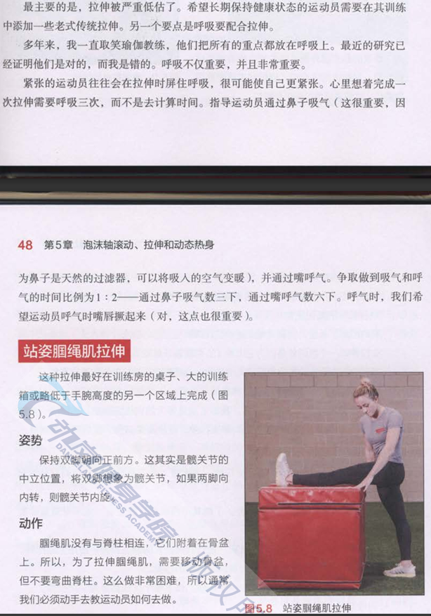
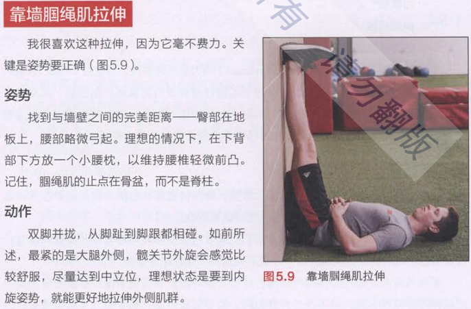
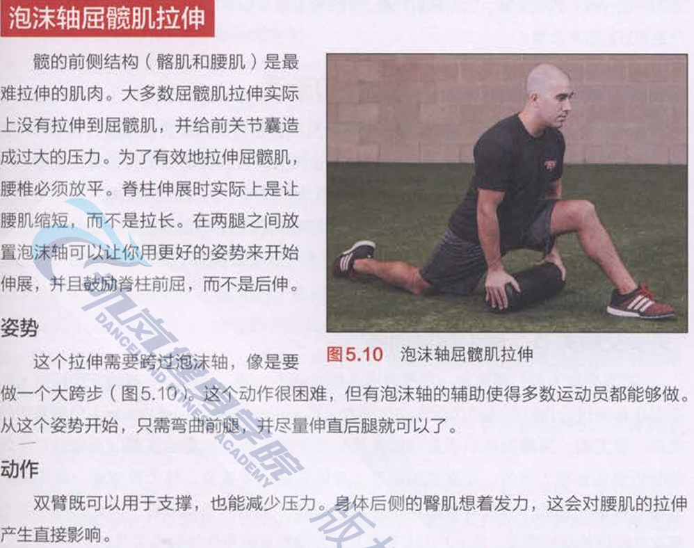
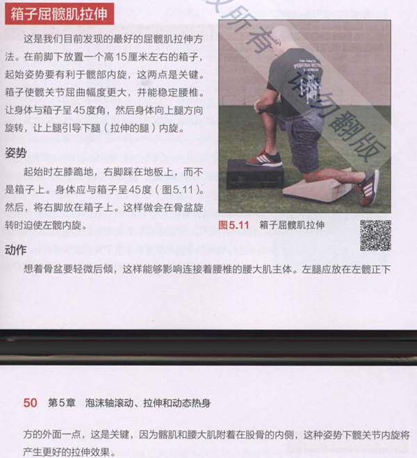

### 灵活性激活
#### “关节交替关节”理论
踝       灵活性
膝       稳定性
髋       灵活性
腰椎     稳定性
胸椎     灵活性
孟肱关节 稳定性

#### 灵活性联系
##### 胸椎灵活性
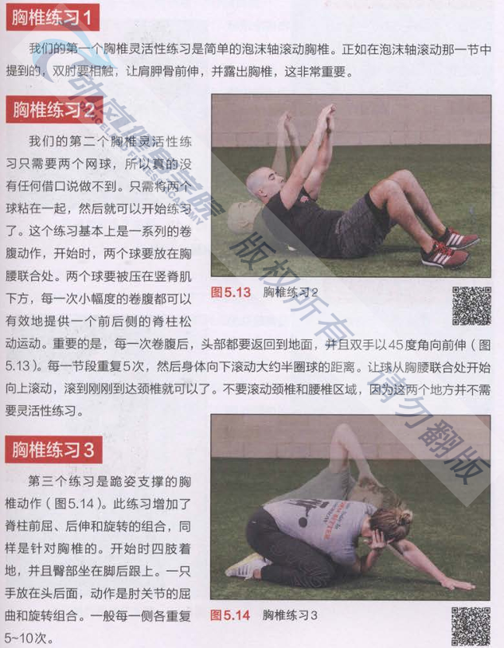

##### 踝关节灵活性
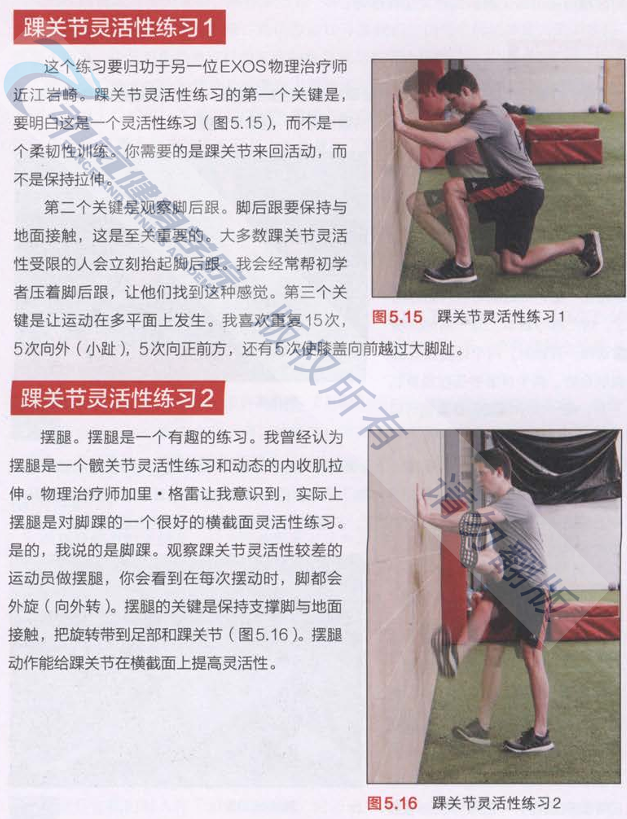

##### 髋关节灵活性
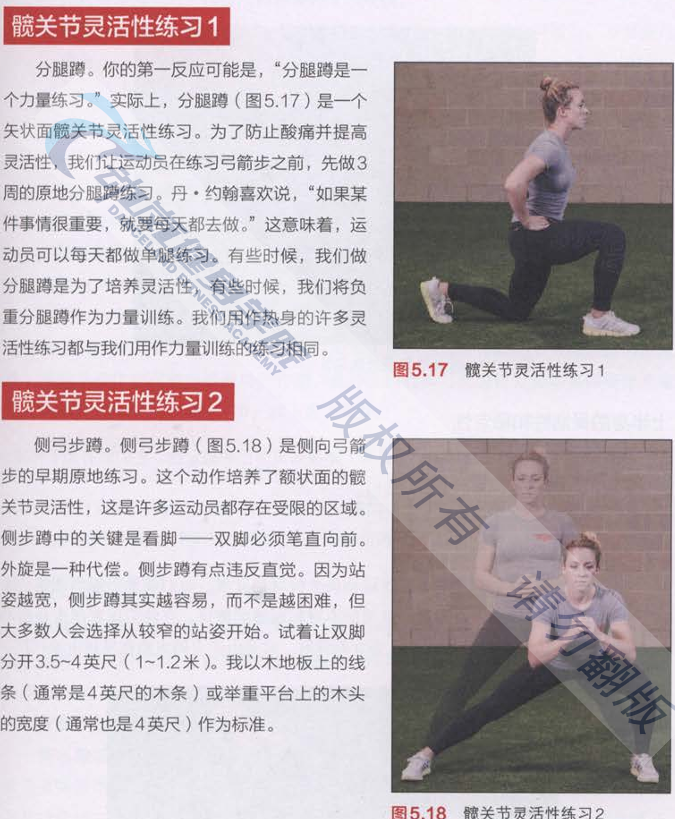
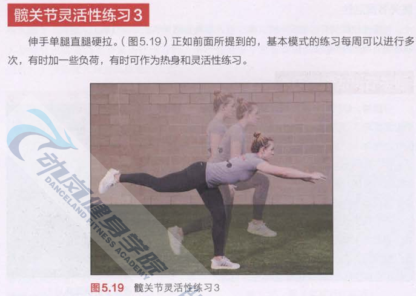

##### 上半身灵活性训练
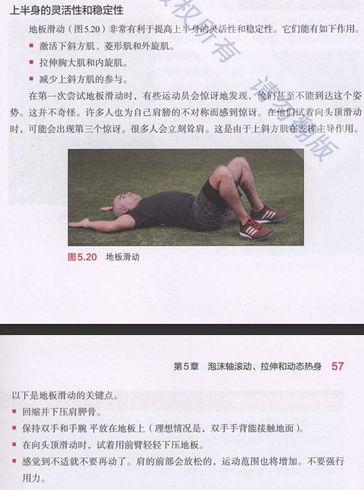

### 动态热身
#### 直线性主动热身（每个20米）
1. 高抬腿走
2. 摇篮抱腿
3. 步行，脚后跟到臀部
4. 步行，脚后跟到臀部，并且前倾
5. 向后弓箭步走，拉伸腘绳肌
6. 向后直推硬拉走
7. 高抬腿垫步跳
8. 高抬腿跑、提脚跟跑、直腿走、直腿垫步跳、后撤步、向后跑

#### 第1至3周：非竞争性速度练习
90度前倾、落地、跑动。帮助肌肉适应冲刺

#### 第4至6周：短距离竞争性速度练习
#### 第7至9周：长距离竞争性速度练习

#### 侧向热身：提高侧向敏捷性和速度
1. 侧步蹲

#### 敏捷性训练：绳梯

## 下肢训练
