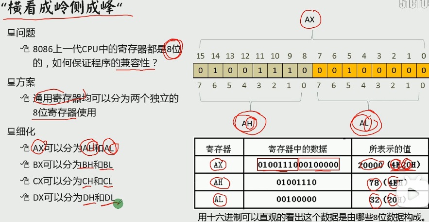

# 计算机组成原理

## 原码、反码、补码、移码

### 原码（Sign-Magnitude）

原码是一种最简单的表示方法，使用最高位作为符号位，其余位表示数值的绝对值。

符号位：0 表示正数，1 表示负数
数值位：表示数值的绝对值
示例：
+6 的原码表示：0000 0110
-6 的原码表示：1000 0110

### 反码（Ones' Complement）

反码用于表示负数，通过将原码的数值位逐位取反得到。

正数：反码与原码相同
负数：符号位不变，数值位逐位取反
示例：
+6 的反码表示：0000 0110
-6 的反码表示：1111 1001

### 补码（Twos' Complement）

补码是计算机中最常用的表示方法，特别适用于算术运算。负数的补码是其反码加 1。

正数：补码与原码相同
负数：反码加 1
示例：
+6 的补码表示：0000 0110
-6 的补码表示：1111 1010
计算过程：
原码：1000 0110
反码：1111 1001
补码：1111 1001 + 1 = 1111 1010

### 移码（Excess-N）

移码是一种用于浮点数表示的编码方式，通过在数值上加一个偏移量（通常是 2^(n-1)）来表示。

正数：移码 = 数值 + 偏移量
负数：移码 = 数值 + 偏移量
示例（假设偏移量为 8，即 2^3）：
+3 的移码表示：3 + 8 = 11 -> 1011
-3 的移码表示：-3 + 8 = 5 -> 0101

*0的反码、补码都为0*

## 数值表示

### 定点数

定点数是一种数值表示方法，其中小数点的位置是固定的。定点数可以用于表示整数或小数，具体取决于小数点的位置。定点数在计算机系统中常用于需要固定精度的场景

## 浮点数运算

基数（也称为底数或基数）：是指用于表示数值的进制系统。

尾数（Mantissa）：尾数是浮点数表示中的有效数字部分。它表示数值的精度。

大阶（Larger Exponent）：大阶是指浮点数中指数部分较大的那个数。

小阶（Smaller Exponent）：小阶是指浮点数中指数部分较小的那个数。

对阶（Aligning the Exponents）：对阶是指在进行浮点数加减运算时，将两个浮点数的指数对齐，使它们具有相同的指数。这样可以方便地进行尾数的加减运算。

规格化（Normalization）：规格化是指将浮点数表示为尾数的绝对值在一定范围内的形式，通常是使尾数的最高位为非零。规格化可以确保浮点数表示的唯一性和精度。

下溢：计算结果的绝对值小于计算机所能表示的最小非零正数时，就会发生下溢。这种情况通常会导致结果被舍入为零，因为计算机无法表示如此小的数值。

cpu乘法运算：在 CPU 运算方法中，原码乘法的正确描述是先取操作数的绝对值相乘，然后单独处理符号位。这是因为原码表示法中，符号位和数值位是分开的，直接相乘会导致错误的结果。

### 运算算法

#### 原码不恢复余数法(又称原码加减交替法)的算法

#### 比较法

在补码乘法中，比较法（也称为 Booth's Algorithm）是一种用于乘法运算的算法。该算法通过检查乘数的相邻两位来决定下一步的操作。具体规则如下：

相邻两位为 00 或 11：

不进行加法操作，只右移一位。
相邻两位为 01：

将被乘数的补码（即负数）加到部分积上，然后右移一位。
相邻两位为 10：

将被乘数的原码（即正数）加到部分积上，然后右移一位。
示例：
假设被乘数 ( X ) 和乘数 ( Y ) 的补码表示如下：

被乘数 ( X ) 的补码表示为 [X]补
乘数 ( Y ) 的补码表示为 [Y]补
在进行补码一位乘法时，如果相邻两位乘数 ( Y_i Y_{i+1} ) 为 01，则下一步操作是将被乘数的补码（即负数）加到部分积上，然后右移一位。

## CPU

**CPU组成**
- 运算器：信息处理
- 寄存器：信息存储
- 控制器：协调器件进行工作
- 内部总线：实现CPU内各个器件之间的联系

### 控制器

能对指令进行译码

### CPU 参数

#### 指令周期

CPU从主存取出一条指令加上执行一条指令的时间

#### 机器周期

由于 CPU 内部操作的速度较快，而 CPU 访问一次存储器的时间较长，因此机器周期通常由存取周期来确定。

#### 主频（Clock Speed）

- **定义**：CPU 的时钟频率，通常以 GHz（千兆赫兹）为单位。
- **作用**：主频越高，CPU 每秒钟可以执行的指令周期越多，处理速度越快。
- **影响因素**：主频受制于制程工艺、散热能力和电压等因素。
- **示例**：一个 3.5 GHz 的 CPU 每秒钟可以执行 3.5 亿个时钟周期。

#### CPI（Cycles Per Instruction）

- **定义**：每条指令所需的时钟周期数。
- **作用**：CPI 是衡量 CPU 执行效率的一个重要指标。CPI 越低，CPU 执行指令的效率越高。
- **计算公式**：CPI = 总时钟周期数 / 指令数
- **影响因素**：CPI 受指令集架构、指令类型、流水线深度和缓存命中率等因素影响。
- **示例**：如果一个程序执行了 1000 条指令，花费了 4000 个时钟周期，则 CPI = 4000 / 1000 = 4。

#### MIPS（Million Instructions Per Second）

- **定义**：每秒钟执行的百万条指令数。
- **作用**：MIPS 是衡量 CPU 执行速度的一个指标，但不能完全反映 CPU 的实际性能，因为不同指令的执行时间不同。
- **计算公式**：MIPS = 主频（MHz） / CPI
- **影响因素**：MIPS 受主频和 CPI 的共同影响。
- **示例**：一个主频为 2 GHz，CPI 为 2 的 CPU，其 MIPS = 2000 / 2 = 1000 MIPS。

#### MFLOPS（Million Floating-Point Operations Per Second）

- **定义**：每秒钟执行的百万次浮点运算数。
- **作用**：MFLOPS 是衡量 CPU 浮点运算能力的一个指标，常用于科学计算和图形处理等需要大量浮点运算的应用。
- **计算公式**：MFLOPS = 浮点运算数 / 执行时间（秒） / 10^6
- **影响因素**：MFLOPS 受浮点单元的性能、指令集和优化算法等因素影响。
- **示例**：如果一个程序执行了 10 亿次浮点运算，花费了 2 秒钟，则 MFLOPS = 10^9 / 2 / 10^6 = 500 MFLOPS。

#### 参数比较

| 参数 | 定义 | 作用 | 计算公式 | 影响因素 |
| --- | --- | --- | --- | --- |
| 主频 | CPU 的时钟频率 | 决定 CPU 每秒钟可以执行的指令周期数 | - | 制程工艺、散热能力、电压 |
| CPI | 每条指令所需的时钟周期数 | 衡量 CPU 执行效率 | CPI = 总时钟周期数 / 指令数 | 指令集架构、指令类型、流水线深度、缓存命中率 |
| MIPS | 每秒钟执行的百万条指令数 | 衡量 CPU 执行速度 | MIPS = 主频（MHz） / CPI | 主频、CPI |
| MFLOPS | 每秒钟执行的百万次浮点运算数 | 衡量 CPU 浮点运算能力 | MFLOPS = 浮点运算数 / 执行时间（秒） / 10^6 | 浮点单元性能、指令集、优化算法 |

### 寄存器

### 通用寄存器

| **寄存器** | **用途**                                      |
|------------|-----------------------------------------------|
| AX（累加器） | 用于算术运算和 I/O 操作                       |
| BX（基址寄存器） | 常用于存放地址                              |
| CX（计数器） | 用于循环和位移操作                            |
| DX（数据寄存器） | 用于存放数据，特别是在双字长运算中          |

### 变址寄存器

| **寄存器** | **用途**                                      |
|------------|-----------------------------------------------|
| SI（源变址寄存器） | 用于存放源地址偏移                        |
| DI（目的变址寄存器） | 用于存放目的地址偏移                      |

### 指针寄存器

| **寄存器** | **用途**                                      |
|------------|-----------------------------------------------|
| SP（堆栈指针） | 用于存放栈的偏移地址                        |
| BP（基址指针） | 用于基址寻址，特别是在函数调用中            |

### 段寄存器

| **寄存器** | **用途**                                      |
|------------|-----------------------------------------------|
| DS（数据段寄存器） | 用于存放数据段地址                      |
| ES（附加段寄存器） | 用于存放附加段地址                      |

### 控制寄存器

#### PC（程序计数器）

存储下一条要执行的指令的地址 copilot ？CPU的程序计数器中存放的是操作数地址 学习通

CPU中决定指令执行顺序的是程序计数器

程序计数器（PC）和存储器地址寄存器（MAR）的位数通常是一样的，因为它们都用于存储内存地址。

程序计数器（PC）的值由CPU在执行指令过程中自动进行修改，以指向下一条要执行的指令。

#### IR（指令寄存器）

存储当前正在执行的指令

### 状态寄存器

#### Flags（标志寄存器）

存储运算结果的状态信息，如进位、溢出、零标志等

状态寄存器中的各个状态标志位是依据**算术逻辑部件上次的运算结果**来设置的

状态寄存器中的标志位对用户并不是完全透明的，用户可以通过特定指令访问和修改某些标志位。

6个状态标志位：OF、SF、ZF、AF、PF、CF，及3个控制标志位DF、IF、TF
标志寄存器Flag
Flag是16位的寄存器，有9个标志位，其中6个状态标志位，3个控制标志位
 
6个状态标志位
CF：进位或者借位 有进位或者借位时CF=1，并且debug显示为CY
否则CF=0，debug显示为NC
 
PF：奇偶标志位 用于校验，运算结果**低8位**（AL AH等） 化为2进制 为奇数个1时PF=0 debug显示 PO
否则 偶数个1时PF=1 debug显示PE
 
AF:辅助进位标志 运算结果的低4位向前1位有进位或者借位时 AF=1，debug显示AC
否则无进位和借位时AF=0,debug显示NA
 
ZF:零标志位 运算结果为0时 则ZF=1，debug显示ZR
否则ZF=0，debug显示NZ
 
SF:符号标志位 运算结果为负数时，SF=1，debug显示NG
否则SF=0，debug显示PL
 
OF:溢出标志位 如果运算结果溢出(与常识不符合 例如两个正数相加为负数 或者两个异数相减为负数)，则ZF=1,debug显示OV
否则ZF=0，debug显示NV
 
3、3个控制标志位
TF:追踪标志位
TF=1则单步执行，执行之后TF=0 即中断然后正常执行
 
IF:中断允许标志位
IF=1,则允许CPU响应外部中断 debug 显示EI
IF=0,则禁止 debug显示DI
 
DF:方向标志位
DF=1，地址减方向 debug显示DN
DF=0,地址增方向 debug显示UP

### 三类总线

地址总线：决定存储单元，地址总线的宽度决定了可寻址的存储单元的大小 // 8086总线宽度为20，寻址空间（内存地址空间）为2^20B(1MB)
数据总线：传输数据，数据总线的宽度决定了CPU和外界的数据传送速度
控制总线：对外部器件进行控制，控制总线的宽度决定了CPU对外部器件的控制能力

### ALU（算术逻辑单元）

ALU 的位数（宽度）不一定与机器字长相同。ALU 可以处理不同位数的数据，例如 8 位、16 位、32 位或 64 位，具体取决于 CPU 的设计。

#### 8086寄存器

中阔号[]只对寄存器有影响，lea 寄存器加中括号代表取值（把地址当作值），mov 寄存器加中括号代表取地址（把他的内容当作地址，加上段地址变成物理地址，取物理地址内的值），[]只能存bx，bi，si，bp（变址 基址寄存器）,lea,[]都是*or&
 
数据寄存器（AX、BX、CX、DX寄存器）:
    AX（accumulator）累加器,是算术运算的主要寄存器。在乘、除等指令中指定用来存放操作数，以及所有的 I/O指令都使用这一寄存器与外部设备传送信息
    BX（base）基址寄存器。常做存放地址使用
    CX（count）计数器。常用来保存计数值，如在循环、位移和串处理指令中作隐含计数器
    DX（data）数据。一般在作双字长运算时把DX和AX组合在一起存放一个双字长数，DX用来存放高位数。对于某些I/O操作，DX可用来存放I/O的端口地址
 
变址寄存器（SI寄存器、DI寄存器）
    SI是源变址寄存器，DI是目的变址寄存器。一般用来存放地址偏移，也可以用来存放数据。但需要注意的是：在串处理指令中，SI用作隐含的源串地址，默认在DS中；DI用做隐含的目的串地址，默认在ES中；此时不能混用
 
指针寄存器（BP寄存器、SP寄存器）
    SP(stack pointer)堆栈寄存器，SP寄存器存放栈的偏移地址,SS存放段地址
 
    BP(base pointer)基数指针寄存器BP，它的用途有点特殊，需和堆栈指针SP联合使用的，作为SP校准使用的，只有在寻找堆栈里的数据和使用个别的寻址方式时候才能用到。比如说，堆栈中压入了很多数据或者地址，你肯定想通过SP来访问这些数据或者地址，但SP是要指向栈顶的，是不能随便乱改的，这时候你就需要使用BP，把SP的值传递给BP，通过BP来寻找堆栈里数据或者地址.
    BP作为基址寄存器，一般在函数中用来保存进入函数时的SP的栈顶基址.每次子函数调用时，系统在开始时都会保存这个两个指针并在函数结束时恢复SP和BP的值
段寄存器（DS寄存器、ES寄存器）
    DS（Data Segment）和 ES（Extra Segment）都属于段寄存器，用于存放的就是某个段地址
    注：CPU不支持直接将立即数送入段寄存器中，如下操作方式不合法：
    mov ds,1000h masm里新建asm文件的初始代码传输也分了两次

**字和字节**

**8086CPU物理地址**

**8086读取和执行指令演示**

### 指令流水线数据通路

指令流水线数据通路是 CPU 中用于执行指令的硬件路径。它包括多个阶段，每个阶段执行指令的一部分操作。以下是对各个选项的解释：

A. 由组合逻辑电路和时序逻辑电路组合而成：

正确。指令流水线数据通路由组合逻辑电路和时序逻辑电路组成，以实现指令的并行处理和时序控制。
B. 包含通用寄存器组和取指部件：

正确。指令流水线数据通路包含通用寄存器组（用于存储操作数和结果）和取指部件（用于从存储器中取指令）。
C. 不包含存储器：

错误。指令流水线数据通路需要访问存储器以取指令和数据。存储器是指令流水线数据通路的重要组成部分。
D. 包含算术逻辑运算部件(ALU)：

正确。指令流水线数据通路包含算术逻辑运算部件（ALU），用于执行算术和逻辑运算。

### 微程序控制器

机器指令与微指令的关系是：  
微程序控制器通过一段微指令（微程序）来解释和执行每一条机器指令。每条机器指令对应一个微程序，该微程序由若干条微指令组成，用于控制CPU的各个部分完成指令的执行。

## 存储器

| 存储器类型                             | 说明                                                                                       | 特点                                                              | 用途                                                                                                                    |
|-----------------------------------|------------------------------------------------------------------------------------------|-----------------------------------------------------------------|-----------------------------------------------------------------------------------------------------------------------|
| SRAM（Static Random Access Memory） | SRAM 是静态随机存取存储器，它使用双稳态触发器（如触发器）来存储每一位数据。由于每个存储单元由多个晶体管组成，SRAM 不需要像 DRAM 那样定期刷新数据，因此速度较快。 | -速度快：由于不需要刷新，SRAM 的访问速度比 DRAM 快。  -功耗低：在不进行读写操作时，SRAM 的功耗较低。 | -高速缓存（Cache）：SRAM 常用于 CPU 的一级缓存（L1 Cache）、二级缓存（L2 Cache）和三级缓存（L3 Cache）。 -嵌入式系统：由于其速度快和功耗低，SRAM 也常用于嵌入式系统中的高速存储需求。 |
| DRAM（Dynamic Random Access Memory） | DRAM 是动态随机存取存储器，它使用电容来存储每一位数据。由于电容会漏电，DRAM 需要定期刷新数据以保持其内容，因此速度较慢。 | -速度较慢：由于需要定期刷新，DRAM 的访问速度比 SRAM 慢。  -功耗较高：刷新操作需要消耗额外的功率，因此 DRAM 的功耗较高。  -集成度高：每个存储单元只需要一个电容和一个晶体管，因此 DRAM 的集成度较高，单位面积内的存储容量较大。  -成本低：由于使用了较少的晶体管，DRAM 的制造成本较低。 | -主存储器（Main Memory）：DRAM 常用于计算机的主存储器（RAM），如 DDR SDRAM、DDR2、DDR3、DDR4 等。 -图形存储器（Graphics Memory）：DRAM 也常用于图形处理器（GPU）的显存（VRAM）。 |

### Cache

#### 直接映射

#### 四路组相联

#### 全相联映射

### 芯片引出线问题

*DRAM采用地址复用技术，地址线是原来的1/2根*

最小引出线数目 = 地址线数目 + 数据线数目 + 控制线数目  

某一RAM芯片，其容量为512K×8位  

512K = 512 × 1024 = 524288 个存储单元  
地址线数目 = (\log_2(524288)) = 19 条  

每个存储单元 8 位，因此需要 8 条数据线。  

通常，RAM 芯片需要以下控制线：  
读/写控制线：1 条  
片选控制线：1 条  

总计：19 + 8 + 2 = 29 条  

### 外存

CPU不能直接访问的

#### 固态硬盘（Solid State Drive-SSD）

[B站视频地址](https://www.bilibili.com/video/BV1XW4y187Nc/?spm_id_from=333.337.search-card.all.click&vd_source=15c229538881316b8c6a43f997de056f)

是一种基于闪存技术的存储设备，与传统的机械硬盘（HDD）相比，具有更高的性能和可靠性。  

  

##### 原理

闪存技术：SSD 使用 NAND 闪存芯片来存储数据。每个 NAND 闪存芯片包含多个存储单元，每个单元可以存储一个或多个比特的数据。  
控制器：SSD 内部有一个控制器，用于管理数据的读写操作、错误校正、垃圾回收等功能。  

##### 参数

###### 类型

| 数据协议 | 描述 |
|----------|------|
| SATA     | 串行高级技术附件（Serial ATA），一种常见的硬盘接口协议，广泛用于消费级 SSD 和 HDD。 |
| NVMe     | 非易失性存储器快速（Non-Volatile Memory Express），一种高性能协议，专为 SSD 设计，利用 PCIe 通道。 |
| AHCI     | 高级主机控制器接口（Advanced Host Controller Interface），一种用于 SATA 接口的协议，支持传统 HDD 和 SSD。 |

| 数据协议通道 | 描述 |
|---------------|------|
| PCIe          | 外设组件互连快（Peripheral Component Interconnect Express），一种高速接口，支持 NVMe 协议，提供高带宽和低延迟。 |
| SATA          | 串行高级技术附件（Serial ATA），一种常见的硬盘接口，支持 AHCI 协议，适用于传统 HDD 和 SSD。 |
| SAS           | 串行连接 SCSI（Serial Attached SCSI），一种企业级接口，提供高性能和高可靠性，适用于服务器和数据中心。 |

| 接口类型 | 描述 |
|----------|------|
| PCIe     | 高速接口，直接连接到主板上的 PCIe 插槽，支持 NVMe 协议，适用于高性能存储设备。目前已经很少见了 |
| SATA     | 常见的硬盘接口，适用于大多数台式机和笔记本电脑。 |
| M.2      | 一种小型化接口，支持 SATA 和 NVMe 协议，适用于超薄笔记本电脑和高性能台式机。 |
| U.2      | 一种企业级接口，支持 NVMe 协议，提供高性能和高可靠性。 |

  
  

###### 颗粒

| 颗粒类型                   | 容量 | 速度 | 寿命（擦写次数）   | 优点           | 消费场景  |
|------------------------|----|----|------------|--------------|-------|---|---|
| SLC(Single-Level Cell) | 1  | 16 | 1 万~10 万   | 速度快、寿命长、可靠性高 | 企业级   |
| MLC(Multi-Level Cell)  | 4  | 8  | 5000~10000 | 成本适中、容量适中    | 高端消费级 |
| TLC(Triple-Level Cell) | 8  | 4  | 1000~3000  | 成本低、容量大      | 一般消费级 |
| QLC(Quad-Level Cell)   | 16 | 1  | 几百~1000    | 成本最低、容量最大    | 还不推荐  |

##### 主控

大部分主控都具有平衡磨损、垃圾回收、地址映射等功能。无缓的主控还有SLC模拟和HMB缓存技术。部分主控还有数据恢复功能。  

  

##### 缓存

独立缓存  
是 DRAM 缓存，使用内存芯片，用于存放 FTL 映射表（索引目录），加快查找速度。  
中高端才有独立缓存  
没有独立缓存的 FTL 映射表直接放在缓冲颗粒里，或者利用内存条  

模拟缓存  
固态硬盘必备  
快速的数据中转仓，用于提升固态的数据处理速度  
把固态硬盘当作模拟缓存，当固态空间减少，模拟缓存减少，速度就会变慢  
  

##### 4k 随机读写

固态硬盘远强于机械硬盘之处  

极大提升电脑流畅度  

##### TBW 数据写入量

## IO 设备

### 键盘

#### 薄膜键盘

#### 机械键盘

键帽、轴体、套件

##### 配列

百分比或键数表示，数字越大，按键越多  
104  

客制化  
Alice(人体工学)  

###### 键帽

PBT  更耐磨、触感偏硬，表层颗粒大
ABS  触感亲肤温润、时间长打油
PC  透光性好

刻字工艺  
- 二色成型
- 热升华

高度  

###### 轴体

线性轴、段落轴、发声段落轴

其他参数  
- 轴体压力  
   一般为 45 g  
- 导通行程  
   按压到触发的距离，标准为 2 mm，  
- 总键程  
   按压到触底的距离，一般 3.6 mm  

##### 套件

###### 外壳材质  

- 塑料  
- 铝  
   铝合金处理工艺
   - 喷涂
   - 阳极氧化
   - 电泳

###### 定位板

###### 内部结构

船壳结构  早期、成本低、容易共振
Gasket 结构  主流
TOP 结构  手感扎实
三明治结构  

###### PCB

热插拔 PCB 自由换轴体  
焊接 PCB

#### 磁轴键盘

## 指令集架构

### RISC（精简指令集计算机）

RISC 设计的一个目标是使大多数指令在一个时钟周期内完成，以提高执行效率。

RISC 处理器通常具有更多的内部通用寄存器，以减少对内存的访问，提高性能。

RISC 的设计原则之一是简化指令集，因此 RISC 的指令数、寻址方式和指令格式种类相对 CISC（复杂指令集计算机）少。

### CISC

## 处理器型号

### x86

早期，1980s年代，x86一般指当时的处理器8088和80286，不过这两个处理器都是16位的。如今，x86通常指32位指令集架构的处理器，比如80386。80386处理器是intel在1985年实现的第一款32位指令集架构的处理器，又叫i386，Intel Architecture, 32-bit，缩写为IA-32，现在，IA-32一般又能引喻成所有的支持32位计算的x86架构。

按照发展历史看，x86应该是指令集概念，一般用于个人PC系统如8086,286,386。IA-32是intel首推的32位架构。

### x86-64/x64/amd64/Intel64

在1999年，AMD公司首先在IA-32基础上，增加了64位寄存器，兼容早期的16位和32位软件系统，推出了x86-64的64位微处理器，后来命名为AMD64，实现了超车。然后intel公司也接受了该方案，叫做Intel64。x86-64应该只算是x86指令集的64位扩展，并不是一种全新的64位架构。

由于amd64和intel64本质上是一样的，叫法也是很多。AMD通常叫它x86-64、x86_64，微软和sun等软件公司叫它x64，操作系统厂商则通常用AMD64或者amd64来指代AMD64和Intel64。

### IA-64

IA-64是Intel推出的用于Itanium处理器（安腾处理器）的自己的Intel Architecture 64位指令集，一般用于服务器。尽管Intel64也是64位处理器，但这两者完全不是一回事。IA-64软件不能直接运行于Intel64处理器上。x86-64是IA-32指令集的扩展，而IA-64则是完完全全没有一点IA-32影子的独立处理器架构。IA-64需要通过模拟器才能运行IA-32，但是性能大大受影响。

### 市面上处理器如何区分AMD64和IA-64呢？

市面上买的Intel 64-bit的cpu其实都属于amd64分类，intel64和amd64其实都应该叫做x86_64。
IA64则指Itaniums系统cpu，并不是x86架构的，一般都是用于服务器，不是个人桌面产品，价格昂贵。
ARM64/AArch64
ARM是精简指令集RISC下的处理器架构。ARMv3至ARMv7支持32位寻址空间。ARMv8-A开始支持64位寻址空间。AArch64和ARM64都是指64位的ARM架构。

## 显示器

### 显示器类型

1. **CRT（Cathode Ray Tube）显示器**：
   - 使用阴极射线管技术。
   - 体积大、重量重，但色彩表现和响应速度较好。
   - 逐渐被淘汰，取而代之的是更轻薄的显示技术。

2. **LCD（Liquid Crystal Display）显示器**：
   - 使用液晶技术，通过背光源照射液晶层来显示图像。
   - 轻薄、能耗低，广泛应用于各种设备。
   - 分为 TN、IPS、VA 等不同面板类型。

3. **LED（Light Emitting Diode）显示器**：
   - 实际上是 LCD 显示器的一种，使用 LED 作为背光源。
   - 亮度高、能耗低、寿命长。
   - 常见于现代显示器和电视。

4. **OLED（Organic Light Emitting Diode）显示器**：
   - 使用有机发光二极管技术，每个像素自发光。
   - 对比度高、色彩表现优秀、响应速度快。
   - 价格较高，主要用于高端设备。

5. **QLED（Quantum Dot LED）显示器**：
   - 使用量子点技术增强色彩表现。
   - 亮度高、色域广，主要用于高端电视和显示器。

### 分辨率

- **分辨率**：显示器屏幕上像素的数量，通常表示为宽度 x 高度（例如 1920x1080）。
- **常见分辨率**：
  - HD（720p）：1280x720
  - Full HD（1080p）：1920x1080
  - QHD（1440p）：2560x1440
  - 4K UHD：3840x2160
  - 8K UHD：7680x4320

### 刷新率

- **刷新率**：显示器每秒刷新图像的次数，以赫兹（Hz）为单位。
- **常见刷新率**：
  - 60Hz：标准刷新率，适用于大多数日常使用。
  - 120Hz、144Hz、240Hz：高刷新率，适用于游戏和专业应用，提供更流畅的视觉体验。

### 响应时间

- **响应时间**：像素从一种颜色转换到另一种颜色所需的时间，以毫秒（ms）为单位。
- **低响应时间**：减少运动模糊和拖影，适合快速移动的图像，如游戏和视频。

### 面板类型

1. **TN（Twisted Nematic）面板**：
   - 响应时间快、成本低。
   - 色彩表现和可视角度较差。

2. **IPS（In-Plane Switching）面板**：
   - 色彩准确、可视角度广。
   - 响应时间较慢、成本较高。

3. **VA（Vertical Alignment）面板**：
   - 对比度高、色彩表现好。
   - 响应时间介于 TN 和 IPS 之间。

### 护眼

德国莱茵认证

#### 硬件防蓝光

#### 调光模式

##### PWN

会频闪

##### DC

大多使用，对双眼较好

### 连接接口

- **DVI（Digital Visual Interface）**：较老的数字视频接口，逐渐被 HDMI 和 DisplayPort 取代。
- **VGA（Video Graphics Array）**：模拟视频接口，逐渐被数字接口取代。
- **HDMI（High-Definition Multimedia Interface）**：常见的数字视频和音频接口，广泛应用于显示器、电视和其他设备。
- **DP（DisplayPort）**：高性能数字接口，支持高分辨率和高刷新率，常用于电脑显示器。

### 其他特性

- **色域**：显示器能够显示的颜色范围，常见的色域标准有 sRGB、Adobe RGB 和 DCI-P3。
- **HDR（High Dynamic Range）**：高动态范围技术，提供更高的亮度和对比度，提升图像质量。
- **G-Sync 和 FreeSync**：同步技术，减少屏幕撕裂和卡顿，提升游戏体验。

#### 独显直连

独立显卡不经过核显直接输出到显示器，渲染画面

##### 效果

网游普遍吃cpu，关闭核显就是降低cpu的一份功耗和热量来提升cpu性能，直接用独显渲染画面帧数就会提示非常多。  
单机普遍吃显卡，尤其是显存。作为市面上最多的60系列显卡，除4060外几乎都是6g以内的显存，这个时候核显是可以共享显存的，否则显卡容易爆显存。  

### 外接设置

# 计算机操作系统
