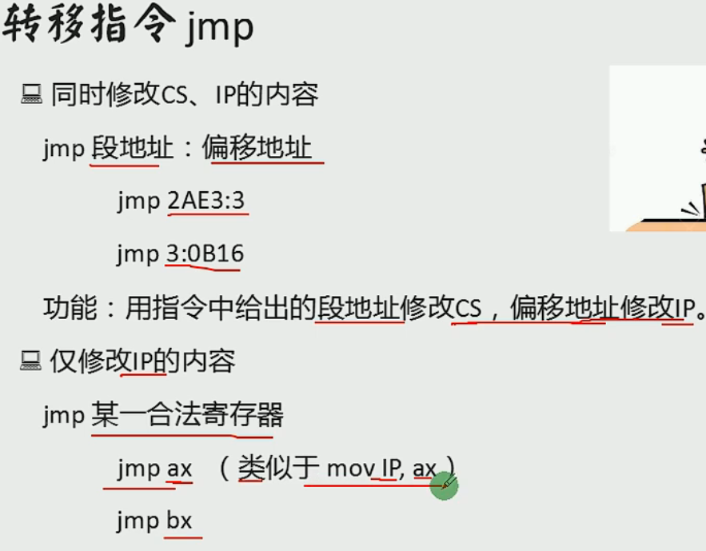

<!-- @import "[TOC]" {cmd="toc" depthFrom=1 depthTo=6 orderedList=false} -->

<!-- code_chunk_output -->

- [assembly](#assembly)
  - [CPU](#cpu)
  - [寄存器](#寄存器)
  - [Assembly](#assembly-1)
  - [转移](#转移)
  - [中断](#中断)
  - [与外设交互](#与外设交互)
- [Java](#java)
  - [break](#break)
- [algorithm](#algorithm)
  - [归并分治](#归并分治)
  - [随机快排](#随机快排)
  - [随机选择算法](#随机选择算法)

<!-- /code_chunk_output -->


## assembly

### CPU

**CPU组成**
- 运算器：信息处理
- 寄存器：信息存储
- 控制器：协调器件进行工作
- 内部总线：实现CPU内各个器件之间的联系

**三类总线**
地址总线：决定存储单元，地址总线的宽度决定了可寻址的存储单元的大小 // 8086总线宽度为20，寻址空间（内存地址空间）为2^20B(1MB)
数据总线：传输数据，数据总线的宽度决定了CPU和外界的数据传送速度
控制总线：对外部器件进行控制，控制总线的宽度决定了CPU对外部器件的控制能力

### 寄存器

中阔号[]只对寄存器有影响，lea 寄存器加中括号代表取值（把地址当作值），mov 寄存器加中括号代表取地址（把他的内容当作地址，加上段地址变成物理地址，取物理地址内的值），[]只能存bx，bi，si，bp（变址 基址寄存器）,lea,[]都是*or&
 
数据寄存器（AX、BX、CX、DX寄存器）:
    AX（accumulator）累加器,是算术运算的主要寄存器。在乘、除等指令中指定用来存放操作数，以及所有的 I/O指令都使用这一寄存器与外部设备传送信息
    BX（base）基址寄存器。常做存放地址使用
    CX（count）计数器。常用来保存计数值，如在循环、位移和串处理指令中作隐含计数器
    DX（data）数据。一般在作双字长运算时把DX和AX组合在一起存放一个双字长数，DX用来存放高位数。对于某些I/O操作，DX可用来存放I/O的端口地址
 
变址寄存器（SI寄存器、DI寄存器）
    SI是源变址寄存器，DI是目的变址寄存器。一般用来存放地址偏移，也可以用来存放数据。但需要注意的是：在串处理指令中，SI用作隐含的源串地址，默认在DS中；DI用做隐含的目的串地址，默认在ES中；此时不能混用
 
指针寄存器（BP寄存器、SP寄存器）
    SP(stack pointer)堆栈寄存器，SP寄存器存放栈的偏移地址,SS存放段地址
 
    BP(base pointer)基数指针寄存器BP，它的用途有点特殊，需和堆栈指针SP联合使用的，作为SP校准使用的，只有在寻找堆栈里的数据和使用个别的寻址方式时候才能用到。比如说，堆栈中压入了很多数据或者地址，你肯定想通过SP来访问这些数据或者地址，但SP是要指向栈顶的，是不能随便乱改的，这时候你就需要使用BP，把SP的值传递给BP，通过BP来寻找堆栈里数据或者地址.
    BP作为基址寄存器，一般在函数中用来保存进入函数时的SP的栈顶基址.每次子函数调用时，系统在开始时都会保存这个两个指针并在函数结束时恢复SP和BP的值
段寄存器（DS寄存器、ES寄存器）
    DS（Data Segment）和 ES（Extra Segment）都属于段寄存器，用于存放的就是某个段地址
    注：CPU不支持直接将立即数送入段寄存器中，如下操作方式不合法：
    mov ds,1000h masm里新建asm文件的初始代码传输也分了两次

**标志寄存器**

6个状态标志位：OF、SF、ZF、AF、PF、CF，及3个控制标志位DF、IF、TF
标志寄存器Flag
Flag是16位的寄存器，有9个标志位，其中6个状态标志位，3个控制标志位
 
6个状态标志位
CF：进位或者借位 有进位或者借位时CF=1，并且debug显示为CY
否则CF=0，debug显示为NC
 
PF：奇偶标志位 用于校验，运算结果**低8位**（AL AH等） 化为2进制 为奇数个1时PF=0 debug显示 PO
否则 偶数个1时PF=1 debug显示PE
 
AF:辅助进位标志 运算结果的低4位向前1位有进位或者借位时 AF=1，debug显示AC
否则无进位和借位时AF=0,debug显示NA
 
ZF:零标志位 运算结果为0时 则ZF=1，debug显示ZR
否则ZF=0，debug显示NZ
 
SF:符号标志位 运算结果为负数时，SF=1，debug显示NG
否则SF=0，debug显示PL
 
OF:溢出标志位 如果运算结果溢出(与常识不符合 例如两个正数相加为负数 或者两个异数相减为负数)，则ZF=1,debug显示OV
否则ZF=0，debug显示NV
 
3、3个控制标志位
TF:追踪标志位
TF=1则单步执行，执行之后TF=0 即中断然后正常执行
 
IF:中断允许标志位
IF=1,则允许CPU响应外部中断 debug 显示EI
IF=0,则禁止 debug显示DI
 
DF:方向标志位
DF=1，地址减方向 debug显示DN
DF=0,地址增方向 debug显示UP

**字和字节**


**8086CPU物理地址**


**8086读取和执行指令演示**


### Assembly

**标号**
地址标号：仅仅表示地址
数据标号：标记了存储数据的单元的地址和长度//不加冒号

**mov and add**


**DEBUG**
*用R命令查看、改变CPU寄存器的内容*
-R -查看寄存器内容
-R寄存器名 -改变指定寄存器内容
*用D命令查看内存中的内容*
-D  -列出预设地址内存储的128个字节的内容
-D 段地址：偏移地址 -列出内存中指定地址处的内容
-D 段地址：偏移地址 结尾偏移地址 -列出内存中指定地址处的内容
*用E命令改变内存中的内容*
-E 段地址：偏移地址 数据1 2 ……
-E 段地址：偏移地址  //逐个询问时修改
*用U命令将内存中的机器指令翻译成汇编指令*
-U 段地址：偏移地址
*用A命令以汇编指令的格式在内存中写入机器指令*
-A 段地址：偏移地址
*用T命令执行机器指令*
-T - 执行CS：IP处的指令
*用Q命令退出Debug*


**CPU从内存单元中读取数据**


**stack**
在8086CPU中有两个和栈有关的寄存器
- 栈段寄存器ss -存放栈顶的段地址
- 栈顶指针寄存器sp -存放栈顶的偏移地址


**汇编语言程序的工作过程**


**三种伪指令**


**如何写一个程序**


**loop指令**


**段前缀**


**字符**
汇编程序中用''的方式指明字符，编译器将他们转化为ASCLL码

**内存寻址方式**


**div指令**


**dup指令**


### 转移


**offset操作符**
offset作用：取得标号的偏移地址
格式：
    offset 标号
例子：
    start： move ax，offset start；相当于 move ax，0

**jmp指令**

jmp short 标号 -短转移，位移为8位，范围-128~127
jmp near ptr 标号 -近转移，位移为16位，范围-32769~32767
jmp far ptr 标号 -远转移
*短转移和近转移给定偏移量，而远转移直接给定偏移地址*

**jcxz**
原理：
jmp改
作用：
如果（cx）=0，则跳转到标号处执行；否则什么也不做（程序向下执行）
格式：
jcxz 标号

**条件转移指令**


**call**
原理：
1. 将当前的IP或CS和IP压入栈中；
2. 转移到标号处执行指令。
*近转移*
作用：
调用子程序
格式：
call 标号

**call far ptr**
原理：
push CS
push IP
jmp far ptr 标号
    
**mul**
作用：
乘法指令
格式：
mul 寄存器
mul 内存单元

**cmp**
原理：
对象1-对象2，通过其他指令识别标志寄存器变化来得知比较结果
作用：
比较指令
格式：
cmp 对象1，对象2

**串传送指令**
movsb：（以字节为单位传送）
movsw：（以字为单位传送）

**移位指令**


**操作显存数据**
低位字节：要显示符号的ascll
高位字节：
| 7 | 6 | 5 | 4 | 3 | 2 | 1 | 0 |
|---|---|---|---|---|---|---|---|
|BL | R | G | B | I | R | G | B |
|闪烁|背景|||高亮|前景|||

### 中断
中断：CPU不再向下执行指令，而去处理中断信息
内中断：CPU内部发生的事件而引起的中断
外中断：外部设备发生的事件引起的中断


### 与外设交互

**读写端口指令**
in： CPU从端口读取数据
执行时：
1. CPU通过**地址总线**将地址信息60h发出；
2. CPU通过**控制线**发出端口读命令，选中端口所在的芯片，并通知要从中读取数据；
3. 端口所在的芯片将60h端口中的数据通过**数据总线**送入CPU。
out： CPU从端口写入数据

**PC机键盘处理过程**
1. **键盘输入**：键盘中的每一个按键相当于一个开关，键盘中有一个芯片来监控这些开关
    1. 键盘被按下：
        - 开关接通，芯片产生一个扫描码，记录闭合开关的位置
        - 扫描码被送入主板相关接口芯片的寄存器（端口位置为60H）中
    2. 键盘被松开：
        - 同上
    3. 扫描码：长度为一个字节的编码
        - 按下产生的扫描码--通码，第七位为0
        - 松开产生的扫描码--断码，第七位为1
2. **引发9号中断**
3. **执行int 9中断例程**


## Java

### break
break只能跳出与之最近的for，while循环，跟if没有关系。


## algorithm
### 归并分治
原理：
1. 思考一个问题在大范围上的答案是否等于，左部分的答案 + 右部分的答案 + 跨越左右的答案吧。
2. 计算“跨越左右产生的答案”时，如果加上左，右各自有序这个设定，会不会获得计算的便利性

例题：
1. 小和问题
    ```
    int[] arr = new int[];
    int[] help = new int[];
    smallSum(0, n-1);

    public static long smallSum(int l, int r) {
        if (l == r) {
            return 0;
        }
        int m = (l + r) / 2;
        return smallSum(l, m) + smallSum(m+1, r) + merge(l, m, r);
    }
    //返回跨左右产生的小和累加和，左侧有序，右侧有序，让左右两侧整体有序
    public static long merge(int l, int m, int r) {
        //统计部分
        long ans = 0;
        for (int j = m + 1, i = l, sum = 0; j <= r; j++) {
            while (i <= m && arr[i] <= arr[j]) {
                sum += arr[i++];
            }
            ans += sum;
        }
        //正常merge
        int i = l;
        int a = l;
        int b = m + 1 ;
        while (a <= m && b <= r) {
            help[i++] = arr[a] <= arr[b] ? arr[a++] : arr[b++];
        }
        while (a <= m) {
            help[i++] = arr[a++];
        }
        while (b <= m) {
            help[i++] = arr[b++];
        }
        for (i = l; i <= r; i++) {
            arr[i] = help[i];
        }
        return ans;
    }
    ```

### 随机快排
核心点： 怎么选数字？
当数字是当前范围上的固定位置，则为普通快排
当数字是当前范围上的随机位置，则为随机快排

普通快排，时间复杂度为O(n^2),空间复杂度为O(n)
随机快排，时间复杂度为O(nlogn)，空间复杂度为o(logn)
**Code**：

1. 随机快拍改进版（推荐）
    ```
    public static void quickSort2(int l, int r) {
        if (l >= r) {
            return;
        }
        // 随机这一下，常数时间比较大
        int x = arr[l + (int) (Math.random() * (r - l + 1))];
        patition2(l, r, x);
        // 为了防止底层的递归过程覆盖全局变量
        // 这里使用临时变量记录first，last
        int left = first;
        int right = last;
        quickSort2(l, left - 1);
        quickSort2(right + 1, r);
    }

    // 荷兰国旗问题
    public static int first, last;

    public static boid partition2(int l, int r, int x) {
        first = 1;
        last = r;
        int i = l;
        while (i <= last) {
            if (arr[i] == x) {
                i++;
            } else if (arr[i] < x) {
                swap(first++, i++);
            } else {
                swap(i , last--);
            }
        }
    }
    ```

### 随机选择算法
无序数组中寻找第k大的数(O(n)复杂度)
**code**：
```
class Solution {
    private static int first, last;

    public static int findKthLargest(int[] nums, int k) {
        return randomizedSelect(nums, nums.length - k);
    }

    public static int randomizedSelect(int[] arr, int i) {
        int ans = 0;
        for (int l = 0, r = arr.length - 1; l <= r;) {
            partition2(arr, l, r, arr[l + (int) (Math.random() * (r - l + 1))]);
            if (i < first) {
                r = first - 1;
            } else if (i > last) {
                l = last + 1;
            } else {
                ans = arr[i];
                break;
            }
        }
        return ans;
    }

    public static void partition2(int[] arr, int l, int r, int x) {
        first = l;
        last = r;
        int i = l;
        while (i <= last) {
            if (arr[i] == x) {
                i++;
            } else if (arr[i] < x) {
                swap(arr, first++, i++);
            } else {
                swap(arr, i , last--);
            }
        }
    }

    public static void swap(int[] arr, int i, int j) {
        int temp = arr[i];
        arr[i] = arr[j];
        arr[j] = temp;
    }
}

```