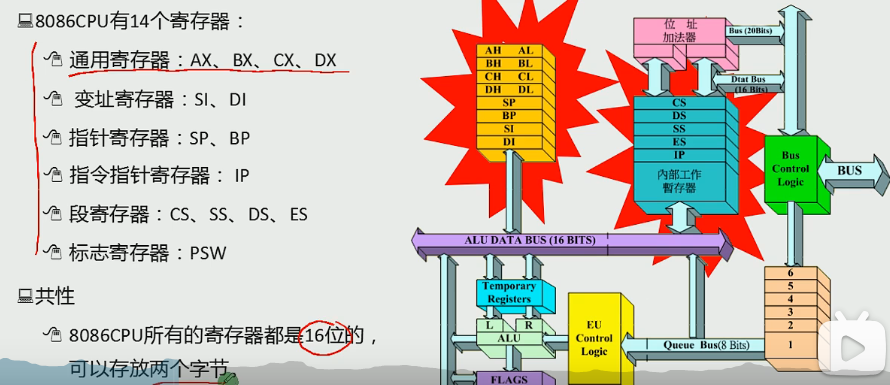
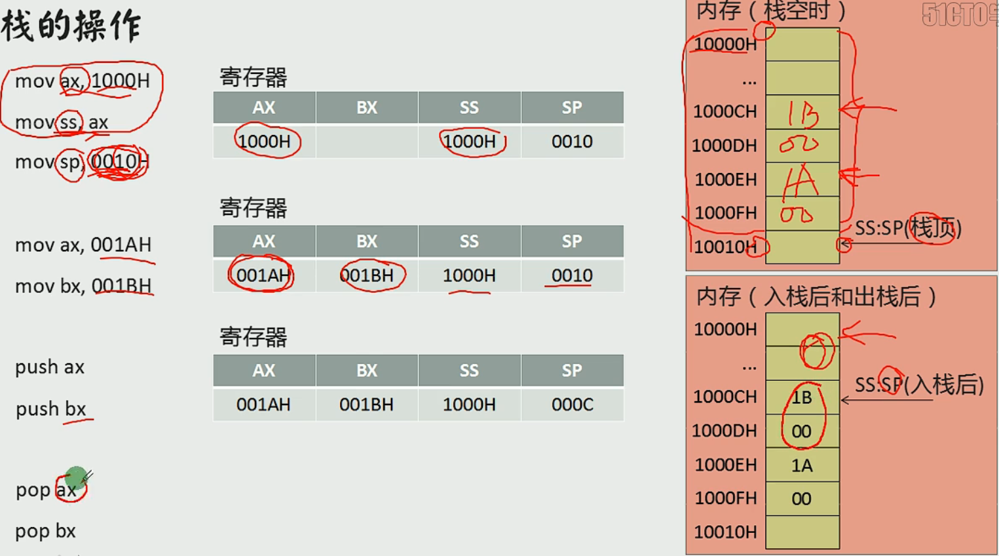
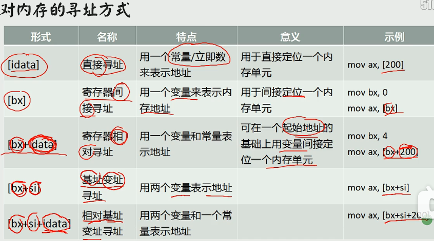

<!-- @import "[TOC]" {cmd="toc" depthFrom=1 depthTo=6 orderedList=false} -->

<!-- code_chunk_output -->

- [assembly](#assembly)
  - [CPU](#cpu)
  - [寄存器](#寄存器)
  - [Assembly](#assembly-1)
  - [转移](#转移)
  - [中断](#中断)
  - [与外设交互](#与外设交互)
- [Java](#java)
  - [==](#)
  - [break](#break)
- [algorithm](#algorithm)
  - [归并分治](#归并分治)
  - [随机快排](#随机快排)
  - [随机选择算法](#随机选择算法)
  - [堆结构与堆排序](#堆结构与堆排序)
  - [哈希表，有序表和比较器的用法](#哈希表有序表和比较器的用法)
  - [堆结构常见问题](#堆结构常见问题)
    - [合并K个有序链表](#合并k个有序链表)
    - [线段最多重合问题](#线段最多重合问题)
    - [让数组整体累加和减半的最少操作次数](#让数组整体累加和减半的最少操作次数)
    - [基数排序](#基数排序)
  - [重要排序算法的总结](#重要排序算法的总结)
  - [异或运算的骚操作](#异或运算的骚操作)

<!-- /code_chunk_output -->


## assembly

### CPU

**CPU组成**
- 运算器：信息处理
- 寄存器：信息存储
- 控制器：协调器件进行工作
- 内部总线：实现CPU内各个器件之间的联系

**三类总线**
地址总线：决定存储单元，地址总线的宽度决定了可寻址的存储单元的大小 // 8086总线宽度为20，寻址空间（内存地址空间）为2^20B(1MB)
数据总线：传输数据，数据总线的宽度决定了CPU和外界的数据传送速度
控制总线：对外部器件进行控制，控制总线的宽度决定了CPU对外部器件的控制能力

### 寄存器

中阔号[]只对寄存器有影响，lea 寄存器加中括号代表取值（把地址当作值），mov 寄存器加中括号代表取地址（把他的内容当作地址，加上段地址变成物理地址，取物理地址内的值），[]只能存bx，bi，si，bp（变址 基址寄存器）,lea,[]都是*or&
 
数据寄存器（AX、BX、CX、DX寄存器）:
    AX（accumulator）累加器,是算术运算的主要寄存器。在乘、除等指令中指定用来存放操作数，以及所有的 I/O指令都使用这一寄存器与外部设备传送信息
    BX（base）基址寄存器。常做存放地址使用
    CX（count）计数器。常用来保存计数值，如在循环、位移和串处理指令中作隐含计数器
    DX（data）数据。一般在作双字长运算时把DX和AX组合在一起存放一个双字长数，DX用来存放高位数。对于某些I/O操作，DX可用来存放I/O的端口地址
 
变址寄存器（SI寄存器、DI寄存器）
    SI是源变址寄存器，DI是目的变址寄存器。一般用来存放地址偏移，也可以用来存放数据。但需要注意的是：在串处理指令中，SI用作隐含的源串地址，默认在DS中；DI用做隐含的目的串地址，默认在ES中；此时不能混用
 
指针寄存器（BP寄存器、SP寄存器）
    SP(stack pointer)堆栈寄存器，SP寄存器存放栈的偏移地址,SS存放段地址
 
    BP(base pointer)基数指针寄存器BP，它的用途有点特殊，需和堆栈指针SP联合使用的，作为SP校准使用的，只有在寻找堆栈里的数据和使用个别的寻址方式时候才能用到。比如说，堆栈中压入了很多数据或者地址，你肯定想通过SP来访问这些数据或者地址，但SP是要指向栈顶的，是不能随便乱改的，这时候你就需要使用BP，把SP的值传递给BP，通过BP来寻找堆栈里数据或者地址.
    BP作为基址寄存器，一般在函数中用来保存进入函数时的SP的栈顶基址.每次子函数调用时，系统在开始时都会保存这个两个指针并在函数结束时恢复SP和BP的值
段寄存器（DS寄存器、ES寄存器）
    DS（Data Segment）和 ES（Extra Segment）都属于段寄存器，用于存放的就是某个段地址
    注：CPU不支持直接将立即数送入段寄存器中，如下操作方式不合法：
    mov ds,1000h masm里新建asm文件的初始代码传输也分了两次

**标志寄存器**

6个状态标志位：OF、SF、ZF、AF、PF、CF，及3个控制标志位DF、IF、TF
标志寄存器Flag
Flag是16位的寄存器，有9个标志位，其中6个状态标志位，3个控制标志位
 
6个状态标志位
CF：进位或者借位 有进位或者借位时CF=1，并且debug显示为CY
否则CF=0，debug显示为NC
 
PF：奇偶标志位 用于校验，运算结果**低8位**（AL AH等） 化为2进制 为奇数个1时PF=0 debug显示 PO
否则 偶数个1时PF=1 debug显示PE
 
AF:辅助进位标志 运算结果的低4位向前1位有进位或者借位时 AF=1，debug显示AC
否则无进位和借位时AF=0,debug显示NA
 
ZF:零标志位 运算结果为0时 则ZF=1，debug显示ZR
否则ZF=0，debug显示NZ
 
SF:符号标志位 运算结果为负数时，SF=1，debug显示NG
否则SF=0，debug显示PL
 
OF:溢出标志位 如果运算结果溢出(与常识不符合 例如两个正数相加为负数 或者两个异数相减为负数)，则ZF=1,debug显示OV
否则ZF=0，debug显示NV
 
3、3个控制标志位
TF:追踪标志位
TF=1则单步执行，执行之后TF=0 即中断然后正常执行
 
IF:中断允许标志位
IF=1,则允许CPU响应外部中断 debug 显示EI
IF=0,则禁止 debug显示DI
 
DF:方向标志位
DF=1，地址减方向 debug显示DN
DF=0,地址增方向 debug显示UP

**字和字节**


**8086CPU物理地址**


**8086读取和执行指令演示**


### Assembly

**标号**
地址标号：仅仅表示地址
数据标号：标记了存储数据的单元的地址和长度//不加冒号

**mov and add**


**DEBUG**
*用R命令查看、改变CPU寄存器的内容*
-R -查看寄存器内容
-R寄存器名 -改变指定寄存器内容
*用D命令查看内存中的内容*
-D  -列出预设地址内存储的128个字节的内容
-D 段地址：偏移地址 -列出内存中指定地址处的内容
-D 段地址：偏移地址 结尾偏移地址 -列出内存中指定地址处的内容
*用E命令改变内存中的内容*
-E 段地址：偏移地址 数据1 2 ……
-E 段地址：偏移地址  //逐个询问时修改
*用U命令将内存中的机器指令翻译成汇编指令*
-U 段地址：偏移地址
*用A命令以汇编指令的格式在内存中写入机器指令*
-A 段地址：偏移地址
*用T命令执行机器指令*
-T - 执行CS：IP处的指令
*用Q命令退出Debug*


**CPU从内存单元中读取数据**


**stack**
在8086CPU中有两个和栈有关的寄存器
- 栈段寄存器ss -存放栈顶的段地址
- 栈顶指针寄存器sp -存放栈顶的偏移地址


**汇编语言程序的工作过程**


**三种伪指令**


**如何写一个程序**


**loop指令**


**段前缀**


**字符**
汇编程序中用''的方式指明字符，编译器将他们转化为ASCLL码

**内存寻址方式**


**div指令**


**dup指令**


### 转移


**offset操作符**
offset作用：取得标号的偏移地址
格式：
    offset 标号
例子：
    start： move ax，offset start；相当于 move ax，0

**jmp指令**

jmp short 标号 -短转移，位移为8位，范围-128~127
jmp near ptr 标号 -近转移，位移为16位，范围-32769~32767
jmp far ptr 标号 -远转移
*短转移和近转移给定偏移量，而远转移直接给定偏移地址*

**jcxz**
原理：
jmp改
作用：
如果（cx）=0，则跳转到标号处执行；否则什么也不做（程序向下执行）
格式：
jcxz 标号

**条件转移指令**


**call**
原理：
1. 将当前的IP或CS和IP压入栈中；
2. 转移到标号处执行指令。
*近转移*
作用：
调用子程序
格式：
call 标号

**call far ptr**
原理：
push CS
push IP
jmp far ptr 标号
    
**mul**
作用：
乘法指令
格式：
mul 寄存器
mul 内存单元

**cmp**
原理：
对象1-对象2，通过其他指令识别标志寄存器变化来得知比较结果
作用：
比较指令
格式：
cmp 对象1，对象2

**串传送指令**
movsb：（以字节为单位传送）
movsw：（以字为单位传送）

**移位指令**


**操作显存数据**
低位字节：要显示符号的ascll
高位字节：
| 7 | 6 | 5 | 4 | 3 | 2 | 1 | 0 |
|---|---|---|---|---|---|---|---|
|BL | R | G | B | I | R | G | B |
|闪烁|背景|||高亮|前景|||

### 中断
中断：CPU不再向下执行指令，而去处理中断信息
内中断：CPU内部发生的事件而引起的中断
外中断：外部设备发生的事件引起的中断


### 与外设交互

**读写端口指令**
in： CPU从端口读取数据
执行时：
1. CPU通过**地址总线**将地址信息60h发出；
2. CPU通过**控制线**发出端口读命令，选中端口所在的芯片，并通知要从中读取数据；
3. 端口所在的芯片将60h端口中的数据通过**数据总线**送入CPU。
out： CPU从端口写入数据

**PC机键盘处理过程**
1. **键盘输入**：键盘中的每一个按键相当于一个开关，键盘中有一个芯片来监控这些开关
    1. 键盘被按下：
        - 开关接通，芯片产生一个扫描码，记录闭合开关的位置
        - 扫描码被送入主板相关接口芯片的寄存器（端口位置为60H）中
    2. 键盘被松开：
        - 同上
    3. 扫描码：长度为一个字节的编码
        - 按下产生的扫描码--通码，第七位为0
        - 松开产生的扫描码--断码，第七位为1
2. **引发9号中断**
3. **执行int 9中断例程**


## Java

### ==
8大类型（String,Integer,Long,Byte,Boolean等）
==比较的是内存地址,equal比较的是值
String str1 = new String("Hello");
String str2 = new String("Hello");
str1 == str2 // false
str1.equals(str2) // true


### break
break只能跳出与之最近的for，while循环，跟if没有关系。


## algorithm
### 归并分治
原理：
1. 思考一个问题在大范围上的答案是否等于，左部分的答案 + 右部分的答案 + 跨越左右的答案吧。
2. 计算“跨越左右产生的答案”时，如果加上左，右各自有序这个设定，会不会获得计算的便利性

例题：
1. 小和问题
    ```
    int[] arr = new int[];
    int[] help = new int[];
    smallSum(0, n-1);

    public static long smallSum(int l, int r) {
        if (l == r) {
            return 0;
        }
        int m = (l + r) / 2;
        return smallSum(l, m) + smallSum(m+1, r) + merge(l, m, r);
    }
    //返回跨左右产生的小和累加和，左侧有序，右侧有序，让左右两侧整体有序
    public static long merge(int l, int m, int r) {
        //统计部分
        long ans = 0;
        for (int j = m + 1, i = l, sum = 0; j <= r; j++) {
            while (i <= m && arr[i] <= arr[j]) {
                sum += arr[i++];
            }
            ans += sum;
        }
        //正常merge
        int i = l;
        int a = l;
        int b = m + 1 ;
        while (a <= m && b <= r) {
            help[i++] = arr[a] <= arr[b] ? arr[a++] : arr[b++];
        }
        while (a <= m) {
            help[i++] = arr[a++];
        }
        while (b <= m) {
            help[i++] = arr[b++];
        }
        for (i = l; i <= r; i++) {
            arr[i] = help[i];
        }
        return ans;
    }
    ```

### 随机快排
核心点： 怎么选数字？
当数字是当前范围上的固定位置，则为普通快排
当数字是当前范围上的随机位置，则为随机快排

普通快排，时间复杂度为O(n^2),空间复杂度为O(n)
随机快排，时间复杂度为O(nlogn)，空间复杂度为o(logn)
**Code**：

1. 随机快拍改进版（推荐）
    ```
    public static void quickSort2(int l, int r) {
        if (l >= r) {
            return;
        }
        // 随机这一下，常数时间比较大
        int x = arr[l + (int) (Math.random() * (r - l + 1))];
        patition2(l, r, x);
        // 为了防止底层的递归过程覆盖全局变量
        // 这里使用临时变量记录first，last
        int left = first;
        int right = last;
        quickSort2(l, left - 1);
        quickSort2(right + 1, r);
    }

    // 荷兰国旗问题
    public static int first, last;

    public static boid partition2(int l, int r, int x) {
        first = 1;
        last = r;
        int i = l;
        while (i <= last) {
            if (arr[i] == x) {
                i++;
            } else if (arr[i] < x) {
                swap(first++, i++);
            } else {
                swap(i , last--);
            }
        }
    }
    ```

### 随机选择算法
无序数组中寻找第k大的数(O(n)复杂度)
**code**：
```
class Solution {
    private static int first, last;

    public static int findKthLargest(int[] nums, int k) {
        return randomizedSelect(nums, nums.length - k);
    }

    public static int randomizedSelect(int[] arr, int i) {
        int ans = 0;
        for (int l = 0, r = arr.length - 1; l <= r;) {
            partition2(arr, l, r, arr[l + (int) (Math.random() * (r - l + 1))]);
            if (i < first) {
                r = first - 1;
            } else if (i > last) {
                l = last + 1;
            } else {
                ans = arr[i];
                break;
            }
        }
        return ans;
    }

    public static void partition2(int[] arr, int l, int r, int x) {
        first = l;
        last = r;
        int i = l;
        while (i <= last) {
            if (arr[i] == x) {
                i++;
            } else if (arr[i] < x) {
                swap(arr, first++, i++);
            } else {
                swap(arr, i , last--);
            }
        }
    }

    public static void swap(int[] arr, int i, int j) {
        int temp = arr[i];
        arr[i] = arr[j];
        arr[j] = temp;
    }
}
```

### 堆结构与堆排序
**堆结构**
完全二叉树和数组前缀范围来对应，大小，单独的变量size来控制。
i的父节点：(i - 1)/2, i'left child: i * 2 + 1, i'right child: i* 2 + 2
堆的定义（小根堆，大根堆）
堆的调整：heapInsert（向上调整），heapify（向下调整）
heapInsert，heapify方法的单次调用，时间复杂度O（log n），完全二叉树的结构决定

**堆排序**
从顶到底建堆，时间复杂度O（n * log n）
从底到顶建堆，时间复杂度O（n）
建好堆之后的调整截断，从最大值到最小值依次归位，时间复杂度O（n * log n）
额外空间复杂度O（1）

**code**：
```
// i 位置的数，向上调整大根堆
public static void heapInset(int[] arr, int i) {
    while (arr[i] > arr[(i - 1) / 2]) {
        swap(arr, i, (i - 1) / 2);
        i = (i - 1) / 2;
    }
}

// i位置的数变小，向下调整大根堆
public static void heapify(int[] arr, int i, int size) {
    int l = i * 2 + 1;
    while (l < size) {
        int best = l + 1 < size && arr[l + 1] > arr[l] ? l + 1 : l;
        best = arr[best] > arr[i] ? best : i;
        if (best == i) {
            break;
        }
        swap(arr, best, i);
        i = best;
        l = i * 2 + 1;
    }
}

public static void swap(int[] arr, int i, int j) {
    int tmp = arr[i];
    arr[i] = arr[j];
    arr[j] = tmp;
}

// 从顶到底建立大根堆,O（n * log n）
// 依次弹出
public static void heapSort1(int[] arr) {
    int n = arr.length;
    for (int i = 0; i < n; i++) {
        heapInsert(arr, i);
    }
    int size = n;
    while (size > 1) {
        swap(arr, 0, --size);
        heapify(arr, 0, size);
    }
}

// 从底到顶建堆，时间复杂度O（n）
public static void heapSort(int[] arr) {
    int n = arr.length;
    for (int i = n - 1; i >= 0; i--) {
        heapify(arr, i, n);
    }
    int size = n;
    while (size > 1) {
        swap(arr, 0, --size);
        heapify(arr, 0, size);
    }
}
```

### 哈希表，有序表和比较器的用法
哈希表的用法（认为是集合，根据值来做key 或者 根据内存地址做key）
- HashSet和HashMap原理一样，有无伴随数据的区别
- 增，删，改，查时间为O（1），但是大常数
- 所以当key的范围是固定的，可控的情况下，可以用数组结构替代哈希表结构
- 对于8大类型（String。。。）
    哈希表中存入的是 值
- 对于其他类型（Object。。）
    哈希表中存入的是地址

有序表的用法（认为是集合，但是有序组织）
- TreeSet和TreeMap原理一样，有无伴随数据的区别
- 增，删，改，查和很多有序相关操作时间为O（log n）
- 有序表比较相同东西会去重，如果不想去重要定制比较器，堆不会去重
- 有序表在java里就是红黑树实现的

比较器：
- 定制比较策略
- 定义类，直接Lamda表达式

### 堆结构常见问题
#### 合并K个有序链表
```
public static ListNode mergeKLists(ArrayList<ListNode> arr) {
    // 小根堆
    PriorityQueue<ListNode> heap = new PriorityQueue<>((a,b) -> a.val - b.val);
    for (ListNode h : arr) {
        if (h != null) {
            heap.add(h);
        }
    }
    if (heap.isEmpty()) {
        return null;
    }
    // 弹出第一个结点做头结点
    ListNode h = heap.poll();
    ListNode pre = h;
    is (pre.next ! null) {
        heap.add(pre.next);
    }
    while (!heap.isEmpty()) {
        ListNode cur = heap.po;;();
        pre.next = cur;
        pre = cur;
        if (cur.next != null) {
            heap.add(cur.next);
        }
    }
    return h;
}
```
#### 线段最多重合问题
```
public class MaxCover {
    public static in MAXN = 10001;
    public static int[][] line = new int [MAXN][2];
    public static int n;
    public static int n;
    public static static void main(String[] args) throws IOException {
        BufferedReader br = new BufferedReader(new InputStreamReader(System.in));
        StreamTokenizer in = new StreamTokenizer(br);
        PrintWriter out = new PrintWriter(new OutputStreamWriter(System.out));
        while (in.nextToken() != StreamTokenizer.TT_EOF) {
            n = (int) in.nval;
            for (int i = 0; i < n; i++) {
                in.nextToken();
                line[i][0] = (int) in.nval;
                in.nextToken();
                line[i][1] = (int) in.nval;
            }
            out.println(compute());
        }
        out.flush();
        out.close();
        br.close();
    }
    public static int compute() {
        // 堆的清空
        size = 0;
        Arrays.sort(line, 0, n, (a, b) -> a[0] - b[0]);
        int max = 0;
        for (int i = 0; i < n; i++) {
            while (size > 0 && heap[0] <= line[i][0]) {
                pop();
            }
            add(line[i][1]);
            max = Math.max(max, size);
        }
        return max;
    }

    public static int[] heap = new int[MAXN];
    public static int size;
    public static void add(int x) {
        heap[size] = x;
        int i = size++;
        while (heap[i] < heap[(i - 1) / 2]) {
            swap(i, (i - 1) / 2);
            i = (i - 1) / 2;
        }
    }
    public static void pop() {
        swap(0, --size);
        int i = 0,l = 1;
        while (l < size) {
            int best = l + 1< size && heap[l + 1] < heap[l] ? l+ 1: l;
            best = heap[best] < heap[i] ? best : i;
            if (best == i) {
                break;
            }
            swap(i, best);
            i = best;
            l = i * 2 + 1;
        }
    }
    public static void swap(int i, int j) {
        int tmp = heap[i];
        heap[i] = heap[j];
        heap[j] = tmp;
    }

}
// 时间复杂度O(n * log n)
// 空间复杂度O(n)
```
#### 让数组整体累加和减半的最少操作次数
```
class Solution {
    public static int MAXN = 100001;
    public static long[] heap = new long[MAXN];
    public static int size;

    public static int halveArray(int[] nums) {
        size = nums.length;
        long sum = 0;
        for (int i = size - 1; i >= 0; i--) {
            heap[i] = (long) nums[i] << 20;
            sum += heap[i];
            heapify(i);
        }
        sum /= 2;
        int ans = 0;
        for (long minus = 0; minus < sum; ans++) {
            heap[0] /= 2;
            minus += heap[0];
            heapify(0);
        }
        return ans;
    }

    public static void heapify(int i) {
        int l = i * 2 + 1;
        while (l < size) {
            int best = l + 1 < size && heap[l + 1] > heap[l] ? l + 1 : l;
            best = heap[best] > heap[i] ? best : i;
            if (best == i) {
                break;
            }
            swap(best, i);
            i = best;
            l = i * 2 + 1;
        }
    }

    public static void swap(int i, int j) {
        long temp = heap[i];
        heap[i] = heap[j];
        heap[j] = temp;
    }

}
```

#### 基数排序
**基于比较的排序**
只需要定义好两个对象之间怎么比较即可，对象的数据特征并不关心
**不基于比较的排序**
和比较无关的排序，对于对象的数据特征有要求

计数排序，简单，但数值范围大了就不行，样本是整数，范围窄

基数排序的实现细节
关键点：前缀数量分区的技巧，数字提取某一位的技巧
时间复杂度O(n)，额外空间复杂度复杂度O(m)
样本是10进制的非负整数

```
// 证没有负数 所有数减去最小值
public static int[] sortArray(int[] arr) {
    if (arr.length > 1) {
        int n = arr.length;
        int min = arr[0];
        for (int i = 1; i < n; i ++) {
            min = Math.min(min, arr[i]);
        }
        int max = 0;
        for (int i = 0; i < n: i++) {
            arr[i] -= min;
            max = Math.max(max, arr[i]);
        }
        radixSort(arr, n, bits(max));
        for (int i = 0; i < n; i++) {
            arr[i] += min;
        }
    }
}
// 基数排序核心代码
// arr内要保证没有负数 所有数减去最小值
// n是arr长度
// bits是arr中最大值在BASE进制下有几位
public static void radixSort(int[] arr, int n, int bits) {
    for (int offset = 1; bits > 0; offset *= BASE, bits--) {
        Arrays.fill(cnts, 0);
        for (int i = 0; i< n; i++) {
            // 数字提取某一位的技巧
            cnts[(arr[i] / offset) % BASE]++;
        }
        // 前缀次数累加形式
        for (int i = 1; i< BASE; i++) {
            cnts[i] = cnts[i] + cnts[i - 1];
        }
        for (int i = n - 1; i >= 0; i--) {
            // 前缀数量分区技巧
            help[--cnts[(arr[i] / offset) % BASE]] = arr[i];
        }
        
        for (int i = 0; i < n; i++) {
            arr[i] = help[i];
        }
    }
}

```

### 重要排序算法的总结
**稳定性：**同样大小的样本再排序之后不会改变原始的相对次序

|  排序           | 时间        | 空间      | 稳定性 |
|:-------------:|:---------:|:-------:|:---:|
| SelectionSort | O(N^2)    | O(1)    | 无   |
| BubbleSort    | O(N^2)    | O(1)    | 有   |
| InsertionSort | O(N^2)    | O(1)    | 有   |
| MergeSort     | O(N*logN) | O(N)    | 有   |
| QuickSort     | O(N*logN) | O(logN) | 无   |
| HeapSort      | O(N*logN) | O(1)    | 无   |
| CountSort     | O(N)      | O(M)    | 有   |
| RadixSort     | O(N)      | O(M)    | 有   |

数据量非常小时非常迅速：插入排序
性能优异，实现简单且利于改进，不在乎稳定性：随机快排
性能优异，不在乎额外空间占用，具有稳定性：归并排序
性能优异，额外空间占用要求O(1)，不在乎稳定性：堆排序

### 异或运算的骚操作
**性质**
1. 无进位相加
2. 满足交换律，结合律，同一批数字，不管异或顺序是什么，最后的结果相同
3. 0^n=n,n^n=0
4. 整体异或和如果是x，整体中某部分异或和为y，则剩余部分异或和为x^y

**题目**
1. 交换两个数
    ```
    a = a ^ b;
    b = a ^ b;
    a = a ^ b;
    ```
2. 不用任何判断语句和比较操作，返回两个数的最大值
    ```
    public static int flip(int n) {
        return n ^ 1;
    }

    // 非负数返回1，负数返回0
    public static int sign(int n) {
        return flip(n >>> 31);
    }

    public static int getMax2(int a, int b) {
        // c可能溢出
        int c = a - b;
        // a的符号
        int sa = sign(a);
        // b的符号
        int sb = sign(b);
        // c的符号
        int sc = sign(c);
        // 判断ab符号是不是不一样，如果不一样diffAB=1，如果一样diffAB=0
        int diffAB = sa ^ sb;
        // 判断ab符号是不是一样，如果一样sameAB=1，如果不一样sameAB=0
        int sameAB = flip(diffAB);
        int returnA = diffAB * sa + sameAB * sc;
        int returnB = flip(returnA);
        return a * returnA + b * returnB;
    }
    ```
3. 找到缺失的数字
    ```
    public static int missingNumber(int[] nums) {
        int eorAll = 0, eorHas = 0;
        for (iint i = 0; i< nums.length; i++) {
            eorAll ^= i;
            eorHas ^= nums[i];
        }
        eorAll ^= nums.length;
        return eorAll ^ eorHas;
    }
    ```
4. 数组中1种数出现了奇数次，其他都出现了偶数次，返回奇数次的数
    ```
    int eor = 0;
    eor ^ 所有数；
    ```
5. 取最右侧的1
n的反：n所有位取反再加1
`n&((~n)+1)`
`n&(-n)`
6. 数组中2种数出现了奇数次，其他都出现了偶数次，返回这2种奇数次的数
    ```
    eor1 ^ 所有的数
    结果必定有一位为1
    找到该1所在位置
    则出现奇数次的数必定一个该位含1，一个不含
    将所有数按此分为两种，再分别异或
    ```
7. 数组中1种数出现次数小于m，其他都出现了m次，返回次数小于m的数
    ```
    假设1种数出现k（k<m）次
    二进制所有位数累加和%m=k
    就可以得到该数的二进制数
    int[] cnts = new int[32];
    for (int num : arr) {
        for (int i = 0; i < 32; i++) {
            cnts[i] += (num >> i) & 1;
        }
    }
    int ans = 0;
    for (int i = 0; i < 32; i++) {
        if (cnts[i] % m !=0) {
            ans != 1 << i;
        }
    }
    return ans;
    ```