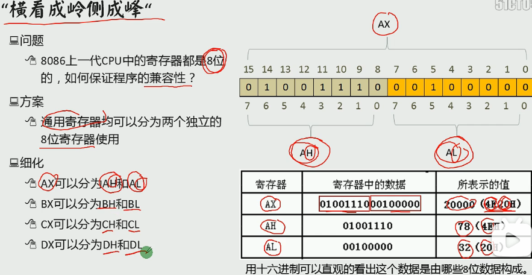
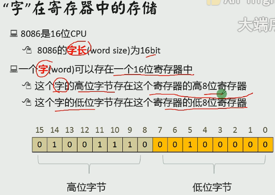

# 计算机组成原理

## 原码、反码、补码
原码、反码、补码是计算机中对数字的二进制表示方法。

原码：将最高位作为符号位（0表示正，1表示负），其它数字位代表数值本身的绝对值的数字表示方式。

反码：如果是正数，则表示方法和原码一样；如果是负数，符号位不变，其余各位取反，则得到这个数字的反码表示形式。

补码：如果是正数，则表示方法和原码一样；如果是负数，则将数字的反码加上1（相当于将原码数值位取反然后在最低位加1）。

总结：正数的原码、反码、补码完全一样，只有负数需要按照以上规则计算。

示例：

数值	        原码	         反码	        补码
6	         0 000 0110
-6	         1 000 0110	      1 111 1001	1 111 1010
*示例中均为8-bit的整数。它的可表示范围包括-128到127，总共256（=2^8）个整数。*

*0的反码、补码都为0*

## CPU

**CPU组成**
- 运算器：信息处理
- 寄存器：信息存储
- 控制器：协调器件进行工作
- 内部总线：实现CPU内各个器件之间的联系

**三类总线**
地址总线：决定存储单元，地址总线的宽度决定了可寻址的存储单元的大小 // 8086总线宽度为20，寻址空间（内存地址空间）为2^20B(1MB)
数据总线：传输数据，数据总线的宽度决定了CPU和外界的数据传送速度
控制总线：对外部器件进行控制，控制总线的宽度决定了CPU对外部器件的控制能力

## 寄存器

中阔号[]只对寄存器有影响，lea 寄存器加中括号代表取值（把地址当作值），mov 寄存器加中括号代表取地址（把他的内容当作地址，加上段地址变成物理地址，取物理地址内的值），[]只能存bx，bi，si，bp（变址 基址寄存器）,lea,[]都是*or&
 
数据寄存器（AX、BX、CX、DX寄存器）:
    AX（accumulator）累加器,是算术运算的主要寄存器。在乘、除等指令中指定用来存放操作数，以及所有的 I/O指令都使用这一寄存器与外部设备传送信息
    BX（base）基址寄存器。常做存放地址使用
    CX（count）计数器。常用来保存计数值，如在循环、位移和串处理指令中作隐含计数器
    DX（data）数据。一般在作双字长运算时把DX和AX组合在一起存放一个双字长数，DX用来存放高位数。对于某些I/O操作，DX可用来存放I/O的端口地址
 
变址寄存器（SI寄存器、DI寄存器）
    SI是源变址寄存器，DI是目的变址寄存器。一般用来存放地址偏移，也可以用来存放数据。但需要注意的是：在串处理指令中，SI用作隐含的源串地址，默认在DS中；DI用做隐含的目的串地址，默认在ES中；此时不能混用
 
指针寄存器（BP寄存器、SP寄存器）
    SP(stack pointer)堆栈寄存器，SP寄存器存放栈的偏移地址,SS存放段地址
 
    BP(base pointer)基数指针寄存器BP，它的用途有点特殊，需和堆栈指针SP联合使用的，作为SP校准使用的，只有在寻找堆栈里的数据和使用个别的寻址方式时候才能用到。比如说，堆栈中压入了很多数据或者地址，你肯定想通过SP来访问这些数据或者地址，但SP是要指向栈顶的，是不能随便乱改的，这时候你就需要使用BP，把SP的值传递给BP，通过BP来寻找堆栈里数据或者地址.
    BP作为基址寄存器，一般在函数中用来保存进入函数时的SP的栈顶基址.每次子函数调用时，系统在开始时都会保存这个两个指针并在函数结束时恢复SP和BP的值
段寄存器（DS寄存器、ES寄存器）
    DS（Data Segment）和 ES（Extra Segment）都属于段寄存器，用于存放的就是某个段地址
    注：CPU不支持直接将立即数送入段寄存器中，如下操作方式不合法：
    mov ds,1000h masm里新建asm文件的初始代码传输也分了两次

**标志寄存器**

6个状态标志位：OF、SF、ZF、AF、PF、CF，及3个控制标志位DF、IF、TF
标志寄存器Flag
Flag是16位的寄存器，有9个标志位，其中6个状态标志位，3个控制标志位
 
6个状态标志位
CF：进位或者借位 有进位或者借位时CF=1，并且debug显示为CY
否则CF=0，debug显示为NC
 
PF：奇偶标志位 用于校验，运算结果**低8位**（AL AH等） 化为2进制 为奇数个1时PF=0 debug显示 PO
否则 偶数个1时PF=1 debug显示PE
 
AF:辅助进位标志 运算结果的低4位向前1位有进位或者借位时 AF=1，debug显示AC
否则无进位和借位时AF=0,debug显示NA
 
ZF:零标志位 运算结果为0时 则ZF=1，debug显示ZR
否则ZF=0，debug显示NZ
 
SF:符号标志位 运算结果为负数时，SF=1，debug显示NG
否则SF=0，debug显示PL
 
OF:溢出标志位 如果运算结果溢出(与常识不符合 例如两个正数相加为负数 或者两个异数相减为负数)，则ZF=1,debug显示OV
否则ZF=0，debug显示NV
 
3、3个控制标志位
TF:追踪标志位
TF=1则单步执行，执行之后TF=0 即中断然后正常执行
 
IF:中断允许标志位
IF=1,则允许CPU响应外部中断 debug 显示EI
IF=0,则禁止 debug显示DI
 
DF:方向标志位
DF=1，地址减方向 debug显示DN
DF=0,地址增方向 debug显示UP

**字和字节**

**8086CPU物理地址**

**8086读取和执行指令演示**

# 计算机操作系统