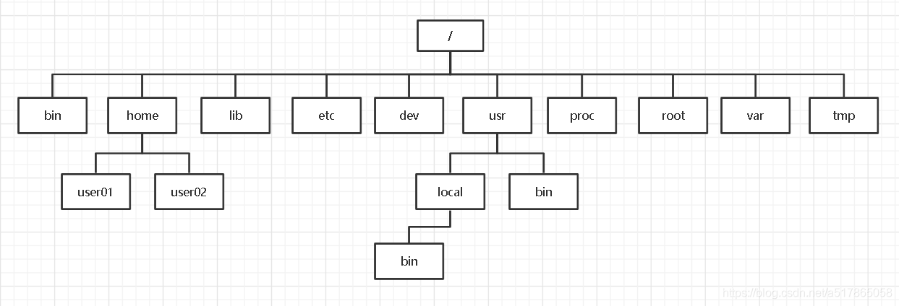

[How to install software in linux](https://linuxize.com/)


# Linus
Debian系列：Debian，Ubuntu
Redhat系列：RHEL，CentOS，Fedora
国产麒麟：飞腾，龙芯，鲲鹏
Slackware Linux：SUSE
### 命令
#### 进程
`ps -ef` 查看进程信息
`ps -ef | grep 关键字`
`kill [-9] 进程号` 关闭指定进程 -9表示强制关闭
#### 主机状态监控
`top` 
`df -h` 查看磁盘使用率
`iostat` 产看磁盘速率
`sar -n DEV` 查看网络情况

列名	含义
PID	进程id
USER	进程所有者的用户名
PR	优先级
NI	nice值。负值表示高优先级，正值表示低优先级
VIRT	进程使用的虚拟内存总量，单位kb。VIRT=SWAP+RES
RES	进程使用的、未被换出的物理内存大小，单位kb。RES=CODE+DATA
SHR	共享内存大小，单位kb
S	进程状态。D=不可中断的睡眠状态 R=运行 S=睡眠 T=跟踪/停止 Z=僵尸进程
%CPU	上次更新到现在的CPU时间占用百分比
%MEM	进程使用的物理内存百分比
TIME+	进程使用的CPU时间总计，单位1/100秒
COMMAND	命令名/命令行

### 文件系统
文件系统是操作系统中用于组织和管理文件数据的一种机制。它提供了一种逻辑结构，用于在存储设备上存储、访问和管理文件。文件系统的出现是为了更好地组织和管理数据，使得用户可以方便地存储和访问文件。

在Linux系统中，存在一些标准目录，它们在文件系统中有着特定的用途和重要性。下面是一些常见的标准目录及其作用：

/：根目录，是整个文件系统的顶级目录，包含了所有其他目录和文件。
/bin：存放系统可执行的基本命令，如ls、cp、mv等。这些命令在系统启动时就可用，独立于其他文件系统。
/boot：包含了Linux系统启动时所需的文件，如内核、引导加载程序和启动配置文件。
/dev：包含设备文件，用于与系统中的各种设备进行交互，如硬盘、键盘、鼠标等。
/etc：存放系统的配置文件，如网络配置、用户账户配置、服务配置等。这些配置文件对系统的正常运行至关重要。
/home：用户的家目录，每个用户在该目录下都有一个独立的子目录用于存放个人文件和设置。
/lib和/lib64：存放系统所需的共享库文件，这些库文件被系统中的程序共享使用。
/media和/mnt：用于挂载可移动介质（如USB设备、光盘等）和其他临时挂载点。
/opt：用于安装第三方软件和应用程序的可选目录。
/proc：虚拟文件系统，提供有关系统内核和运行进程的信息。
/root：超级用户（root）的家目录，与普通用户的家目录类似，但只有超级用户才能访问。
/run：
/sbin：包含系统管理员使用的系统管理命令，如ifconfig、fdisk等。这些命令通常需要具备超级用户权限才能运行。
/srv：
/sys：
/tmp：用于存放临时文件，系统重启时会自动清空该目录下的文件。
/usr：包含用户安装的应用程序、库文件和文档等，通常较大。
/var：存放经常变化的文件，如日志文件、缓存文件和邮件队列。
### softmare mirror
### shell
`cat /etc/shells`  查看系统内的shell
可以使用路径切换到相应的shell版本
`echo $SHELL`      查看当前系统变量中显示的shell版本   
`echo $0`          当前正在执行的脚本名称
`chsh -s $(which zsh)` 切换为zsh

#### usage
```
vi hello.sh //create a sh script file
chmod a+x hello.sh
./hello.sh
```

### vim
- 显示行号 :set number!
- 删除当前行 dd
- 清空文件内容
    - gg		# 跳至文件首行
    - dG		# 删除光标所在行到末尾行内容，d删除，G跳转到文件末尾行

### 删除编译软件
1. make uninstall 执行作者编写的卸载文件
2. build目录下，执行：```xargs rm < install_manifest.txt```
make install之后，build目录下会有一个install_mainfest.txt的文件, 记录了安装的所有内容及路径，
执行 xargs rm < install_manifest.txt 就可以了。
如果没有这个文件，可以自己重新make install，从log中过滤出install的安装路径信息，保存到unistall.txt中，再执行xargs rm < unistall.txt即可。

### 包管理器
**Redhat系列**
- rpm
    ```
    RPM包默认安装路径
    /etc/配置文件安装目录
    /usr/bin/可执行的命令安装目录
    /usr/lib/程序所使用的函数库保存位置
    /usr/share/doc/基本的软件使用手册保存位置
    /usr/share/man/帮助文件保存位置
    ```
- yum
换源
`curl -o /etc/yum.repos.d/CentOS-Base.repo http://mirrors.aliyun.com/repo/Centos-7.repo ##CentOS 7`


**Debian系列**
- apt
    ```
    sudo apt update
    sudo apt list --upgradable
    sudo apt upgrade
    ```

### 服务管理
**System V**
一种最早的 Linux 服务管理方式,使用/etc/init.d 下的脚本来管理服务。

service 命令就是管理 System V 类型服务的命令。它主要用于操作/etc/init.d下的脚本。

特点:
- 初始化脚本存放在`/etc/init.d`目录下
- 利用`/etc/init.d` 下的脚本来管理服务,例如 `/etc/init.d/httpd` 启动httpd服务
- service 命令用于管理这些服务,例如 `service httpd restart` 重启httpd服务
- 针对单个服务管理
- 启动速度较慢，顺序启动
常用命令：
service service start：启动指定的服务。
service service stop：停止指定的服务。
service service restart：重启指定的服务。
service service reload：重新加载指定的服务配置。
service service status：查看指定服务的状态和详细信息。
service --status-all：列出所有正在运行的服务。
chkconfig --list：列出所有已经注册的服务和它们的运行级别。

**systemd**
一种新的服务管理方式,使用 systemctl 命令来管理 systemd类型的服务。

特点:
- 初始化脚本存放在 `/etc/systemd/system`目录下
- systemd unit 文件描述服务的各种属性
- systemctl 命令管理这些服务,例如 `systemctl restart httpd.service` 重启httpd服务
- 统一管理所有服务
- 较快，并行启动

常用命令：
systemctl start service：启动指定的服务。
systemctl stop service：停止指定的服务。
systemctl restart service：重启指定的服务。
systemctl reload service：重新加载指定的服务配置。
systemctl enable service：设置指定的服务为开机自启动。
systemctl disable service：禁止指定的服务开机自启动。
systemctl status service：查看指定服务的状态和详细信息。
systemctl list-units --type=service：列出所有正在运行的服务。
systemctl list-unit-files --type=service：列出所有已经注册的服务。


### ssh
配置文件路径 `/etc/ssh/sshd_config`
```
service ssh start   启动ssh
service ssh status  查看ssh服务是否正常运行

开机自动启动ssh服务
方法一：
sysv-rc-conf
sysv-rc-conf --list | grep ssh
sysv-rc-conf ssh on  //系统自动启动SSH服务
sysv-rc-conf ssh off  // 关闭系统自动启动SSH服务
方法二：
update-rc.d ssh enable  //系统自动启动SSH服务
update-rc.d ssh disabled // 关闭系统自动启动SSH服务
```

### mysql

##### start
1. use apt update the package
2. use `apt-cache serach mysql-server` to fing the package
3. use `sudo apt install mysql-server-8.0` install mysql
    **setting the root password：**
    ```
    sudo mysql;
    ALTER USER 'root'@'localhost' IDENTIFIED WITH mysql_native_password BY 'My7Pass@Word_9_8A_zE';
    ```
    **MySQL 8.xx 的关键配置文件和端口:**
    - mysql.service，这是服务的名称。您可以使用以下 systemctl 命令来管理它
    ```
    sudo systemctl start mysql.service
    sudo systemctl stop mysql.service
    sudo systemctl restart mysql.service
    sudo systemctl status mysql.service
    ```
    - /etc/mysql/ - MySQL 服务器的主要配置目录。
    - /etc/mysql/my.cnf - MySQL 数据库服务器的配置文件。编辑 .my.cnf ($HOME/.my.cnf) 文件来设置用户特定的选项。以下两个目录中的设置可以覆盖它： /etc/mysql/conf.d//etc/mysql/mysql.conf.d/
    - TCP/3306 端口 - TCP/3306 是 MySQL 服务器的默认网络端口，出于安全考虑，它绑定在 127.0.0.1 上，可以更改这个设置，之后就可以通过在 /run/mysqld/ 目录下设置的 localhost 套接字来访问 MySQL 服务器。
4. enhacing the security of mysql
`sudo mysql_secure_installation`
5. controlling the status of mysql
```
systemctl enable mysql.service
systemctl start mysql.service
systemctl status mysql.service
systemctl stop mysql.service
systemctl restart mysql.service
```
6. Configuring the MySQL 8 Server
Edit the /etc/mysql/mysql.conf.d/mysqld.cnf file with a text editor
` vim /etc/mysql/mysql.conf.d/mysqld.cnf`
##### Mysql user management
- add user
`create user username identified by 'password';`
create user zhangsan identified by 'zhangsan';
- grant (`show grants;//查询用法`)
`grant privilegesCode on dbName.tableName to username@host;`
grant all privileges on zhangsanDb.* to zhangsan@'%';
flush privileges;
`show grants for user;`
show grants for 'zhangsan';

privilegesCode表示授予的权限类型，常用的有以下几种类型：
all privileges：所有权限。
select：读取权限。
delete：删除权限。
update：更新权限。
create：创建权限。
drop：删除数据库、数据表权限。
dbName.tableName表示授予权限的具体库或表，常用的有以下几种选项：
.：授予该数据库服务器所有数据库的权限。
dbName.*：授予dbName数据库所有表的权限。
dbName.dbTable：授予数据库dbName中dbTable表的权限。
username@host表示授予的用户以及允许该用户登录的IP地址。其中Host有以下几种类型：
localhost：只允许该用户在本地登录，不能远程登录。
%：允许在除本机之外的任何一台机器远程登录。
192.168.52.32：具体的IP表示只允许该用户从特定IP登录。
password指定该用户登录时的面。
flush privileges表示刷新权限变更。
- change passwoed
`update mysql.user set password = password('zhangsannew') where user = 'zhangsan' and host = '%';`
- delete user
`drop user zhangsan@'%';`
- 常用命令组
`create user zhangsan identified by 'zhangsan';`
`grant all privileges on zhangsanDb.* to zhangsan@'%' identified by 'zhangsan';`
`flush  privileges;`
创建了用户zhangsan，并将数据库zhangsanDB的所有权限授予zhangsan。如果要使zhangsan可以从本机登录，那么可以多赋予localhost权限：
`grant all privileges on zhangsanDb.* to zhangsan@'localhost' identified by 'zhangsan';`


### nginx
/etc/nginx

nginx -t 检测文件配置是否有问题
nginx -s reload 重新加载

##### Web服务器

nginx.conf
```
events{}

http{
    
        include /etc/nginx/mine.types;
        include /etc/nginx/conf.d/*.conf;
}
```
/etc/nginx/conf.d/default.conf
```
server {
    listen 80;
    server_name localhost;

    location /app {
        root /var/www/localhost;
    }
}
```
###### location


**路径匹配**

存在：
localhost/app/index.html
localhost/apple/index.html
1. 
location /app {
    root /var/www/localhost;
}  //匹配路径包含 /app 的地址

URL localhost/app //在app当前所在的文件夹下寻找，  不能找到
URL localhost/app/ //在app文件夹中寻找，  能找到
URL localhost/app/index.html  //能访问
URL localhost/apple/index.html  //能访问
//更灵活但容易暴露其他文件
2. 
location = /app/index.html {
    root /var/www/localhost;
}  //访问的路径要与实际文件完全一致
//不太灵活
3. 
location ~ /app/index[2-4].html {
    root /var/www/localhost;
}  //使用正则表达式

*匹配优先级*：
1. = 精确
2. ^~ 优先前缀
3. ~和~* 正则
4. 空格 普通前缀

**重定向**

1. return
location / {
    return 307 /app/index.html
}

2. rewrite
rewrite /temp /app/index.html

3. try_files
location / {
    try_files $url $url/ =404;
} //先匹配第一个，失败后第二个，最后404；可通过 error_page 404 route 自定义404页面

###### 反向代理

```
server {
    listen 80;
    server_name localhost;

    root /var/www/localhost;
    index index.html;
    error_page 404 /404.html;

    location app1 {
        proxy_pass http://localhost:3000;
    }

    location app2 {
        proxy_pass http://localhost:3001;
    }
}
```

###### 负载均衡

```
upstream backend-servers {
    server localhost:3000 weight=2;
    server localhost:3001 weight=6;
}

server {
    listen 80;
    server_name localhost;

    root /var/www/localhost;
    index index.html;
    error_page 404 /404.html;

    location / {
        proxy_pass http://backend-servers;
    }

}
```


### other
update-rc.d和sysv-rc-conf 更新系统启动项的脚本

### problem
#### Processing triggers for man-db
解决方法：
The Processing triggers for man-db step is only executed if the file /var/lib/man-db/auto-update exists. This is an empty file with the sole purpose of controlling this behavior, so it can be safely removed to disable this time-consuming and arguably unnecessary process.

I personally disable this trigger on all of my systems. While the man-db cache is supposed to enhance the manual page system's speed and functionality, I have not experienced any noticeable performance degradation or functional problem after disabling the trigger.