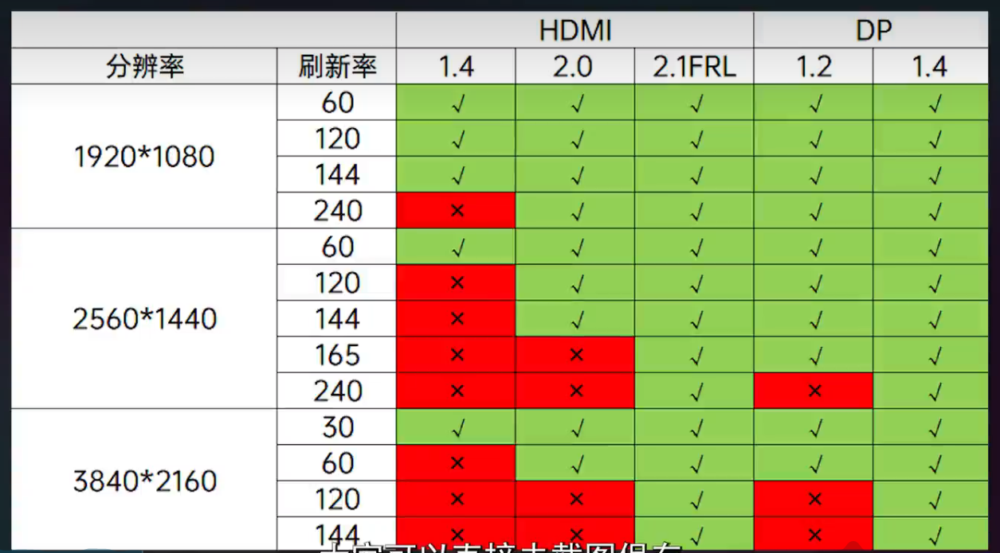

# 外设

## 键盘

### 薄膜键盘

### 机械键盘

键帽、轴体、套件

#### 配列

百分比或键数表示，数字越大，按键越多  
104  

客制化  
Alice(人体工学)  

##### 键帽

PBT  更耐磨、触感偏硬，表层颗粒大
ABS  触感亲肤温润、时间长打油
PC  透光性好

刻字工艺  
- 二色成型
- 热升华

高度  
- SA  
- MDA  
- OEM  
- 原厂

##### 轴体

线性轴、段落轴、发声段落轴

其他参数  
- 轴体压力  
   一般为 45 g  
- 导通行程  
   按压到触发的距离，标准为 2 mm，  
- 总键程  
   按压到触底的距离，一般 3.6 mm  

#### 套件

##### 外壳材质  

- 塑料  
- 铝  
   铝合金处理工艺
   - 喷涂
   - 阳极氧化
   - 电泳

##### 定位板

- PC
- POM
- FR4
- 铝
- 碳纤维
- 铜

##### 内部结构

船壳结构  早期、成本低、容易共振
Gasket 结构  主流
TOP 结构  手感扎实
三明治结构  

##### PCB

热插拔 PCB 自由换轴体  
焊接 PCB

### 磁轴键盘

### 产品

- VGN V87
    有线/无线/蓝牙三模客制化机械键盘  
    gasket 结构  
    全键热插拔  
    动力银轴  
    加勒比海  
    电池容量 4000mAh（连接电脑充电 6h，无线开灯续航 20h，关灯 20 天）  

## 鼠标

### 组成和参数

- 传感器  
   3395  
- 模具  
   握姿 + 手长  
   [鼠标模具查看网站](www.eloshapes.com)

- 回报率  
   回报率也被称为轮询率或者刷新率（FPS），通常是指鼠标向计算机报告其位置的频率，单位为 Hz（赫兹）。比如一个鼠标回报率是 125 Hz，那么它每秒会向计算机报告其位置125次。理论上来说，回报率越高，操作鼠标时的延迟就会越低，鼠标移动也就更丝滑。  
   不过太高的回报率也会消耗更多的CPU资源，特别是无线鼠标，建议调低回报率增加续航时间。  

### 价格

0 - 200 性能足够  
200 - 400 性能顶尖  
400 - ∞ 创新独特  

## 鼠标垫

- 布垫  
   顺滑度较好、价格较便宜  
   比较容易脏  
   推荐带锁边  
- 皮革垫  
   相比布垫，抗污性更强、质感颜色更好  
   阻力较大；只有纯色；长期沾有会油亮，不好清理  
   推荐带缝线  
- 毛毡垫  
   质感好  
   抗污能力差；阻力大；几个月会起球  
- 玻璃垫  
   顺滑；抗污；  
   冰手；贵  

## 显示器

- 色域
- 色准
- 面板
- 背光
- 硬件防蓝光
- 对比度

### 显示器类型

1. **CRT（Cathode Ray Tube）显示器**：
   - 使用阴极射线管技术。
   - 体积大、重量重，但色彩表现和响应速度较好。
   - 逐渐被淘汰，取而代之的是更轻薄的显示技术。

2. **LCD（Liquid Crystal Display）显示器**：
   - 使用液晶技术，通过背光源照射液晶层来显示图像。
   - 轻薄、能耗低，广泛应用于各种设备。
   - 分为 TN、IPS、VA 等不同面板类型。

3. **LED（Light Emitting Diode）显示器**：
   - 实际上是 LCD 显示器的一种，使用 LED 作为背光源。
   - 亮度高、能耗低、寿命长。
   - 常见于现代显示器和电视。

4. **OLED（Organic Light Emitting Diode）显示器**：
   - 使用有机发光二极管技术，每个像素自发光。
   - 对比度高、色彩表现优秀、响应速度快。
   - 价格较高，主要用于高端设备。

5. **QLED（Quantum Dot LED）显示器**：
   - 使用量子点技术增强色彩表现。
   - 亮度高、色域广，主要用于高端电视和显示器。

### 分辨率

- **分辨率**：显示器屏幕上像素的数量，通常表示为宽度 x 高度（例如 1920x1080）。
- **常见分辨率**：
  - HD（720p）：1280x720
  - Full HD（1080p）：1920x1080
  - QHD（1440p）：2560x1440
  - 4K UHD：3840x2160
  - 8K UHD：7680x4320

### 刷新率

- **刷新率**：显示器每秒刷新图像的次数，以赫兹（Hz）为单位。
- **常见刷新率**：
  - 60Hz：标准刷新率，适用于大多数日常使用。
  - 120Hz、144Hz、240Hz：高刷新率，适用于游戏和专业应用，提供更流畅的视觉体验。

### 响应时间

- **响应时间**：像素从一种颜色转换到另一种颜色所需的时间，以毫秒（ms）为单位。
- **低响应时间**：减少运动模糊和拖影，适合快速移动的图像，如游戏和视频。

### 面板类型

1. **TN（Twisted Nematic）面板**：
   - 响应时间快、成本低。
   - 色彩表现和可视角度较差。

2. **IPS（In-Plane Switching）面板**：
   - 色彩准确、可视角度广。
   - 响应时间较慢、成本较高。

3. **VA（Vertical Alignment）面板**：
   - 对比度高、色彩表现好。
   - 响应时间介于 TN 和 IPS 之间。

### 护眼

德国莱茵认证

#### 硬件防蓝光

#### 调光模式

##### PWN

会频闪

##### DC

大多使用，对双眼较好

### 连接接口

- **DVI（Digital Visual Interface）**：较老的数字视频接口，逐渐被 HDMI 和 DisplayPort 取代。
- **VGA（Video Graphics Array）**：模拟视频接口，逐渐被数字接口取代。
- **HDMI（High-Definition Multimedia Interface）**：常见的数字视频和音频接口，广泛应用于显示器、电视和其他设备。
- **DP（DisplayPort）**：高性能数字接口，支持高分辨率和高刷新率，常用于电脑显示器。

### 其他特性

- **色域**：显示器能够显示的颜色范围，常见的色域标准有 sRGB、Adobe RGB 和 DCI-P3。
- **HDR（High Dynamic Range）**：高动态范围技术，提供更高的亮度和对比度，提升图像质量。
- **G-Sync 和 FreeSync**：同步技术，减少屏幕撕裂和卡顿，提升游戏体验。

#### 独显直连

独立显卡不经过核显直接输出到显示器，渲染画面

##### 效果

网游普遍吃cpu，关闭核显就是降低cpu的一份功耗和热量来提升cpu性能，直接用独显渲染画面帧数就会提示非常多。  
单机普遍吃显卡，尤其是显存。作为市面上最多的60系列显卡，除4060外几乎都是6g以内的显存，这个时候核显是可以共享显存的，否则显卡容易爆显存。  

HDMI
    2.0 支持 2k 144Hz  
    2.1 支持 2k 180Hz
DP（推荐）