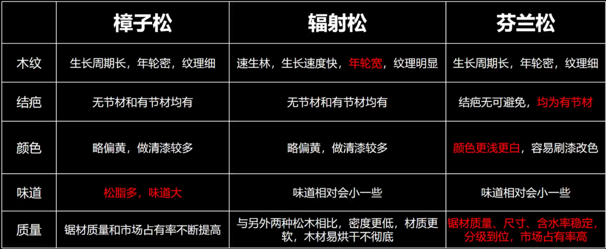

# 材料

## 常用纤维

### 天然纤维

棉
- 长绒棉 36mm
- 细绒棉 28mm
- 精梳棉 把短棉花梳走
- 丝光棉 棉花放入烧碱，横截面变圆
- 彩棉

麻

总的来说，现在生产的麻面料已经比较舒服了。亚麻是欧洲一直很受欢迎的夏季面料，纯亚麻的价格和一些比较高级的棉花差不多，当然亚麻也分等级。大麻在古代确实是很粗糙的，但是现在我国已经掌握了处理大麻的工艺，纺出的布和亚麻差距不是很大，雅戈尔的汉麻也是大麻。苎麻（夏布）也是一种自古以来的面料，三种面料的衣服我都买过，总的来说，大麻和亚麻比较类似，像布。苎麻摸起来有点滑，整体又有点粗糙，感觉有点纸那种质感，热天穿薄苎麻衣服的感觉很不错。三种材料都有透气很好，遇水不会变透明，容易干的优点，也都易皱。黄麻就不了解了

蚕丝 
- 桑蚕丝 （白色）
- 柞蚕丝 （黄色）
- 双宫丝 两只蚕一起吐丝，品质不好
- 绢丝 断了的蚕丝，重新加工

羊毛
- 绵羊毛

羊绒
- 山羊毛

### 化学纤维

再生纤维素纤维
- 粘胶纤维：“竹纤维”，棉的再生纤维，吸湿性胜棉50%；
- 莫代尔纤维：贴身内衣内裤；
- 莱赛尔纤维：更高级，常被人称为天丝(×)—天丝是商标，包括以上两个尔纤维；
- 醋酯纤维：吸附焦油性好，质感高级

合成纤维
- 涤纶：常见涤纶PET，还有PTT，PBT，阳离子（其因“阳”字，使得部分商家诈骗宣传像太阳一样发热）；涤纶并非由塑料瓶而来，而是直接化工合成，塑料瓶做成的会标识“再生聚酯纤维”
- 锦纶：又叫尼龙，耐磨性好（冲锋衣、羽绒服、防晒服），价格贵涤纶三倍，湿水时更坚韧（渔网）
- 腈纶：外号人造羊毛，因而见于冬季毛衣内衣。德绒：德国腈纶商标；美雅迪—日本。腈纶不发热，发热是粘胶纤维吸湿发热，保暖得看厚度和空气储存量
- 氨纶：有弹力，给面料加弹力，遇84则不弹；莱卡：氨纶。

## 木材

[信息来源，b站视频](https://www.bilibili.com/video/BV1d8411R7xx/?spm_id_from=333.337.search-card.all.click&vd_source=15c229538881316b8c6a43f997de056f)  

人造板 实木板

### 木材知识框架

#### 分类

生物归类&档次划分

##### 生物分类（林奈生物命名法）

硬木和软木  

- 阔叶材硬木（被子植物）  
    木质较硬、密度较大、纹理漂亮、胀缩变形大、加工较难、成材时间几十年到百年不等  
    常用作内部装饰、家具、次要承重构建等  
    硬木中较软的树种：白杨树
- 针叶材软木（裸子植物）  
    松树、杉树、柏树  
    强度高、胀缩变形小、耐腐蚀性强、纹理顺直、容易加工、成材时间几年到十几年不等（三年成木、五年成材）  
    建筑工程中主要使用的木材、主要承重构建  
    软木中木质较硬的树种：落叶松、紫杉  

##### 档次划分（大概）

顶级：  
- 红木  
- 缅甸柚木  
- 北美黑胡桃  

15k/m^2

高级：  
- 北美白橡  
- 北美硬枫  
- 印尼柚木  
- 北美樱桃木  
- 北美红橡  
- 北美白蜡木  

6k  

中级：  
- 北美鹅掌楸  
- 非洲沙比利  
- 欧洲榉木  
- 柞木  
- 水曲柳  
- 欧洲榆木  
- 南美黑胡桃  
- 南美柚木  

3k  

一般：  
- 橡胶木  
- 松木  
- 杉木  
- 桦木  
- 桐木  
- 柳桉木  
- 樟木  

1k  

### 常用木材介绍

xx木材，基本都是同一属和同一科的树木所形成的木材，称为xx木材组更合适  

特性  
- 油性
- 密度
- 强度
- 纹理
- 价格

#### 红木

新国标 5 属 8 类 29 种材延伸图  
  
其他只是国家不认可  

#### 橡木

橡树是壳斗科的泛称，包括栎属、青冈属和柯属（等）的种  
通常指栎属  

##### 我国本土橡木品种

蒙古栎、栎树、柞树

##### 明星品牌

- 北美白橡木  
    
    防腐、防虫、耐水性比红橡木好很多。橡木酒桶用材  
    价格略高于红橡木，产量越来越少，品质越来越差  
- 北美红橡木
    
    目前占主要市场  
北美橡木花纹整齐规则，纹路有比较清晰明显的山形竖纹；白橡木的木髓射线较长，红橡木的木髓射线较短  

购买时认准**名字-北美红/白橡木**和**美国硬木板材协会规定的等级**

根据瑕疵面积划分 4 个等级  
- FAS 级  
    较差板面上净划面出材率至少为 83.33%  
- FAS 单面  
- 普 1 级  
- 普 2 级  

##### 橡胶木

常常被商家称为泰国橡木、东南亚橡木、缅甸橡木、非洲橡木  
**橡胶木和橡木无论是物理性质还是颜值都差了几条街**  
橡胶木几乎没有纹理，侧面看不到年轮；市面上一般都是指接材；含糖量高，容易霉变虫蛀腐朽；主要作为不见光板材  

#### 柚木

东南亚树种（缅甸和泰国北部）；缅甸国宝  

天然柚木纹理清晰  
含油量高，越用越光滑  
柚木家具表面非常细致油滑  
油脂的香味让虫类不敢靠近，对多种化学物质有较强的耐腐蚀性，防水性很强，常用做大型船只甲板（二战航母甲板）  

二十世纪八十年代后，随着传统柚木出口国泰国、印尼相继停止了原始柚木的出口，缅甸成了唯一一个出口柚木的国家  
**黑心商家的诱导性称呼**：  
非洲柚木 实为 大美木豆  
老挝柚木 实为 翅苹婆  
金丝柚木 实为 黑心木莲  

#### 松木

占有率较大的松木：  
- 樟子松  
    别名海拉尔松、蒙古松，国际上一般叫西伯利亚松  
    基本为俄罗斯进口的木材  
- 辐射松  
    新西兰松、智利松  
    生长在新西兰  
- 芬兰松  
    被称为松木之王  
    来自芬兰的人工林松木  



#### 杉木

杉（shan）树的木材叫杉（sha）木

杉木树材直、纹理通达、材质松软、自身能够散发香味（抗虫耐腐，能保持上百年）  

#### 胡桃木

核桃木

- 北美黑胡桃  
    可再生树种中最名贵的硬木  
    50-100 年成材  
    独一无二的巧克力色，深色  
    唯一正宗之选  
- 南美黑胡桃  
    雨木；雨豆木、琥珀木、金合欢木  
- 东南亚胡桃木  
    榄仁木；金丝檀木、金丝柚木、金胡桃木  
- 非洲胡桃木  
    奥古曼；红胡桃木、红檀木、黄金檀木、桃花芯  
    橄榄科  
    目前市场上用来做胡桃木家具的一般都是加工好的所谓奥古曼直拼板  

#### 北榆南榉

- 榆木  
    木性坚韧、纹理通达清晰；硬度与强度适中，透雕浮雕；刨面光滑，弦面花纹美丽  
    市面上主要为榆木老料（经历了几十年，木性趋于稳定）和进口的俄罗斯榆木  
- 榉木  
    产于我国南方，通常指大叶榉树
    目前市场上，国产榉木已经绝迹（1999年成为二级保护树种），大部分为欧洲榉木  
- 欧洲榉木  
    山毛榉；水青冈  
    壳斗科；按照橡木广义的定义，可称为橡木  
    广泛用于家具、地板和橱柜  


#### 白蜡木

木质坚硬且富有弹性、耐腐蚀  
北美白蜡木，是家具地板的优良品种  

#### 水曲柳

水曲柳和白蜡木属于同科同种不同属的树木  
产地一般为欧洲和俄罗斯  
商家会称为欧洲白蜡木  

### 认识新木材

```
樱桃木：  
长*宽*厚  
120*60*2.7cm760，
140*70*2.7cm978，
160*70*2.7cm1150，
160*80*2.7cm1280，
180*80*2.7cm1420，
120*60*3.4cm990，
140*70*3.4cm1240，
160*70*3.4cm1420，
160*80*3.4cm1650，
180*80*3.4cm1800。
```


# 标准

### 洗洁精

食品级（以下两个标准同在）  
- GB14930.1-2022 A类《食品安全国家标准 洗涤剂》  
- GB/T9985-2022 《手洗餐具用洗涤剂》  

餐具 B类

去农药  
- GB/T24691-2022 《果蔬清洗剂》  

### 牙膏

GBT8372-2017   
1. 含氟
2. 摩擦剂  
    水合硅石、磷酸氢钙。**不推荐碳酸钙**  
3. 表面活性剂  
    月桂醇酯硫酸氢钠（SLS），比较刺激粘膜  
    月桂酰肌氨酸钠，氨基酸表活，刺激性小  
    椰油酰谷氨酸钠，氨基酸表活，刺激性小  
4. 防腐剂  
    戊二醇，2-己二醇，安全系数高  
5. 其他  
    磷硅酸钙钠：能与水及唾液发生迅速、持续的反应，是一种高科技生物活性材料，经过两次1900摄氏度高温煅烧，形成纳米级生物活性修复微粒，该成分与骨骼及牙釉质主要成分相同（钙磷比1.67），通过刷牙深入牙本质小管30-40微米进行修复固化，形成新的牙釉面矿物保护层，修复牙釉质及诱导牙周组织生长，根本消除牙敏感症状，延长牙齿生命；同时，具有强大的非药物杀菌、抑菌、消炎作用，能够激活  

柠檬酸钙可以和奥拉氟形成保护膜

### 大米，食用油，面粉


# 商品

## 内裤

**支数**跟纱的长度和重量有关。打个比方，一两棉花做成30根长度为1米的纱，那就是30支；一两棉花做成40根长度为1米的纱，那就是40支；1两棉花做成60根长度为1米的纱，那就是60支。  
所以纱的支数越高，纱就越细，织出的布就越薄，布相对越柔软舒适。

- 冰丝  
    不推荐  
- 纯棉  
    50 支起步
- 莫代尔  
    60 支起步

价格（一般情况）：莫代尔 > 纯棉 > 冰丝  

## 羽绒服

[中国羽绒信息网](https://www.cfd.com.cn/)