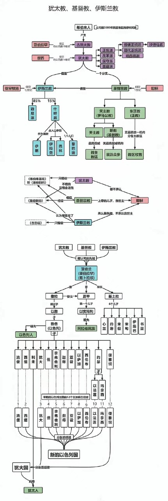

### 印度宗教

1. 婆罗门教
2. 佛教
3. 印度教
婆罗门教生成佛教，佛教生出印度教，印度教消灭前两者。

#### 婆罗门教

三大教条：
1. 吠陀天启
2. 婆罗门至上
3. 祭祀万能

#### 佛教

教义  
轮回  

#### 印度教

教义  
轮回、上梵我、至高梵、梵我同一、阿凡达（分身）、不杀生祭、现实种姓，宗教众生平等、三相神  

### 犹太教、基督教、伊斯兰教关系图

#### 犹太教

起源于古代以色列  
一神教（耶和华）  
《希伯来圣经》  

#### 基督教

从犹太教发展而来  
信仰上帝、耶稣（上帝之子）  
创建 新约《圣经》，将《希伯来圣经》称为旧约  

#### 伊斯兰教

吸收前两者  
将亚伯拉罕视为为最后一位先知  
